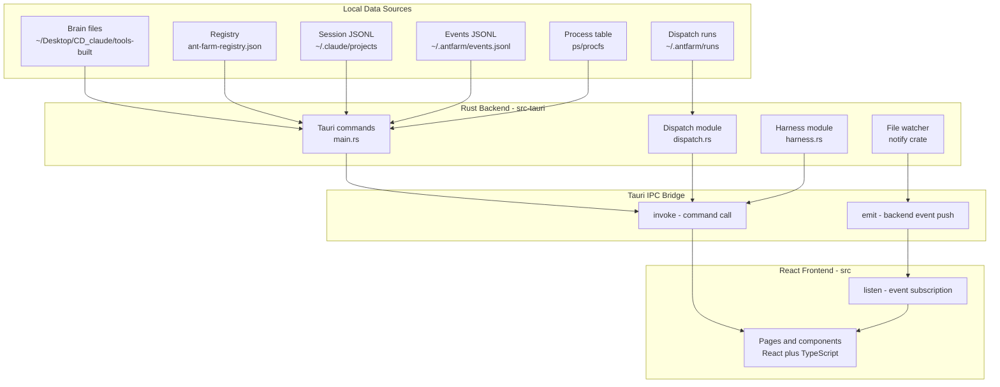

# Architecture

**Parent:** [Overview](overview.md) · [Getting Started](getting-started.md)

Ant Farm is a [Tauri 2](https://tauri.app/) desktop application: a Rust binary hosts a WebView that serves a React/TypeScript UI. The two halves communicate exclusively through Tauri’s inter-process communication bridge — the frontend never touches the filesystem directly, and the backend never manipulates the DOM. This clean boundary lets each side stay focused: Rust reads local files and runs shell commands; React renders the results.

## Layered Architecture

The diagram below shows how data flows from disk to screen. All reads originate in the Rust backend; the frontend is purely a rendering layer.



## The Tauri IPC Model

The backend exposes its entire public surface as `#[tauri::command]` functions registered at startup via `tauri::generate_handler!` inside `fn main()`. Each command is a plain Rust function whose return value is serialized through `serde` and returned as JSON to the caller. Commands are synchronous or async; none of them call external APIs. The complete command list spans project listing, usage rollup, session enumeration, git metrics, working tree status, dispatch control, harness control, PTY management, workspace persistence, and voice/mobile helpers.

The frontend calls commands with `invoke` from `@tauri-apps/api/core`:

```typescript
import { invoke } from "@tauri-apps/api/core";
const sessions = await invoke<SessionMeta[]>("list_sessions");
```

For push notifications the backend emits named events via `AppHandle::emit`. The frontend subscribes with `listen` from `@tauri-apps/api/event`. The events file watcher is the primary example: when `~/.antfarm/events.jsonl` is appended to, the watcher fires `antfarm-events-updated` and the Sessions page re-invokes `list_sessions` to refresh.

```typescript
import { listen } from "@tauri-apps/api/event";
listen("antfarm-events-updated", () => invoke<SessionMeta[]>("list_sessions"));
```

## The Observe-First Data Flow

Every number shown in the UI originates from a local file or the process table — never from an API call. The backend reads the project brain as read-only structured Markdown, parses Claude Code and Cowork session `.jsonl` files for token counts, tails `~/.antfarm/events.jsonl` for push status, and queries `git log` / `git status` for metrics and dirty files. Commands compute rollups on demand and return plain structs; there is no in-process database or cache beyond an offset pointer for the events file. The app never writes to the brain or to session files. Writes are constrained to `~/.antfarm/` (events, runs, dispatch records) and the Tauri app-data directory (settings, workspace layouts).

Tolerant parsing is a first-class constraint. Session JSONL formats are undocumented and change between Claude Code releases. Every parser degrades gracefully on malformed input: a file that cannot be parsed is skipped with a logged warning rather than surfaced as an error or included in rollup totals. This guarantees that a broken transcript never crashes a list view or inflates a usage number.

## TypeScript Types and the IPC Boundary

`src/types.ts` is the single source of truth for the shapes that cross the IPC boundary. Every struct the Rust backend serializes has a matching TypeScript interface in that file: `Project`, `ProjectDetail`, `SessionMeta`, `UsageRollup`, `GitMetricsRollup`, `WorkingTreeRollup`, `RunRecord`, `RunEvent`, `WrappedStats`, and others. Because serde produces snake\_case JSON by default and TypeScript conventionally uses camelCase, the boundary is a mix: Rust-origin fields such as `last_activity` and `cache_read` stay snake\_case in the TypeScript interfaces to match the serialized payload without a mapping layer.

Keeping both sides in sync is a manual discipline. There is no code-generation step. When a Rust struct gains or loses a field, the corresponding TypeScript interface must be updated at the same time. The [Frontend](architecture/frontend.md) and [Backend](architecture/backend.md) child docs cover the complete type surface and command signatures in detail.

---

## Child Documents

### [Frontend](architecture/frontend.md)

The React/TypeScript application is built with Vite and rendered inside Tauri’s WebView. `src/App.tsx` wires `react-router-dom` routes to page components — `Home`, `Projects`, `ProjectDetail`, `Sessions`, `Usage`, `Morning`, `Tonight`, `VoiceMode`, `Wrapped`, and `Workspace` — all rendered inside a shared `Layout` wrapper that provides the sidebar and the dark Tailwind theme. Each page is responsible for calling the relevant Tauri commands on mount and on event subscription, then passing the returned data into presentational components.

Shared state lives inside each page component; there is no global store. Cross-cutting concerns such as token formatting, cost estimation, and Wrapped stats calculations are handled in `src/lib/` helper modules. The sidebar is static and driven from a hard-coded route list; no dynamic registration is needed because the feature set is determined at build time.

The Tailwind dark theme is applied globally via `src/index.css` and the `tailwind.config.js` configuration. Component-level styling uses Tailwind utility classes directly — no CSS modules or styled-components. The design is intentionally dense: this is a personal operator dashboard, not a consumer product.

See [Frontend](architecture/frontend.md) for the full component tree, routing details, and lib helpers.

### [Backend](architecture/backend.md)

The Rust backend lives entirely under `src-tauri/src/`. `main.rs` is the entry point and largest module, containing the Tauri `Builder` setup, the events file watcher, and the majority of the `#[tauri::command]` implementations for projects, sessions, usage, git, and working-tree. Subsystems that grew large enough to warrant their own file are split into sibling modules: `dispatch.rs` for headless run management, `harness.rs` for the overnight multi-step harness, `chat.rs` for the AI chat bridge, `morning.rs` and `planning.rs` for the briefing and nightly planning flows, `mobile.rs` for the local HTTP bridge and voice helpers, and `pty.rs` for PTY terminal management.

Threading is straightforward: the main thread runs the Tauri event loop; background work uses `std::thread::spawn` or Tokio async tasks. Shared mutable state (events cache, run registry, harness state, PTY map) is wrapped in `Arc<Mutex<_>>` and registered with Tauri’s `manage` system so commands can retrieve it via `tauri::State`. The `notify` crate drives the file watcher that fires `antfarm-events-updated` events back to the frontend via `AppHandle::emit`.

No external network calls are made from the backend. The only outbound process invocations are `git` subprocesses and `claude` CLI calls for dispatch and harness runs. All writes to the filesystem are confined to `~/.antfarm/` and the Tauri app-data directory; the project brain and session files are opened read-only.

See [Backend](architecture/backend.md) for module-by-module command signatures, threading details, and the file watcher implementation.

### [Local Data Sources](architecture/data-sources.md)

The app reads from six distinct local data sources, none of which it owns or writes to (except `~/.antfarm/` which it manages itself). The project brain is a directory tree of Markdown files under `~/Desktop/CD_claude/tools-built/`, organized by project slug, with `README.md`, `decisions.md`, `ideas.md`, and a `notes/` folder per project. The registry file `ant-farm-registry.json` maps each slug to one or more repository folder names, enabling the backend to resolve a project slug to its actual checkout path.

Session data comes from Claude Code’s `~/.claude/projects/*/*.jsonl` files and from Cowork session audit JSONL files. Both are parsed with tolerant readers: unknown fields are ignored, malformed lines are skipped. Token counts are extracted from `message.usage` fields and accumulated into per-project, per-day buckets. Push status events arrive through `~/.antfarm/events.jsonl`, which the Claude Code status hook appends to on `Stop`, `Notification`, `SessionStart`, and `SessionEnd` lifecycle events. Dispatch run records are written to `~/.antfarm/runs/` by the Rust dispatch module.

Understanding these data sources is essential for tracing any feature end to end: every page in the UI can be traced back to one or more of these files. The [Features](features.md) section documents each subsystem from UI to command to file.

See [Local Data Sources](architecture/data-sources.md) for the complete file layout, path constants, and parsing strategies.

---

## Related Topics

-   [Overview](overview.md) — What Ant Farm is and the principles it is built on
-   [Getting Started](getting-started.md) — Dev setup, build gate, and hook installation
-   [Features](features.md) — Per-subsystem deep dives tracing UI to backend to local files
-   [Sessions](features/sessions.md) — How push-status events flow from the hook to the UI
-   [Dispatch](features/dispatch.md) — Headless run spawning and the dispatch command surface
-   [Usage](features/usage.md) — Token rollup computation from session JSONL files
