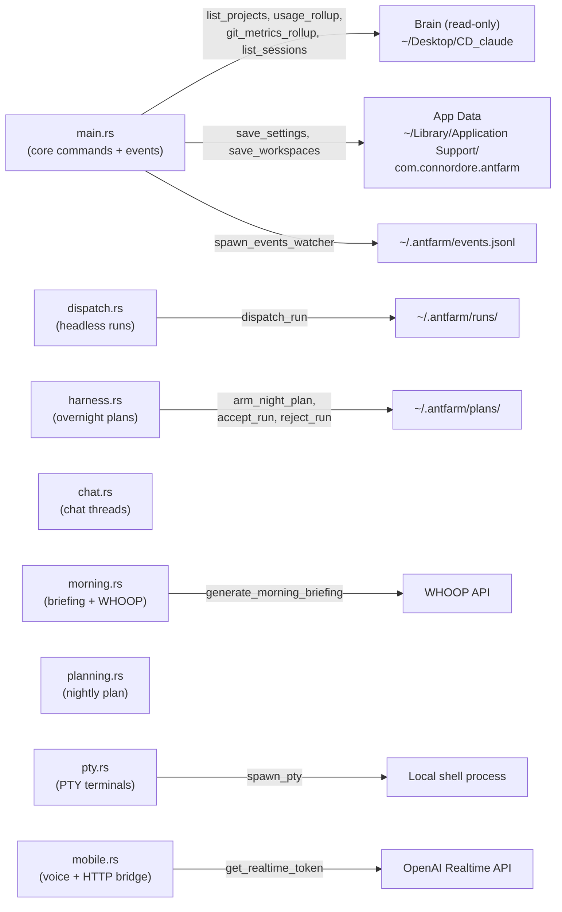

# Backend Architecture

The Ant Farm backend is a Rust binary compiled as a [Tauri](https://tauri.app) application. It owns the entire system side of the app: spawning child processes, reading local files, managing shared mutable state, and pushing events to the React frontend over Tauri’s IPC bridge. All user-visible behavior in Ant Farm is eventually grounded in a `#[tauri::command]` defined here.

**Parent topic:** [Architecture](../architecture.md)

---

## Module Layout

`src-tauri/src/main.rs` is the entry point and core module. Seven sibling modules are declared at the top of `main.rs` and compiled as separate files:

```
src-tauri/src/
├── main.rs       — tauri::Builder, shared state, core commands, events watcher
├── chat.rs       — chat threads, build-from-chat, arm-chat-plan
├── dispatch.rs   — headless claude -p dispatch, run records, worktree isolation
├── harness.rs    — overnight multi-step plans, budget gates, accept/reject
├── mobile.rs     — voice STT/TTS, realtime token, local HTTP bridge (port 8787)
├── morning.rs    — morning briefing, WHOOP integration, insight generation
├── planning.rs   — nightly plan-chat, lock-tomorrow-plan
└── pty.rs        — PTY terminals via portable-pty
```

Each module exposes `pub fn` commands marked `#[tauri::command]` that are collected in the `tauri::generate_handler!` macro in `main`.

---

## Mermaid: Module and Responsibility Map



---

## `tauri::Builder` and Managed State

`main()` instantiates all shared state before constructing the builder. The pattern is `Arc<Mutex<...>>` for everything that must be mutated from multiple threads:

| State type | Registered via | Purpose |
| --- | --- | --- |
| `EventsState` | `.manage(events_state)` | In-memory session statuses derived from `events.jsonl` |
| `dispatch::DispatchState` | `.manage(dispatch_state)` | Running child handles, killed-run set, resolved `claude` path |
| `harness::HarnessState` | `.manage(harness_state)` | Per-plan abort flags |
| `pty::PtyState` | `.manage(pty_state)` | Map of PTY IDs to writer + master + child |
| `mobile::VoicePendingState` | `.manage(...)` | Queued voice intents from the mobile bridge |

Inside `setup`, before the window opens:

1.  `harness::reconcile_orphans()` — marks any run left `"running"` from a prior crash as `"interrupted"`.
2.  `mobile::start(app.handle().clone())` — starts the `tiny_http` server on `127.0.0.1:8787` in a background thread.
3.  `dispatch::resolve_claude_path()` — locates the `claude` CLI via a login shell (`/bin/zsh -lc command -v claude`) so the `.app` bundle picks up NVM, Homebrew, and custom `PATH` entries.
4.  `spawn_events_watcher(...)` — spawns the file-watch loop for `~/.antfarm/events.jsonl`.
5.  A `CloseRequested` handler on the main window calls `pty::kill_all(...)` to prevent zombie shell processes.

The window is configured in `tauri.conf.json`: 1100×740 px, min 760×500, decorated, with `csp: null` (local content only).

---

## The Command Surface

Commands are grouped below by the module that defines them. Every name here appears verbatim in the `tauri::generate_handler!` macro in `main.rs`.

### Core (`main.rs`)

These commands are defined as free functions in `main.rs` and handle the primary read path against the project brain and app data directory.

| Command | Description |
| --- | --- |
| `list_projects` | Scans `~/Desktop/CD_claude/tools-built/`, reads each project’s `README.md`, and returns a sorted `Vec<Project>`. |
| `get_project_detail` | Returns the full `ProjectDetail` for one slug: `readme`, `ideas`, `notes_files`, and registry repos. |
| `get_file_content` | Reads a single file from a project’s `notes/` subdirectory. Guards against path traversal (rejects `/`, `\`, and leading `.`). |
| `get_settings` | Deserializes `settings.json` from the app data dir; returns defaults on failure. |
| `save_settings` | Writes `Settings` (`weekly_cap_tokens`, `reset_weekday`) to `settings.json`. |
| `usage_rollup` | Scans `~/.claude/projects/**/*.jsonl`, applies an mtime/size incremental cache, returns per-day and per-project token + dollar breakdowns. |
| `list_sessions` | Combines Claude Code and Cowork session scans, then overlays event-derived statuses from `EventsState`. |
| `active_session_count` | Fast process-count check (`count_live_claude`). |
| `needs_you_count` | Counts sessions with `attention: true` in `EventsState`. |
| `git_metrics_rollup` | Per-repo commit, line-change, and file-change rollups with a `HEAD sha + week_start` cache key. |
| `working_tree_rollup` | Runs `git status --porcelain` on each repo; sorts dirty files oldest-mtime-first. |
| `get_project_paths` | Resolves repo basenames through the registry and active session paths to absolute filesystem paths. |
| `load_workspaces` | Reads the `workspaces.json` file for the tabbed workspace layout. |
| `save_workspaces` | Persists workspace layout JSON to app data. |
| `list_slash_commands` | Scans `~/.claude/skills/` for `SKILL.md` files with YAML frontmatter; returns `name` + `description`. |
| `wrapped_stats` | Builds a period comparison (week / month / all-time) for the Wrapped recap view. |
| `save_png_to_desktop` | Base64-decodes a PNG and writes it to `~/Desktop/<filename>`. |
| `open_devtools` | Opens the WebView DevTools window; no-op in release builds. |

### `dispatch` module

See [Dispatch](../features/dispatch.md) for the full feature walkthrough.

| Command | Description |
| --- | --- |
| `dispatch_run` | Spawns `claude -p <prompt> --output-format stream-json` (optionally with `--worktree`) in a background thread. Streams `RunEvent` payloads to the frontend via `app.emit("antfarm-run-event", ...)`. Persists `RunRecord` JSON under `~/.antfarm/runs/`. |
| `list_runs` | Lists `RunRecord` files from `~/.antfarm/runs/`, optionally filtered by `project_path`. |
| `kill_run` | Writes `"killed"` status immediately, then sends `SIGTERM` to the child via the `DispatchState.children` map. |
| `take_over_run` | Opens a new terminal window pre-filled with a `claude` session-resume command for the given `run_id`. |

`dispatch_run` resolves `claude` at startup rather than at dispatch time; the resolved path is stored in `DispatchState.claude_path` (`Arc<Mutex<String>>`). stdout and stderr are each read on their own `std::thread::spawn` reader. The stdout reader captures the `session_id` from the stream-json `system/init` line.

### `harness` module

See [Overnight Harness](../features/overnight-harness.md) for the full feature walkthrough.

| Command | Description |
| --- | --- |
| `arm_night_plan` | Validates and arms a `NightPlan` from a YAML path; launches `execute_plan` in a background thread. |
| `abort_night_plan` | Sets the abort flag in `HarnessState.aborts` for the given plan ID. |
| `list_plan_states` | Reads all `~/.antfarm/plans/<id>/state.json` files and returns their statuses. |
| `harness_run_diff` | Returns the `git diff` of a completed harness run’s worktree against its base branch. |
| `accept_run` | Merges a run’s worktree branch back to the project’s main branch. |
| `reject_run` | Marks a run as rejected without merging. |
| `take_over_overnight_run` | Opens a terminal for interactive takeover of an in-progress harness run. |
| `list_stale_worktrees` | Finds worktrees older than `days` days. |
| `harness_run_summary` | Returns the LLM-authored summary for a completed run. |
| `validate_plan_file` | Validates a plan YAML file and returns a `PlanValidation` result. |
| `author_plan` | Calls `claude -p` to generate a structured `NightPlan` from a natural-language description. |
| `propose_plan` | Like `author_plan` but returns a proposal without arming it. |
| `dev_test_harness` | Developer fixture: runs a simple single-step test plan. |
| `dev_test_3step_fail` | Developer fixture: three-step plan where step 2 is designed to fail. |
| `dev_test_budget_gate` | Developer fixture: triggers the per-step budget-gate path. |
| `dev_test_parallel` | Developer fixture: tests parallel step execution. |
| `dev_test_escalation` | Developer fixture: tests the escalation-to-human path. |

`HarnessState` holds `Arc<Mutex<HashMap<String, bool>>>` abort flags. Each plan runs on its own `std::thread::spawn` thread; steps communicate via `std::sync::mpsc` channels for budget-gate decisions.

### `chat` module

See [Morning & Planning](../features/morning-and-planning.md) for context on how chat threads integrate with planning.

| Command | Description |
| --- | --- |
| `load_chat` | Loads a `ChatThread` from disk by key. |
| `send_chat_message` | Sends a message to `claude -p` in streaming mode and appends the response to the thread. |
| `build_from_chat` | Converts a completed chat thread into a harness plan structure. |
| `arm_chat_plan` | Arms a plan derived from a chat thread via `harness::arm_plan_from_path`. |

### `morning` module

See [Morning & Planning](../features/morning-and-planning.md) for the full feature walkthrough.

| Command | Description |
| --- | --- |
| `generate_morning_briefing` | Runs the chief-of-staff agent (`claude -p`) with WHOOP data and project context; caches result to disk. |
| `morning_chat_send` | Sends a follow-up message in the morning briefing chat session. |
| `morning_insight` | Asks `claude -p` a pointed insight question about a specific project or topic. |
| `refresh_whoop` | Fetches today’s WHOOP metrics (sleep, HRV, strain) from the WHOOP API and updates the cache. |
| `get_morning_cache` | Returns the cached morning briefing string without triggering a regeneration. |
| `get_whoop_today` | Returns today’s WHOOP metrics from cache as `serde_json::Value`. |

### `planning` module

See [Morning & Planning](../features/morning-and-planning.md) for context.

| Command | Description |
| --- | --- |
| `plan_chat_send` | Sends a message in the nightly planning chat; streams response. |
| `lock_tomorrow_plan` | Finalizes tomorrow’s plan: invokes `claude -p` to structure the chat into a locked plan document. |
| `get_tomorrow_plan` | Returns the current locked tomorrow plan as a `TomorrowPlan`. |

### `pty` module

See [Workspace](../features/workspace.md) for the full PTY terminal feature walkthrough.

| Command | Description |
| --- | --- |
| `spawn_pty` | Allocates a `portable_pty` pair, spawns a shell (defaulting to `$SHELL`), and starts a reader thread that emits base64-encoded chunks as `"pty-data-<id>"` Tauri events. |
| `write_pty` | Decodes a base64 payload and writes it to the PTY master writer. |
| `resize_pty` | Resizes the PTY via `MasterPty::resize`. |
| `kill_pty` | Kills the child process and removes the entry from `PtyState`. |

Each PTY’s reader thread emits `app.emit("pty-data-<id>", chunk)` so the frontend’s xterm.js instance can write the bytes directly.

### `mobile` module

See [Voice & Mobile](../features/voice-and-mobile.md) for the full feature walkthrough.

| Command | Description |
| --- | --- |
| `voice_stt` | Decodes a base64 audio blob and sends it to the OpenAI Whisper transcription endpoint via `reqwest` (blocking). |
| `voice_tts` | Posts text to the OpenAI TTS endpoint and returns base64-encoded audio. |
| `get_realtime_token` | Calls `POST /v1/realtime/client_secrets` on the OpenAI API and returns a short-lived token + model + session ID for WebRTC. |
| `append_voice_log` | Appends a line to the voice session log file on disk. |
| `tool_get_brief` | Returns the current morning briefing text for use in voice tool calls. |
| `tool_draft_dispatch` | Drafts a dispatch run from a voice command (does not launch). |
| `tool_launch_dispatch` | Launches a previously drafted dispatch run. |
| `tool_lock_tomorrow_plan` | Locks tomorrow’s plan from a voice command. |
| `jarvis_chat` | Routes a Captain Jack (voice assistant persona) message through `claude -p` with project context injected. |

The mobile module also runs `mobile::start()` — a `tiny_http` server on `127.0.0.1:8787` — as a separate `std::thread::spawn` thread. The server provides a token-gated REST API for mobile access to harness state, diffs, and summaries. The token is a UUID stored in app data and must be included in every request as a bearer token or query parameter.

---

## Concurrency Model

Ant Farm uses `std::thread` throughout — no async runtime on the Tauri side except for `async fn` commands handled by Tauri’s built-in executor.

```
main thread
  └── tauri event loop (window + IPC)
        ├── EventsState (Arc<Mutex<...>>) — read by list_sessions / needs_you_count
        ├── DispatchState (Arc<Mutex<...>>) — children map + killed set + claude path
        ├── HarnessState (Arc<Mutex<...>>) — abort flags per plan
        ├── PtyState (Arc<Mutex<...>>) — PTY entries
        └── VoicePendingState (Arc<Mutex<...>>) — queued voice intents

background threads (std::thread::spawn)
  ├── events watcher   — notify watcher loop → mpsc::channel → process_events_file → app.emit
  ├── mobile HTTP      — tiny_http blocking accept loop on :8787
  ├── per dispatch run — stdout reader thread + stderr reader thread (2 threads per run)
  ├── per harness plan — plan executor thread (steps use inner mpsc for budget decisions)
  └── per PTY          — reader thread draining master pty → app.emit("pty-data-<id>", ...)
```

Long-running child processes (`claude -p`) are launched with `std::process::Command` using `Stdio::piped()`. Each process gets two reader threads: one for stdout (stream-json lines) and one for stderr. Both threads emit events via `AppHandle::emit` / `Emitter` and terminate when their pipe closes or the process exits.

---

## File Watching and Event Emission

The `spawn_events_watcher` function (defined in `main.rs`) starts a single background thread that watches the `~/.antfarm/` directory using the `notify` crate (`RecommendedWatcher` with `RecursiveMode::NonRecursive`).

When `events.jsonl` changes:

1.  The watcher sends a `notify::Event` through an `mpsc::channel` to the reader loop.
2.  `process_events_file` re-opens the file at the last persisted byte offset, reads new lines, and updates `EventsState` with derived session statuses (`"running"`, `"idle"`, `"needs-you"`, `"done"`).
3.  The offset is persisted to `app_data_dir()/events_offset.json` after each batch so the watcher can resume after a restart without re-reading the entire file.
4.  `app.emit("antfarm-events-updated", ())` notifies the frontend to re-call `list_sessions`.

If the file shrinks (rotated or truncated), the offset resets to 0.

Tauri events used by the backend:

| Event name | Emitter | Frontend subscriber |
| --- | --- | --- |
| `antfarm-events-updated` | events watcher | Sessions page polling hook |
| `antfarm-run-event` | dispatch reader threads | DispatchPanel live log |
| `pty-data-<id>` | PTY reader thread | xterm.js `Terminal.write()` |

---

## Cargo Dependencies

Defined in `src-tauri/Cargo.toml`:

| Crate | Version | Role |
| --- | --- | --- |
| `tauri` | 2 (feature: `devtools`) | Application framework; window, IPC, event emission |
| `tauri-plugin-shell` | 2 | `shell:allow-open` permission for `open_devtools` |
| `serde` / `serde_json` | 1 | Serialization of all IPC types and JSON file I/O |
| `chrono` | 0.4 (feature: `serde`) | Date arithmetic for usage rollup and weekly resets |
| `notify` | 6 | File-system event watching (`RecommendedWatcher`) |
| `portable-pty` | 0.9 | Cross-platform PTY allocation and I/O |
| `base64` | 0.22 | Encoding PTY output and PNG data for IPC transport |
| `tiny_http` | 0.12 | Minimal HTTP server for the mobile bridge on `:8787` |
| `reqwest` | 0.12 (features: `json`, `multipart`, `rustls-tls`, `blocking`) | HTTP client for WHOOP, OpenAI STT/TTS, and realtime token APIs |

`reqwest` is compiled with `rustls-tls` (pure-Rust TLS) so the app has no system OpenSSL dependency. The `blocking` feature is used in the `voice_stt` and `voice_tts` commands which are called from synchronous `#[tauri::command]` functions.

---

## Tauri Capabilities

`src-tauri/capabilities/default.json` defines the permissions granted to the main window:

```json
{
  "identifier": "default",
  "windows": ["main"],
  "permissions": [
    "core:default",
    "shell:allow-open"
  ]
}
```

`core:default` grants the standard Tauri core permissions (IPC, window management, path resolution). `shell:allow-open` is used by `open_devtools` to open the browser DevTools panel. No other shell execution permissions are declared — process spawning is done from Rust code directly via `std::process::Command`, not through Tauri’s shell plugin.

---

## Release Profile

`src-tauri/Cargo.toml` `[profile.release]`:

```toml
panic = "abort"       # smaller binary, no unwinding
codegen-units = 1     # single CGU for maximum LTO inlining
lto = true            # link-time optimization
opt-level = "s"       # optimize for size
strip = true          # strip debug symbols from the binary
```

The combination of `lto`, `codegen-units = 1`, and `opt-level = "s"` produces a compact binary suitable for distribution as a macOS `.app` bundle. `panic = "abort"` avoids the cost of stack-unwinding machinery; Rust panics in release terminate the process immediately rather than attempting cleanup.

---

## Key Design Constraints

Understanding these four constraints is essential for extending the backend correctly.

**Observe-first.** The backend never writes to the project brain (`~/Desktop/CD_claude/`). All brain reads are done with `fs::read_to_string` and `fs::read_dir`. Commands that need to modify project data dispatch a headless `claude -p` run to do the writing — the backend is an observer, not an editor.

**Zero-API.** Core features (projects, sessions, usage, git metrics, working tree) require no network calls. The backend reads local files only. Network calls are confined to the `morning`, `mobile`, `planning`, and `chat` modules, and only when the user explicitly triggers a briefing, voice session, or planning flow.

**Tolerant parsers.** Every JSON/JSONL file read — usage JSONL, events JSONL, run records, plan state — is parsed with `serde_json::from_str(...).ok()` or `unwrap_or_default()`. Missing fields or malformed lines are silently skipped. This ensures that a corrupted or partially-written file never prevents the app from loading.

**Sandboxed writes.** The only directories the backend writes to are:

-   `~/Library/Application Support/com.connordore.antfarm/` — settings, caches, offsets
-   `~/.antfarm/runs/` — dispatch run records
-   `~/.antfarm/plans/` — harness plan state
-   `~/.antfarm/voice/` — voice session logs
-   `~/Desktop/<filename>.png` — via `save_png_to_desktop` only

It does not write to project repos directly. Harness `accept_run` merges a worktree branch, but the merge is executed by a `git` subprocess in the repo, not by the backend writing files directly.

---

## Related Topics

-   [Architecture](../architecture.md) — the overall Tauri app structure and IPC model
-   [Local Data Sources](../architecture/data-sources.md) — every file the backend reads or writes
-   [Dispatch](../features/dispatch.md) — `dispatch_run`, run records, worktree isolation
-   [Overnight Harness](../features/overnight-harness.md) — `arm_night_plan`, multi-step plans, accept/reject
-   [Workspace](../features/workspace.md) — PTY terminals, `spawn_pty`, xterm.js integration
-   [Morning & Planning](../features/morning-and-planning.md) — `generate_morning_briefing`, `plan_chat_send`, `lock_tomorrow_plan`
-   [Voice & Mobile](../features/voice-and-mobile.md) — `voice_stt`, `get_realtime_token`, the `:8787` HTTP bridge
