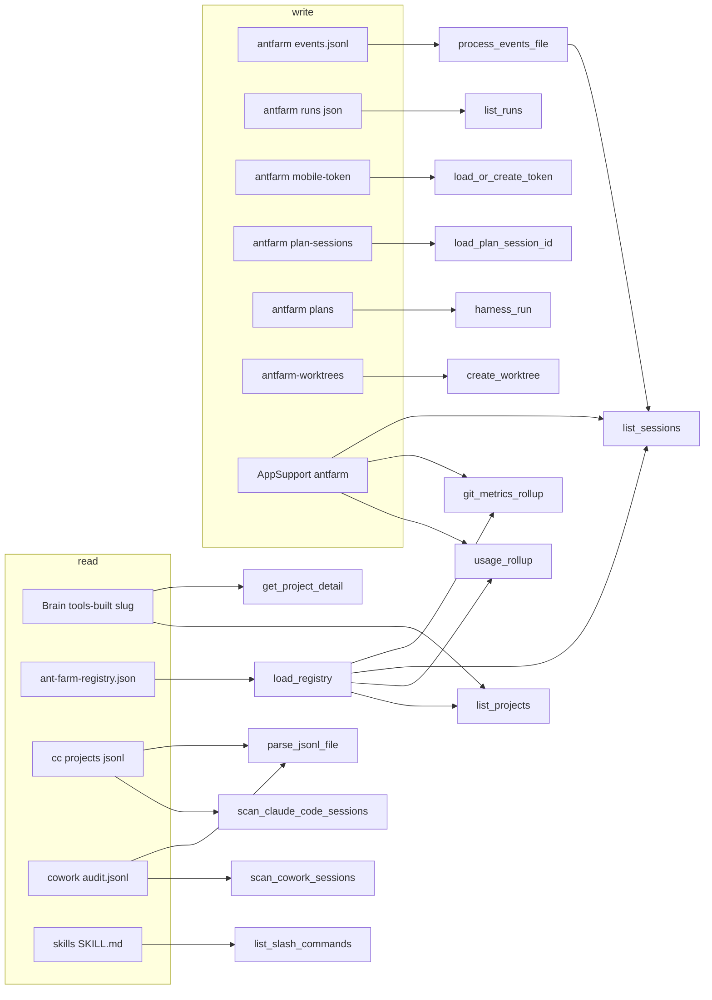

# Local Data Sources

Ant Farm operates on a strict two-tier model: a read-only view into your project brain and session history, and a sandboxed write area the app owns outright. This page is the definitive reference for every file path the app touches, whether it may be mutated, what it contains, and which backend function or feature depends on it.

**Parent:** [Architecture](../architecture.md)

---

## Guiding constraints

Four principles shape every data-source decision in the codebase:

| Constraint | Behaviour |
| --- | --- |
| **Observe-first** | The project brain at `~/Desktop/CD_claude/` is strictly read-only. The app never creates or modifies files there. |
| **Zero-API** | Every number — tokens, cost, git stats — comes from local files and the process table. No network calls are made to resolve them. |
| **Tolerant parsers** | A malformed JSONL line or a missing file degrades gracefully to “details unavailable”. It never crashes a list or rollup. |
| **Sandboxed writes** | Writes are confined to `~/.antfarm/` and `~/Library/Application Support/com.connordore.antfarm/`. The app never writes into a repo or the brain. |

---

## Path quick-reference

| Path | R/W | Purpose | Feature |
| --- | --- | --- | --- |
| `~/Desktop/CD_claude/tools-built/<slug>/README.md` | R | Project name and status line | [Projects](../features/projects.md) |
| `~/Desktop/CD_claude/tools-built/<slug>/ideas.md` | R | Idea bullet count | [Projects](../features/projects.md) |
| `~/Desktop/CD_claude/tools-built/<slug>/decisions.md` | R | Decision bullet count | [Projects](../features/projects.md) |
| `~/Desktop/CD_claude/tools-built/<slug>/notes/<file>` | R | Notes file content | [Projects](../features/projects.md) |
| `~/Desktop/CD_claude/ant-farm-registry.json` | R | slug to repo-basename map | [Projects](../features/projects.md), [Sessions](../features/sessions.md), [Usage](../features/usage.md), [Git Metrics](../features/git-metrics.md) |
| `~/.claude/projects/*/*.jsonl` | R | Claude Code session transcripts | [Sessions](../features/sessions.md), [Usage](../features/usage.md) |
| `~/Library/Application Support/Claude/local-agent-mode-sessions/` | R | Cowork session tree | [Sessions](../features/sessions.md), [Usage](../features/usage.md) |
| `~/.claude/skills/*/SKILL.md` | R | Installed slash-command definitions | Settings panel |
| `~/.antfarm/events.jsonl` | W† | Hook-appended lifecycle events | [Sessions](../features/sessions.md) |
| `~/.antfarm/hooks/` | W | Status hook install directory | [Sessions](../features/sessions.md) |
| `~/.antfarm/runs/<run-id>.json` | W | Dispatch RunRecord per headless run | [Dispatch](../features/dispatch.md) |
| `~/.antfarm/mobile-token` | W | Auto-generated 16-byte hex token | [Voice and Mobile](../features/voice-and-mobile.md) |
| `~/.antfarm/openai-key` | W | Optional OpenAI key file fallback | [Voice and Mobile](../features/voice-and-mobile.md) |
| `~/.antfarm/plan-sessions/<date-key>.txt` | W | Nightly planning session IDs | [Morning and Planning](../features/morning-and-planning.md) |
| `~/.antfarm/plans/<plan-id>/` | W | Overnight harness plan runtime state | [Overnight Harness](../features/overnight-harness.md) |
| `~/.antfarm/plans-authored/` | W | Mobile-authored plans awaiting arming | [Overnight Harness](../features/overnight-harness.md) |
| `~/.antfarm/allowlists/` | W | Per-project Claude allowlists for worktree runs | [Overnight Harness](../features/overnight-harness.md) |
| `<repo>/.antfarm-worktrees/<run-id>/` | W | Git worktrees for harness runs | [Overnight Harness](../features/overnight-harness.md) |
| `~/Library/Application Support/com.connordore.antfarm/events_offset.json` | W | Byte offset for incremental events.jsonl reads | [Sessions](../features/sessions.md) |
| `~/Library/Application Support/com.connordore.antfarm/usage_cache.json` | W | Incremental usage cache keyed by path and mtime and size | [Usage](../features/usage.md) |
| `~/Library/Application Support/com.connordore.antfarm/git_metrics_cache.json` | W | Git metrics cache keyed by repo path and HEAD SHA and week-start | [Git Metrics](../features/git-metrics.md) |
| `~/Library/Application Support/com.connordore.antfarm/settings.json` | W | App settings: weekly cap and reset weekday | All |
| `~/Library/Application Support/com.connordore.antfarm/workspaces.json` | W | Named workspace entries with persisted layout JSON | [Workspace](../features/workspace.md) |

*†Written by `antfarm_status_hook.sh` on the Claude Code side, not by the Tauri process itself.*

---

## Data-source to consumer diagram



---

## READ sources

The app never creates, modifies, or deletes anything in these locations.

### Brain (`~/Desktop/CD_claude/tools-built/<slug>/`)

The brain is the human-maintained source of truth for every project. The backend helper `brain_root()` in `src-tauri/src/main.rs` builds this path as `home_dir().join("Desktop").join("CD_claude")`. Each project has a slug-named subdirectory under `tools-built/`.

Files the app reads inside each slug directory:

| File | Data extracted |
| --- | --- |
| `README.md` | Project name: first `# Heading` line via `extract_h1`. Status: first `Status:` prefix line via `extract_status`. |
| `ideas.md` | Bullet count: lines starting with `-` or `*` via `count_bullets`. |
| `decisions.md` | Same bullet-count logic as [ideas.md](http://ideas.md). |
| `notes/<filename>` | Raw string content returned by `get_file_content` on request. |

`list_projects` reads `README.md`, `ideas.md`, and `decisions.md` for every slug directory, plus calls `newest_mtime` to find the most recently modified file anywhere in the slug tree — this drives sort order in the project grid.

`get_project_detail` returns the full text of `README.md` and `ideas.md`, and lists the filenames inside `notes/`.

**Path traversal guard.** `get_file_content` rejects any filename containing `/`, `\`, or a leading `.` before constructing the path. It is not possible to escape the `notes/` directory.

**Failure mode.** A missing brain directory produces an empty project list. A missing individual file returns `None` or `0`; it is never surfaced as an error to the caller.

---

### Registry (`~/Desktop/CD_claude/ant-farm-registry.json`)

A single JSON file mapping project slugs to repository basenames:

```json
{
  "projects": {
    "ant-farm": { "repos": ["antfarm"] },
    "my-tool":  { "repos": ["my-tool", "my-tool-backend"] }
  }
}
```

`load_registry()` reads and deserializes this file fresh on every command call that needs it: `list_projects`, `usage_rollup`, `list_sessions`, and `git_metrics_rollup`. The registry is the connective tissue that routes a Claude Code `cwd` path or a Cowork `userSelectedFolders` entry back to a project slug.

Two matching strategies are used:

-   `match_dir_to_slug` — suffix-matches the encoded CC project directory name against `-<repo-basename>`, taking the longest match to avoid ambiguity.
-   `match_basename_to_slug` / `match_cwd_to_slug_ci` — exact or case-insensitive match on the final path component.

**Failure mode.** Any I/O or deserialization error returns `Registry::default()` (an empty project map). Unmatched sessions and transcript files land in the `"unfiled"` bucket.

---

### Claude Code sessions (`~/.claude/projects/*/*.jsonl`)

Claude Code stores one `.jsonl` file per session under `~/.claude/projects/<encoded-cwd>/<session-id>.jsonl`. Each line is a JSON object.

**Token extraction.** Only lines with `"type": "assistant"` are parsed. Usage data lives at `message.usage`:

-   `input_tokens`
-   `output_tokens`
-   `cache_read_input_tokens`
-   `cache_creation_input_tokens`

The model identifier is read from `message.model` and passed to `model_rates()`, which returns per-million-token `(input_rate, output_rate)` pairs used to compute `est_dollars_for`.

**Cheap parse.** `cc_session_cheap_parse` reads only the first **8 192 bytes** of each file to extract `aiTitle`, `cwd`, and the first `timestamp`. This keeps session listing fast with hundreds of transcripts.

**Incremental cache.** `usage_rollup` and `wrapped_stats` maintain `~/Library/Application Support/com.connordore.antfarm/usage_cache.json`. Each entry is keyed by absolute file path and stores `{ mtime, size, days }`. A file is only re-parsed when its mtime or size has changed since the last scan.

**Failure mode.** A malformed JSON line is skipped with `continue`. An unreadable file is skipped entirely. A missing `~/.claude/projects` directory returns an empty result without error.

---

### Cowork sessions (`~/Library/Application Support/Claude/local-agent-mode-sessions/`)

Cowork stores sessions in a three-level tree:

```
local-agent-mode-sessions/
  <space-id>/
    <workspace-id>/
      local_<session-id>.json          <- session metadata
      local_<session-id>/
        audit.jsonl                    <- usage data
```

The metadata `.json` provides `sessionId`, `title`, `userSelectedFolders` (array of repo paths), `createdAt` (millisecond epoch), and `lastActivityAt` (millisecond epoch). Slug resolution uses the basename of the first `userSelectedFolders` entry matched against the registry.

`audit.jsonl` follows the same per-line format as Claude Code transcripts but uses `_audit_timestamp` instead of `timestamp` as the date key field, so both sources flow through the same `parse_jsonl_file` function.

**Cutoff.** Sessions whose metadata file mtime is older than 90 days are skipped during scan.

**Failure mode.** A missing or malformed metadata `.json` uses the filename as the session ID and leaves title and timestamps as `None`. A missing `audit.jsonl` means zero token totals, not an error.

---

### Slash commands (`~/.claude/skills/*/SKILL.md`)

`list_slash_commands` scans `~/.claude/skills/` for subdirectories. Each subdirectory must contain a `SKILL.md` with YAML frontmatter delimited by `---`. The `name` field is the directory name; the `description` field is extracted by `parse_frontmatter_field`, a lightweight line scanner that handles unquoted and double-quoted values without a full YAML parser.

**Failure mode.** A missing skills directory or a `SKILL.md` without parseable frontmatter is silently skipped. The command always returns a sorted partial list, never an error.

---

## WRITE sources

Every write path is under `~/.antfarm/` or the macOS Application Support sandbox.

### `~/.antfarm/events.jsonl`

The push-status file. `antfarm_status_hook.sh` appends one JSON line per Claude Code lifecycle event:

```json
{ "session_id": "<id>", "hook_event_name": "Stop", "cwd": "/path/to/repo" }
```

Hook events map to statuses:

| `hook_event_name` | `notification_type` | Derived status |
| --- | --- | --- |
| `SessionStart` | — | `running` |
| `Stop` | — | `idle` |
| `SessionEnd` | — | `done` |
| `Notification` | `permission_prompt` | `needs_permission` |

The Tauri backend watches `~/.antfarm/` (non-recursive) using `notify::RecommendedWatcher`. On each file-change event `process_events_file` seeks to the byte offset stored in `events_offset.json` and reads only new bytes. If the file shrinks (log rotation or manual truncation), the offset resets to 0.

Event-derived statuses are held in `EventsState` and override the process-table + mtime heuristic for the matching session ID in `list_sessions`. See [Sessions and Push Status](../features/sessions.md).

---

### `~/.antfarm/hooks/`

Designated install directory for `antfarm_status_hook.sh`. The user places the script here during setup and marks it executable. The Tauri process receives hook output only indirectly through `events.jsonl`; it does not spawn the hook itself.

---

### `~/.antfarm/runs/<run-id>.json`

`save_record` in `src-tauri/src/dispatch.rs` writes one JSON file per dispatch run. Run IDs have the format `run-<unix-ts>-<zero-padded-counter>`. The `RunRecord` fields are:

```
run_id          — unique run identifier
project_path    — path the run was launched against
effective_cwd   — actual working directory used
prompt          — the text prompt sent to claude -p
status          — running | done | failed | killed
started_at      — ISO 8601 timestamp
finished_at     — ISO 8601 timestamp or null
used_worktree   — whether --worktree flag was passed
session_id      — captured from the stream-json init line once available
permission_mode — acceptEdits | dontAsk (passed as --permission-mode)
```

`session_id` is populated asynchronously as soon as the `claude -p` process emits its init line, enabling one-click takeover via `take_over_run`. See [Dispatch](../features/dispatch.md).

---

### `~/.antfarm/mobile-token`

Generated once from `/dev/urandom` (16 bytes, encoded as 32 hex characters) by `load_or_create_token` in `src-tauri/src/mobile.rs`. The file is written with mode `0o600`.

The token gates every request to the local HTTP bridge at `http://127.0.0.1:8787`. It is accepted as either `Authorization: Bearer <token>` in the request header or `?token=<token>` in the query string. If the file already contains a non-empty string it is reused unchanged on restart.

See [Voice and Mobile](../features/voice-and-mobile.md).

---

### `~/.antfarm/openai-key`

Optional fallback for the OpenAI API key. `openai_api_key()` in `mobile.rs` first checks the `OPENAI_API_KEY` environment variable; if absent or empty it reads `~/.antfarm/openai-key` and trims the content. The app only reads this file; the user is responsible for creating it.

See [Voice and Mobile](../features/voice-and-mobile.md).

---

### `~/.antfarm/plan-sessions/<date-key>.txt`

`planning.rs` stores the Claude Code session ID for each nightly planning conversation, keyed by date string (e.g. `2026-06-25`). This lets the Tonight view call `load_plan_session_id` to resume the same Claude session when the user returns during the same day. Written by `save_plan_session_id`; read by `load_plan_session_id`.

See [Morning and Planning](../features/morning-and-planning.md).

---

### `~/.antfarm/plans/` and `~/.antfarm/plans-authored/`

`harness.rs` uses two plan directories for the overnight harness:

-   **`~/.antfarm/plans/<plan-id>/`** — runtime state directory written during active harness execution. Each plan-id subdirectory holds step records and status.
-   **`~/.antfarm/plans-authored/`** — plans created through the mobile UI and staged for overnight arming.

See [Overnight Harness](../features/overnight-harness.md).

---

### `~/.antfarm/allowlists/`

`write_allowlist` in `harness.rs` writes a per-project Claude Code allowlist to this directory before each worktree step begins. The allowlist JSON is copied into `<worktree>/.claude/settings.json` and then added to `<worktree>/.git/info/exclude` so it does not appear as a dirty working-tree file during the agent run.

---

### `<repo>/.antfarm-worktrees/<run-id>/`

`create_worktree` in `harness.rs` constructs the path as `{repo}/.antfarm-worktrees/{run-id}` and calls `git worktree add` to create an isolated working tree on a dedicated branch named `antfarm/<run-id>`, branching from the current HEAD. Each harness step’s agent runs inside this worktree; the main branch is left untouched throughout.

Cleanup paths:

-   `reject_overnight_run` calls `git worktree remove --force` followed by `git worktree prune`.
-   `list_stale_worktrees` surfaces worktrees older than a configurable threshold for manual reconciliation.

See [Overnight Harness](../features/overnight-harness.md).

---

### Application Support sandbox (`~/Library/Application Support/com.connordore.antfarm/`)

`app_data_dir()` in `src-tauri/src/main.rs` resolves to this directory via `home_dir().join("Library/Application Support/com.connordore.antfarm")`.

| File | Purpose |
| --- | --- |
| `events_offset.json` | Byte offset into `~/.antfarm/events.jsonl` for incremental reads; resets to 0 when the file shrinks |
| `usage_cache.json` | Token rollup cache; each entry stores `{ mtime, size, days }` keyed by absolute file path |
| `git_metrics_cache.json` | Git commit and line metrics per repo; invalidated when HEAD SHA or week-start date changes |
| `settings.json` | `weekly_cap_tokens` (default 100 000 000) and `reset_weekday` (0=Monday through 6=Sunday) |
| `workspaces.json` | Array of `WorkspaceEntry` objects with `id`, `name`, optional `project_slug`, and `layout_json` |

---

## Liveness detection

The app uses two signals and promotes the push event as the authoritative override:

1.  **Process table.** `count_live_claude()` runs `ps ax -o comm=` and counts entries equal to `claude` or ending with `/claude`. A positive count indicates at least one active session.
    
2.  **Transcript mtime.** `session_status(last_activity_secs, has_live)` maps transcript age to a status string:
    
    -   Age under 120 seconds with a live process → `running`
    -   Age under 600 seconds with a live process → `waiting`
    -   Modified today → `idle`
    -   Older → `done`
3.  **Event override.** If `events.jsonl` contains a more recent event for a session, `list_sessions` replaces the heuristic with the event-derived status. This is the push path: the hook fires synchronously on the agent side, the `notify` watcher fires within milliseconds, and the frontend receives an `antfarm-events-updated` Tauri event immediately.
    
    A stale-guard clears `attention = true` for any session that is older than 600 seconds or has no live process, preventing phantom permission-prompt badges from dead sessions.
    

---

## Tolerant-parser guarantees

No data-source failure propagates as a panic or unhandled Tauri error. Every caller receives a partial or empty result, never an exception.

| Parser or loader | Failure behaviour |
| --- | --- |
| `load_registry` | Returns `Registry::default()` on any I/O or JSON error |
| `parse_jsonl_file` | Skips each malformed line with `continue`; returns whatever day buckets parsed successfully |
| `cc_session_cheap_parse` | Reads at most 8 192 bytes; missing fields return `None`, not an error |
| `scan_cowork_sessions` | Missing metadata `.json` uses filename as session ID; missing `audit.jsonl` gives zero tokens |
| `process_events_file` | Skips malformed event lines; resets offset if file shrinks |
| `get_project_detail` | Missing `ideas.md` or `notes/` files return `None` or empty vec respectively |
| `list_slash_commands` | Missing skills directory or unreadable `SKILL.md` frontmatter is silently skipped |

---

## Related topics

-   [Architecture](../architecture.md) — the Tauri model and observe-first data flow
-   [Backend](../architecture/backend.md) — Rust module layout and the full IPC command surface
-   [Projects](../features/projects.md) — how the brain directory is scanned and rendered
-   [Sessions and Push Status](../features/sessions.md) — the full push-status lifecycle driven by `events.jsonl`
-   [Usage, Cost and Wrapped](../features/usage.md) — how JSONL tokens become dollar estimates with per-model pricing
-   [Git Metrics and Working Tree](../features/git-metrics.md) — how repos are resolved from the registry and metrics are cached
-   [Dispatch](../features/dispatch.md) — run records, streaming logs, and one-click takeover
-   [Overnight Harness](../features/overnight-harness.md) — multi-step plans, worktrees, allowlists, and diff review
-   [Morning and Planning](../features/morning-and-planning.md) — nightly planning and session resumption
-   [Voice and Mobile](../features/voice-and-mobile.md) — mobile token, OpenAI key, and the local HTTP bridge
