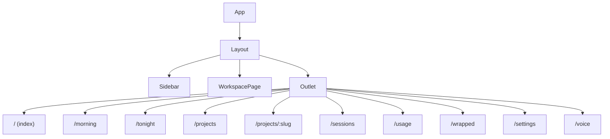

# Frontend Architecture

**Parent topic:** [Architecture](../architecture.md)

The Ant Farm frontend is a React 18 + TypeScript single-page application embedded inside a Tauri v2 shell. It runs in the system webview (WebKit on macOS), talks to the Rust backend exclusively through Tauri’s typed IPC `invoke` calls, and never makes outbound network requests on its own. The observe-first, zero-API constraint means every piece of data the frontend shows is fetched from the backend, which in turn reads local files.

**Prerequisites:** Familiarity with React hooks and TypeScript. For the backend commands this layer calls, see [Backend](../architecture/backend.md). For the local files those commands read, see [Local Data Sources](../architecture/data-sources.md).

---

## Entry Points

### `src/main.tsx`

The Vite entry point. It mounts `<App />` into `#root`:

```tsx
ReactDOM.createRoot(document.getElementById("root")!).render(<App />);
```

`React.StrictMode` is intentionally absent. The Workspace page uses `dockview` for its tiling layout, and dockview renders panel content through React portals. StrictMode’s dev-only double-mount tears down dockview’s portal lifecycle, leaving panels blank. The production build was unaffected; the decision is recorded in `decisions.md` (2026-06-11).

`src/index.css` is imported here; it applies Tailwind base/components/utilities and sets `html, body, #root` to full height with `bg-surface-0` and `text-zinc-100`.

### `src/App.tsx`

`App` wraps the whole tree in a `<BrowserRouter>` and declares the route table:

```tsx
<BrowserRouter>
  <Routes>
    <Route element={<Layout />}>
      <Route index element={<Home />} />
      <Route path="morning"         element={<Morning />} />
      <Route path="tonight"         element={<Tonight />} />
      <Route path="projects"        element={<Projects />} />
      <Route path="projects/:slug"  element={<ProjectDetail />} />
      <Route path="sessions"        element={<Sessions />} />
      <Route path="usage"           element={<Usage />} />
      <Route path="wrapped"         element={<Wrapped />} />
      <Route path="workspace"       element={null} />
      <Route path="settings"        element={<Settings />} />
      <Route path="voice"           element={<VoiceMode />} />
    </Route>
  </Routes>
</BrowserRouter>
```

`/workspace` passes `element={null}` because the Workspace page is always mounted by `Layout` directly (see below).

---

## Routing Tree



All routes share the same `<Layout>` shell. The Workspace pane is toggled with CSS visibility rather than mounting/unmounting, so the PTY terminals inside it never lose their state during navigation.

---

## `src/components/Layout.tsx`

`Layout` is the single layout route component rendered for all paths. It reads the current pathname from `useLocation()` and applies a CSS `display` toggle:

```tsx
const isWorkspace = pathname === "/workspace";

<div className="flex h-full overflow-hidden">
  <Sidebar />
  <div style={{ display: isWorkspace ? "flex" : "none", flexDirection: "column" }}>
    <WorkspacePage />          {/* always mounted */}
  </div>
  <main
    className="flex-1 overflow-y-auto bg-surface-0"
    style={{ display: isWorkspace ? "none" : undefined }}
  >
    <Outlet />                 {/* all other routes */}
  </main>
</div>
```

When `display` transitions from `none` back to `flex`, the browser fires `ResizeObserver` inside `TerminalPane`, which triggers `xterm`’s `FitAddon.fit()` and a `resize_pty` IPC call to correct the PTY dimensions.

---

## `src/components/Sidebar.tsx`

The left navigation rail (220 px wide, `bg-surface-1`). It renders the `NAV` array as `<NavLink>` elements with Lucide icons and two live IPC-driven badges:

```ts
const NAV = [
  { to: "/morning",   label: "Morning",   icon: Sunrise,  end: false },
  { to: "/tonight",   label: "Tonight",   icon: Moon,     end: false },
  { to: "/voice",     label: "Voice",     icon: Radio,    end: false },
  { to: "/",          label: "Home",      icon: Home,     end: true  },
  { to: "/projects",  label: "Projects",  icon: Layers,   end: false },
  { to: "/sessions",  label: "Sessions",  icon: Activity, end: false },
  { to: "/usage",     label: "Usage",     icon: BarChart2,end: false },
  { to: "/wrapped",   label: "Wrapped",   icon: Gift,     end: false },
  { to: "/workspace", label: "Workspace", icon: PanelLeft,end: false },
  { to: "/settings",  label: "Settings",  icon: Settings, end: false },
];
```

**Live session count badge** — polls `active_session_count` every 30 seconds; renders an emerald pill next to “Sessions” when `liveCount > 0`.

**Tonight plan nudge** — after 20:00 local time, polls `get_tomorrow_plan` every 60 seconds; renders an amber dot next to “Tonight” when the plan is not yet locked.

Both intervals are cleaned up in the effect’s return. The `end: true` flag on the Home link prevents it from matching as active on every route.

---

## Pages

Each page is a top-level route component in `src/pages/`. They all follow the same fetch lifecycle described in the [IPC Pattern](#ipc-pattern) section below.

| Route | File | Feature doc |
| --- | --- | --- |
| `/` | `Home.tsx` | (aggregates [Usage](../features/usage.md), [Git Metrics](../features/git-metrics.md)) |
| `/morning` | `Morning.tsx` | [Morning & Planning](../features/morning-and-planning.md) |
| `/tonight` | `Tonight.tsx` | [Morning & Planning](../features/morning-and-planning.md) |
| `/projects` | `Projects.tsx` | [Projects](../features/projects.md) |
| `/projects/:slug` | `ProjectDetail.tsx` | [Projects](../features/projects.md) |
| `/sessions` | `Sessions.tsx` | [Sessions & Push Status](../features/sessions.md) |
| `/usage` | `Usage.tsx` | [Usage, Cost & Wrapped](../features/usage.md) |
| `/wrapped` | `Wrapped.tsx` | [Usage, Cost & Wrapped](../features/usage.md) |
| `/workspace` | `Workspace.tsx` | [Workspace](../features/workspace.md) |
| `/settings` | `Settings.tsx` | — |
| `/voice` | `VoiceMode.tsx` | [Voice & Mobile](../features/voice-and-mobile.md) |

**`Home.tsx`** calls `usage_rollup`, `get_settings`, `git_metrics_rollup`, and `working_tree_rollup` in parallel on mount; renders a `TokenChart`, stat cards, a weekly-cap progress bar, `ProjectBreakdown`, and git/working-tree summaries.

**`Sessions.tsx`** calls `list_sessions` on mount, then subscribes to the `antfarm-events-updated` Tauri event to refresh without polling. Sessions are grouped by `project_slug`; unfiled sessions rendered separately.

**`Projects.tsx`** calls `list_projects`, `git_metrics_rollup`, and `working_tree_rollup`; renders a responsive grid of `ProjectCard` components.

**`ProjectDetail.tsx`** calls `get_project_detail` with the `:slug` param; shows readme, ideas, and notes via `MarkdownView`, and embeds `DispatchPanel` for headless agent dispatch.

**`Usage.tsx`** calls `usage_rollup` and `get_settings`; renders a full-width `TokenChart`, four `StatCard` cells, and a `ProjectBreakdown` with usage bars. Shows file-cache diagnostics (`cached_files` / `parsed_files`).

**`Wrapped.tsx`** calls `get_wrapped_stats` with a period selector; uses `wrapped.ts` helpers to derive word-count and agent-hour equivalents; renders a shareable card using `html-to-image`.

**`Workspace.tsx`** is a ~2400-line file that implements a dockview-based tiled layout with PTY terminal panes, web/media panes, project-brief panes, and session-watcher panes. It is always mounted by `Layout` regardless of the current route.

**`Morning.tsx`** (~1360 lines) orchestrates the morning briefing: WHOOP health data, a chief-of-staff agent chat, and an insights carousel. Uses `useVoice` for the push-to-talk shortcut.

**`VoiceMode.tsx`** (~690 lines) manages a WebRTC data-channel session against the OpenAI Realtime API (token fetched via `get_realtime_token`), an animated orb driven by `AudioContext` analyser nodes, and a fallback STT/TTS path via `useVoice`.

---

## Shared Components

All shared components live in `src/components/`.

### `StatCard`

A small labelled metric tile. Props: `label`, `value`, `sub?`, `accent?`. When `accent` is true it uses an indigo border/background; otherwise a standard `surface-2` card.

```tsx
<StatCard label="Tokens" value="1.2M" sub="this week" accent />
```

### `SessionRow` / `StatusDot`

`SessionRow` renders a single `SessionMeta` as a horizontal row: status dot, status label, session title, provider badge (`code` vs `cowork`), estimated cost, and relative time. `StatusDot` maps status strings to color classes: emerald/pulse for `running`, amber for `needs_permission`, zinc for `idle`/`done`.

### `ProjectCard`

A `<Link to="/projects/:slug">` card showing project name, status badge, idea/decision/repo pills, weekly git stats, and a dirty-file count badge. Uses `relativeTime` for last-activity.

### `TokenChart`

A recharts `BarChart` with stacked bars for `output`, `cache_write`, `input`, and `cache_read` tokens per day. A custom tooltip shows per-layer token counts and estimated cost. Accepts a `weekOnly` flag to limit to the current week’s data.

### `ProjectBreakdown`

A ranked list of projects by token usage. Each row has a proportional bar, a `Link` to the project detail page, token count, and estimated cost. Accepts an optional `dirtyBySlug` map to show uncommitted-file counts inline.

### `MarkdownView`

Renders a markdown string through `react-markdown` with a dark-theme component map. Links are rendered as non-navigable `<span>` elements (Tauri’s CSP has no external link handling) with `text-indigo-400` styling. Used in `ProjectDetail` for briefs, ideas, and notes files.

### `DispatchPanel`

Embedded in `ProjectDetail`. Manages the full dispatch lifecycle: prompt input, permission mode selector, worktree toggle, `dispatch_run` IPC call, live log streaming via `antfarm-run-event` Tauri events, and run history via `list_runs`. Tolerantly parses streamed JSON lines using `summarizeLine` to surface agent text and tool calls.

---

## IPC Pattern

The frontend never reads files directly. All data access goes through Tauri’s typed `invoke` bridge imported from `@tauri-apps/api/core`:

```ts
import { invoke } from "@tauri-apps/api/core";

// Generic: invoke<ReturnType>("command_name", { arg1, arg2 })
const projects = await invoke<Project[]>("list_projects");
const rollup   = await invoke<UsageRollup>("usage_rollup");
const settings = await invoke<Settings>("get_settings");
```

The typical page fetch lifecycle:

```tsx
const [data, setData] = useState<UsageRollup | null>(null);

useEffect(() => {
  invoke<UsageRollup>("usage_rollup")
    .then(setData)
    .catch(() => {});          // errors are silent; the UI shows a fallback
}, []);
```

For periodic refresh, pages use `setInterval` inside the effect and clear it on unmount:

```tsx
useEffect(() => {
  function refresh() {
    invoke<number>("active_session_count")
      .then(setLiveCount)
      .catch(() => setLiveCount(0));
  }
  refresh();
  const id = setInterval(refresh, 30_000);
  return () => clearInterval(id);
}, []);
```

For event-driven refresh (sessions page), the frontend subscribes to Tauri events:

```tsx
import { listen } from "@tauri-apps/api/event";

listen("antfarm-events-updated", () => {
  invoke<SessionMeta[]>("list_sessions").then(setSessions).catch(() => {});
});
```

`withGlobalTauri: true` in `tauri.conf.json` makes the `window.__TAURI__` bridge available globally, which is required for the Tauri API packages to function inside the webview.

---

## TypeScript Types (`src/types.ts`)

`src/types.ts` contains all TypeScript interfaces that mirror the Rust structs returned by IPC commands. None of these types carry runtime logic — they are pure shape declarations used to type `invoke` call sites.

Key interfaces:

| Interface | Used by |
| --- | --- |
| `Project` | `Projects.tsx`, `ProjectCard` |
| `ProjectDetail` | `ProjectDetail.tsx` |
| `SessionMeta` | `Sessions.tsx`, `SessionRow`, `Sidebar` |
| `UsageRollup` | `Home.tsx`, `Usage.tsx`, `Wrapped.tsx` |
| `DayUsage` | `TokenChart` |
| `ProjectUsage` | `ProjectBreakdown` |
| `WeekTotals` | `Home.tsx`, `Usage.tsx` |
| `Settings` | `Home.tsx`, `Usage.tsx`, `Settings.tsx` |
| `GitMetricsRollup` / `ProjectGitMetrics` | `Home.tsx`, `Projects.tsx` |
| `WorkingTreeRollup` / `DirtyFile` | `Home.tsx`, `Projects.tsx` |
| `RunRecord` / `RunEvent` | `DispatchPanel` |
| `WorkspaceEntry` | `Workspace.tsx` |
| `WrappedStats` / `DailyTokenPoint` | `Wrapped.tsx` |

`SessionMeta.status` is a union literal: `"running" | "idle" | "needs_permission" | "waiting" | "done"`. The backend derives this from push-status hook output written to each session’s JSONL file.

---

## `src/lib` Helpers

### `relativeTime.ts`

Pure formatting utilities with no side effects:

-   `relativeTime(epochSecs)` — humanizes a Unix timestamp to “just now”, “5m ago”, “2d ago”, etc.
-   `formatDate(iso)` — formats a `YYYY-MM-DD` string to “Jun 25”.
-   `formatDateShort(iso)` — formats to a weekday abbreviation like “Wed”.
-   `fmtTokens(n)` — abbreviates token counts: 1200000 → “1.2M”, 950000 → “950K”.
-   `fmtDollars(n)` — formats cost: 0.003 → “<$0.01”, 1.234 → “$1.23”, 42.1 → “$42”.
-   `fmtNet(n)` — formats signed line-delta with a `+`/`-` prefix: 1200 → “+1K”.

### `useVoice.ts`

A React hook that manages the push-to-talk fallback voice path (distinct from the WebRTC realtime session in `VoiceMode.tsx`):

```ts
export function useVoice({ voice = "ash", onTranscript }: UseVoiceOptions)
  : { state, error, isSupported, startRecording, stopRecording, cancel }
```

1.  `startRecording` opens the microphone via `navigator.mediaDevices.getUserMedia`.
2.  On `stop`, chunks are assembled into a `Blob`, base64-encoded in 8192-byte steps, and sent to `invoke("voice_stt", { audioBase64, contentType })`.
3.  The transcript string is passed to `onTranscript`.

State machine: `idle → recording → transcribing → idle` (or `error` with a 3-second auto-reset).

### `wrapped.ts`

Deterministic math helpers for the Wrapped view. All derivations are from the user’s own data — no invented percentiles:

-   `tokensToWords(n)` — tokens × 0.75 (standard LLM approximation).
-   `wordsToNovels(n)` — words / 90,000.
-   `linesToHours(n)` — lines / 50.
-   `runsToAgentHours(n)` — runs × 0.25.
-   `fmtK(n)` — short form: 12000 → “12k”, 1500000 → “1.5M”.
-   `vsHistory(current, prev, period)` — returns a ratio string vs the prior period, or `null` when no prior data exists.

---

## Styling

### Tailwind Configuration

`tailwind.config.js` extends the default palette with four `surface` color steps used throughout the app:

| Token | Hex | Usage |
| --- | --- | --- |
| `surface-0` | `#0a0a0b` | Page background (`<main>`, `#root`) |
| `surface-1` | `#111113` | Sidebar background |
| `surface-2` | `#18181b` | Cards, panels, chart backgrounds |
| `surface-3` | `#27272a` | Hover states on cards |

A `progress-fill` keyframe is defined for the weekly-cap bar animation in `Home.tsx`.

### `src/index.css`

Three concerns:

1.  **Chat loading indicators** — `.chat-dot` (bounce animation, 7 px circles) and `.chat-spinner` (spin animation, 9 px border circle) used in `Morning.tsx` for the chief-of-staff streaming response. Both respect `prefers-reduced-motion`.
2.  **Base layer** — sets `html, body, #root` to `h-full bg-surface-0 text-zinc-100`; applies system UI font stack.
3.  **Scrollbar theming** — 6 px webkit scrollbar with `bg-zinc-700 rounded-full` thumbs.

---

## Third-Party Libraries

| Library | Version | Role |
| --- | --- | --- |
| `react` / `react-dom` | 18.3 | UI rendering |
| `react-router-dom` | 7.17 | Client-side routing |
| `@tauri-apps/api` | 2.11 | IPC `invoke` + `listen` |
| `@tauri-apps/plugin-shell` | 2.2 | `open` for external links (Workspace pane) |
| `lucide-react` | 1.17 | Icon set used throughout |
| `recharts` | 3.8 | Token bar charts (`TokenChart`) |
| `react-markdown` | 10.1 | Brain content rendering (`MarkdownView`) |
| `dockview` | 6.6 | Tiled layout engine in `Workspace.tsx` |
| `@xterm/xterm` + `@xterm/addon-fit` | 6.0 / 0.11 | Terminal emulation in `Workspace.tsx` |
| `html-to-image` | 1.11 | PNG export in `Wrapped.tsx` |
| `tailwindcss` | 3.4 | Utility CSS (dev-only) |
| `vite` | 6.3 | Dev server (port 1420) + production bundler |

The Vite dev server watches only `src/**`; `src-tauri/**` and `.antfarm-worktrees/**` are excluded from the file watcher. Tauri’s `beforeDevCommand` launches `npm run dev` automatically when you run `cargo tauri dev`.

---

## Typical Page Walkthrough

To trace a new feature end-to-end through the frontend:

1.  Add a route in `src/App.tsx` pointing to a new page component.
2.  Add the nav entry to `NAV` in `src/components/Sidebar.tsx` with a Lucide icon.
3.  In the page component, call `invoke<ReturnType>("your_command")` inside a `useEffect`. Model the return type in `src/types.ts` to match the Rust struct.
4.  Render the data. For periodic refresh, wrap the `invoke` in a `setInterval`; for event-driven refresh, call `listen("your-event", handler)`.

The backend side of this flow — registering `#[tauri::command]`, reading local files, and emitting events — is described in [Backend](../architecture/backend.md).

---

## Related Topics

-   [Architecture](../architecture.md) — overview of the full Tauri app structure and the IPC bridge
-   [Backend](../architecture/backend.md) — all `tauri::command` handlers, threading, and file watchers
-   [Local Data Sources](../architecture/data-sources.md) — the brain, registry, session JSONL files, and run records the backend reads
-   [Features: Sessions & Push Status](../features/sessions.md) — `Sessions.tsx` and `SessionRow` in depth
-   [Features: Usage, Cost & Wrapped](../features/usage.md) — `Usage.tsx`, `TokenChart`, and `wrapped.ts`
-   [Features: Dispatch](../features/dispatch.md) — `DispatchPanel` and the `dispatch_run` command
-   [Features: Workspace](../features/workspace.md) — `Workspace.tsx` dockview layout and PTY integration
-   [Features: Voice & Mobile](../features/voice-and-mobile.md) — `VoiceMode.tsx` and `useVoice.ts`
-   [Features: Morning & Planning](../features/morning-and-planning.md) — `Morning.tsx` and `Tonight.tsx`
