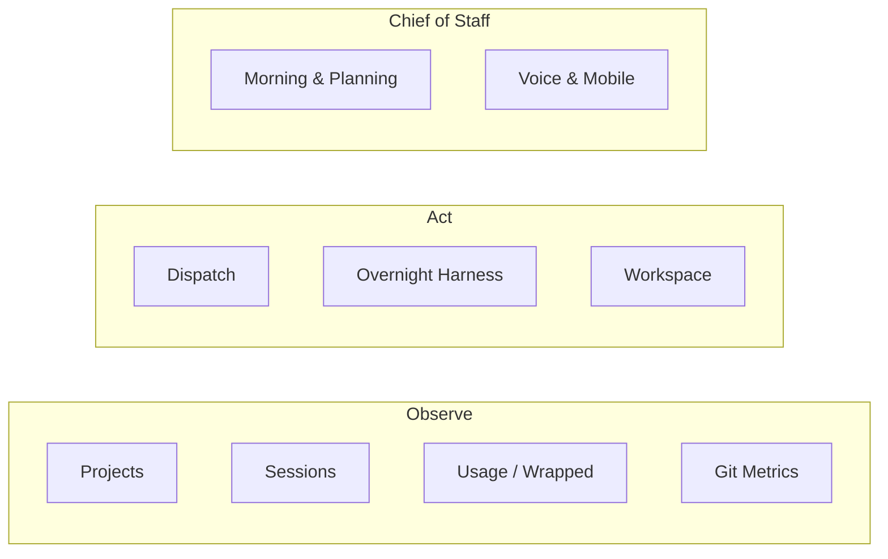

# Features

Ant Farm’s feature set is organized into three groups: **Observe** subsystems that surface live data from local files with zero API calls, **Act** subsystems that dispatch and manage headless agent work, and **Chief of Staff** subsystems that drive higher-level planning and real-time interaction. Every subsystem is backed by a specific set of React pages and Rust modules described below.

See also: [Overview](overview.md) · [Architecture](architecture.md) · [Getting Started](getting-started.md)

---

## Observe

The Observe subsystems are read-only from the app’s perspective: they parse local files, surface live data, and never write to the project brain.

### Projects

The Projects page renders a grid of every project found in the brain directory (`~/Desktop/CD_claude/tools-built/`). Each card resolves the project’s repository folder via the registry file (`ant-farm-registry.json`), then loads its brief, ideas, notes, and decisions as Markdown through tolerant parsers that degrade gracefully on malformed files. The detail view (`src/pages/ProjectDetail.tsx`) adds a git summary and uncommitted file counts supplied by the Rust backend.

**Backed by:** `src/pages/Projects.tsx`, `src/pages/ProjectDetail.tsx`, `src/components/ProjectCard.tsx`, `src-tauri/src/main.rs`

→ [Projects](features/projects.md)

### Sessions & Push Status

The Sessions page lists all live and recent Claude Code and Cowork sessions, auto-filed under the project they belong to. Push status — Running / Idle / Needs permission / Done — is hook-driven rather than polled: a Claude Code status hook appends lifecycle events to `~/.antfarm/events.jsonl`, which the Rust backend tails and re-emits as Tauri events to the UI in real time.

**Backed by:** `src/pages/Sessions.tsx`, `src/components/SessionRow.tsx`, `src-tauri/src/main.rs`

→ [Sessions & Push Status](features/sessions.md)

### Usage, Cost & Wrapped

The Usage page aggregates token counts and estimated dollar cost per project, day, and week from Claude Code and Cowork transcript files on disk. Pricing is per-model and per-message (read from each message’s `model` field), with separate multipliers for cache-read and cache-write tokens so estimates stay honest. A configurable weekly cap and the Wrapped recap view (`src/pages/Wrapped.tsx`) round out the picture.

**Backed by:** `src/pages/Usage.tsx`, `src/pages/Wrapped.tsx`, `src/lib/wrapped.ts`, `src-tauri/src/main.rs`

→ [Usage, Cost & Wrapped](features/usage.md)

### Git Metrics & Working Tree

The Home page surfaces per-repo git statistics — commits, lines added/removed, files changed, and last-commit metadata — pulled live from the Rust backend. Working-tree tracking flags uncommitted files by age (oldest first), making drift visible at a glance without leaving the app.

**Backed by:** `src-tauri/src/main.rs`, `src/pages/Home.tsx`

→ [Git Metrics & Working Tree](features/git-metrics.md)

---

## Act

The Act subsystems write only to Ant Farm’s sandboxed directories (`~/.antfarm/`) and can spawn external processes, but they never touch the project brain.

### Dispatch

The Dispatch panel fires a headless `claude -p` run at any project from a prompt box in the UI. Runs can optionally isolate themselves in a git worktree, operate in `acceptEdits` or `dontAsk` permission mode, and stream a live log back to the UI. Each completed run is persisted as a record under `~/.antfarm/runs/`, and a one-click **Take over** button hands the session off to a real terminal when a human decision is required.

**Backed by:** `src/components/DispatchPanel.tsx`, `src-tauri/src/dispatch.rs`

→ [Dispatch](features/dispatch.md)

### Overnight Harness

The Overnight Harness executes multi-step, multi-run plans while the developer is away. Each step is budget-gated before spawning a worktree run; orphaned worktrees from prior sessions are reconciled on startup. When all runs finish, the harness generates a diff review and presents accept / reject / takeover controls so results can be triaged — typically the next morning.

**Backed by:** `src-tauri/src/harness.rs`, `src-tauri/src/chat.rs`

→ [Overnight Harness](features/overnight-harness.md)

### Workspace

The Workspace page provides a tabbed, tiled terminal environment built on `portable-pty` and `xterm.js`. Each workspace is named, tied to a project, and hosts tiled PTY panes (shell, Claude Code session, reviewer, etc.). The dockview layout is persisted per workspace in app-data storage so it survives restarts.

**Backed by:** `src/pages/Workspace.tsx`, `src-tauri/src/pty.rs`

→ [Workspace](features/workspace.md)

---

## Chief of Staff

These subsystems go beyond passive observation: they run agentic loops and coordinate higher-level planning across the day.

### Morning & Planning

The Morning page delivers a daily briefing that aggregates WHOOP health data, dispatches a chief-of-staff agent, and surfaces insights and priorities for the day. The companion Tonight page drives the nightly planning flow — locking tomorrow’s plan into `src-tauri/src/planning.rs` — and the sidebar shows an amber nudge when the plan is still unlocked after 8 pm.

**Backed by:** `src/pages/Morning.tsx`, `src/pages/Tonight.tsx`, `src-tauri/src/morning.rs`, `src-tauri/src/planning.rs`, `src-tauri/src/chat.rs`

→ [Morning & Planning](features/morning-and-planning.md)

### Voice & Mobile

The Voice page enables real-time speech interaction via a speech-to-text / text-to-speech pipeline backed by a WebRTC realtime session (`src/lib/useVoice.ts`). The Mobile bridge exposes a token-gated local HTTP server so that Ant Farm’s data — sessions, dispatch, usage — can be reached from a phone on the same network, with no cloud relay required.

**Backed by:** `src/pages/VoiceMode.tsx`, `src/lib/useVoice.ts`, `src-tauri/src/mobile.rs`

→ [Voice & Mobile](features/voice-and-mobile.md)

---

## Related Topics

-   [Overview](overview.md) — What Ant Farm is and the principles behind it
-   [Architecture](architecture.md) — Frontend, backend, and the IPC command surface
-   [Getting Started](getting-started.md) — Setup, dev environment, and hook installation
