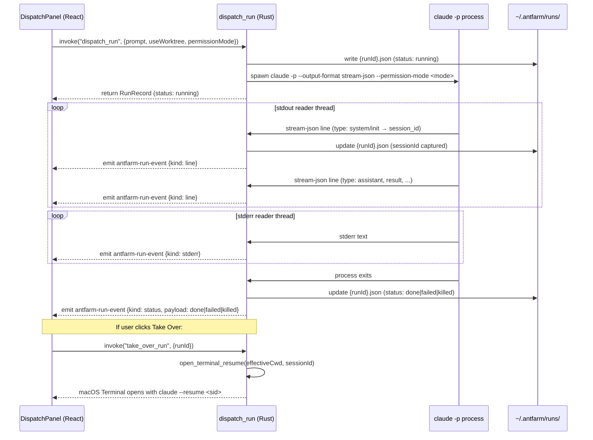

# Dispatch

**Parent topic:** [Features](../features.md)

Dispatch is Ant Farm’s one-click headless agent runner. From a project detail view, a developer types a natural-language task, selects a permission mode and an optional worktree flag, and clicks **Dispatch**. Ant Farm spawns `claude -p` as a child process, streams every line of its `stream-json` output back to the UI as Tauri events, and persists a structured run record on disk. When the run finishes—or needs a human—one more click opens a real terminal and resumes the session.

Dispatch makes no API calls of its own. The zero-API constraint means Ant Farm merely manages the subprocess and reads what it writes; all model traffic flows directly through the `claude` CLI subprocess. See [Architecture](../architecture.md) for the broader zero-API principle.

---

## Prerequisites

-   `claude` CLI installed and on the PATH discovered by `/bin/zsh -lc`. See [Getting Started](../getting-started.md) for the PATH landmine that affects Finder-launched `.app` bundles and how `resolve_claude_path` works around it.
-   A project registered in the brain so Ant Farm knows its path on disk.

---

## The dispatch lifecycle



---

## DispatchPanel (`src/components/DispatchPanel.tsx`)

`DispatchPanel` receives a single `projectPath` prop and manages the full run lifecycle within a single component. It renders:

-   A `<textarea>` for the prompt.
-   A checkbox to enable `--worktree` isolation (maps to the `useWorktree` state boolean).
-   A `<select>` for the permission mode: `acceptEdits` (Exploratory) or `dontAsk` (Deterministic).
-   A **Dispatch** button that calls `startRun`, replaced by a **Stop** button while `run.status === "running"`.
-   A **Take over** button that appears once `run.sessionId` is non-null.
-   A status line showing the `runId`, `usedWorktree`, and `permissionMode` from the active `RunRecord`.
-   A live log pane (max-height scrollable, dark monospace) rendered from a `LogEntry[]` array.

### Event subscription

On mount, the component registers a Tauri event listener for the `antfarm-run-event` channel:

```ts
listen<RunEvent>("antfarm-run-event", (event) => {
  const ev = event.payload;
  if (ev.runId !== runIdRef.current) return;   // ignore other runs
  if (ev.kind === "line")   setLog(prev => [...prev, summarizeLine(ev.payload)]);
  if (ev.kind === "stderr") setLog(prev => [...prev, { label: "stderr", text: ev.payload }]);
  if (ev.kind === "status") setRun(prev => prev ? { ...prev, status: ev.payload } : prev);
});
```

`runIdRef` is a `useRef` that is set when `dispatch_run` returns a `RunRecord`. The `ref` (not state) is used inside the listener closure to avoid stale-closure captures.

### Log rendering (`summarizeLine`)

Each `stream-json` line is parsed by `summarizeLine` into a `{ label, text }` pair. The label is colour-coded:

| Label | Colour class | Trigger |
| --- | --- | --- |
| `init` | `text-zinc-500` | `type === "system"` and `subtype === "init"` |
| `agent` | `text-indigo-400` | `type === "assistant"` — text and `[tool: name]` blocks |
| `result` | `text-emerald-400` | `type === "result"` — includes cost and duration |
| `stderr` | `text-rose-400` | Emitted on the stderr event kind |
| `raw` | `text-zinc-600` | JSON parse failed or unrecognised type |

For `result` events, the formatted text includes `total_cost_usd` (4 decimal places, USD) and `duration_ms` (converted to seconds, 1 decimal place) when those fields are present.

### Tauri command calls

| Action | Command | Key args |
| --- | --- | --- |
| Start a run | `dispatch_run` | `projectPath`, `prompt`, `useWorktree`, `permissionMode` |
| Kill a run | `kill_run` | `runId` |
| Take over | `take_over_run` | `runId` |

All three are invoked via `@tauri-apps/api/core`’s `invoke`. Errors are caught and surfaced in a red error banner beneath the controls row.

---

## `dispatch.rs` internals

`src-tauri/src/dispatch.rs` is the entire backend for the dispatch system. It is registered as a Tauri plugin with `manage(DispatchState::default())` and four `#[tauri::command]` handlers.

### `DispatchState`

```rust
pub struct DispatchState {
    children:    Arc<Mutex<HashMap<String, Child>>>,
    killed:      Arc<Mutex<HashSet<String>>>,
    pub claude_path: Arc<Mutex<String>>,
}
```

-   **`children`**: Maps `runId → Child` for every in-flight process. The stdout reader thread removes the child when stdout closes (by calling `child.wait()`).
-   **`killed`**: A set of `runId` strings. `kill_run` inserts here *before* sending `SIGKILL`, so the stdout reader can check the flag when stdout eventually closes and emit `"killed"` rather than `"done"` or `"failed"`.
-   **`claude_path`**: Resolved once at startup by `resolve_claude_path()` and stored here so every invocation uses the same fully-qualified binary path.

### PATH resolution (`resolve_claude_path`)

When Ant Farm is launched from Finder (as a compiled `.app`) the process inherits macOS’s stripped launch environment, which typically contains only `/usr/bin:/bin:/usr/sbin:/sbin`. NVM-managed Node bins, Homebrew-installed tools, and npm-global packages are not on that PATH.

`resolve_claude_path` works around this at startup:

```rust
pub fn resolve_claude_path() -> String {
    if let Ok(out) = Command::new("/bin/zsh")
        .args(["-lc", "command -v claude"])
        .output()
    {
        if out.status.success() {
            let p = String::from_utf8_lossy(&out.stdout).trim().to_string();
            if !p.is_empty() { return p; }
        }
    }
    // Static fallback candidates
    for candidate in [
        home().join(".local/bin/claude"),
        PathBuf::from("/opt/homebrew/bin/claude"),
        home().join(".npm-global/bin/claude"),
    ] {
        if candidate.exists() { return candidate.to_string_lossy().into_owned(); }
    }
    "claude".to_string()   // last-resort bare name; logs a warning
}
```

The `-lc` flag opens a **login interactive** shell, which sources `~/.zprofile` and `~/.zshrc`, giving `command -v claude` the same PATH as a terminal session would see. The resolved path is stored in `DispatchState.claude_path` and emitted to stderr for debugging (`antfarm dispatch: resolved claude → /path/to/claude`).

See [Getting Started](../getting-started.md) for the full PATH landmine explanation.

### `dispatch_run`

```rust
#[tauri::command]
pub fn dispatch_run(
    app: AppHandle,
    state: State<'_, DispatchState>,
    project_path: String,
    prompt: String,
    use_worktree: bool,
    permission_mode: String,
) -> Result<RunRecord, String>
```

**Argument construction.** The command is always:

```
claude -p <prompt> --output-format stream-json --verbose --permission-mode <mode>
```

`--worktree` is appended only when `use_worktree` is `true`. There are no other flags; the worktree creation is delegated entirely to the `claude` CLI’s native `--worktree` flag rather than being hand-rolled with `git worktree add`.

**Spawn.** The process is spawned with:

-   `current_dir(&project_path)` — the project root is the working directory.
-   `stdout(Stdio::piped())`, `stderr(Stdio::piped())` — both streams are captured.
-   `stdin(Stdio::null())` — the process is fully non-interactive.

**Initial record.** A `RunRecord` is constructed with `status: "running"` and saved to `~/.antfarm/runs/{runId}.json` synchronously before the stdout reader thread starts. This ensures a restart of the app can always see the run, even if it crashes before the thread completes.

**Return value.** `dispatch_run` returns the `RunRecord` to the frontend immediately (before the run finishes). The frontend uses the returned `runId` to filter subsequent events.

### Stdout reader thread

A dedicated thread reads `stdout` line by line using `BufReader::lines()`:

1.  **`session_id` capture.** For each line, if `session_id` has not yet been captured, the line is parsed as JSON. If `type == "system"` and `subtype == "init"`, the `session_id` field is extracted, stored in the local `RunRecord` copy, and `save_record` is called so the ID is persisted immediately.
    
2.  **Event emission.** Every non-empty line (including the init line) is emitted to the frontend as a `RunEvent { run_id, kind: "line", payload: <raw json string> }` on the `antfarm-run-event` channel.
    
3.  **Process reap.** When the reader exhausts stdout, the child is removed from `DispatchState.children` and `child.wait()` is called to collect the exit status.
    
4.  **Final status.** After reaping:
    
    -   If `runId` is in `DispatchState.killed`, emit `kind: "status", payload: "killed"` and return. The killed status was already written to disk by `kill_run`.
    -   Otherwise, write `"done"` (exit 0 or `None`) or `"failed"` (non-zero exit) to the local record, save it, and emit the corresponding status event.

### Stderr reader thread

A second thread reads `stderr` and emits each line as `RunEvent { kind: "stderr", payload: <line> }`. Stderr events are never written to the run record file; they only appear in the live log.

---

## `kill_run`

```rust
#[tauri::command]
pub fn kill_run(state: State<'_, DispatchState>, run_id: String) -> Result<(), String>
```

The kill sequence is carefully ordered to avoid a race between the reader thread and the kill command:

1.  **Insert into `killed` set** — this is done first, before touching the child process.
2.  **Remove child from `children` map** and call `child.kill()`.
3.  **Write `"killed"` to disk immediately** — reads the existing `.json`, sets `status: "killed"` and `finished_at`, and saves. This ensures a post-restart `list_runs` shows the correct status even if the reader thread hasn’t emitted its final event yet.

The stdout reader checks `killed` after reaping. Because step 1 happens before the kill signal, the flag is always set by the time stdout closes, so the reader always emits `"killed"` rather than `"done"` or `"failed"`.

Returns `Err` if there is no live child for that `runId` (already dead, already killed, or the ID is wrong).

---

## `list_runs`

```rust
#[tauri::command]
pub fn list_runs(project_path: Option<String>) -> Result<Vec<RunRecord>, String>
```

Reads every `.json` file in `~/.antfarm/runs/`, deserialises each one as a `RunRecord`, optionally filters by `project_path`, and returns the list sorted descending by `started_at`. There is no separate database; the directory is the store.

`load_all_runs` is an identical non-command helper used internally (e.g. by `wrapped_stats`) that bypasses the `State` requirement.

---

## `take_over_run`

```rust
#[tauri::command]
pub fn take_over_run(run_id: String) -> Result<(), String>
```

Reads the persisted `RunRecord` for `run_id` from disk, extracts `session_id` (returning an error if it hasn’t been captured yet), and calls `open_terminal_resume(effective_cwd, session_id)`.

`open_terminal_resume` sends an AppleScript block to `osascript` via `stdin`:

```applescript
tell application "Terminal"
  do script ("cd " & quoted form of "/path/to/project" & " && claude --resume <sid>")
  activate
end tell
```

This opens macOS Terminal (or reuses an existing window) at the project directory and runs `claude --resume <session_id>`, which reconnects the user to the existing session. The **Take over** button in the UI is disabled until `run.sessionId` is non-null, preventing premature invocation before the init line arrives.

`open_terminal_resume` is a public function shared between dispatch (`take_over_run`) and the [Overnight Harness](../features/overnight-harness.md)’s `take_over_overnight_run`.

The resulting session appears in the [Sessions](../features/sessions.md) view alongside other active Claude Code sessions.

---

## Run record schema

Run records are persisted as pretty-printed JSON under `~/.antfarm/runs/{runId}.json`. See [Local Data Sources](../architecture/data-sources.md) for the full directory layout.

### `RunRecord` (TypeScript: `src/types.ts`, Rust: `dispatch.rs`)

| Field | Type | Description |
| --- | --- | --- |
| `runId` | `string` | `run-{unix_secs}-{counter:04}` format, e.g. `run-1750000000-0001` |
| `projectPath` | `string` | Absolute path to the project root |
| `effectiveCwd` | `string` | Working directory actually used (same as `projectPath` for non-worktree runs; may differ when `--worktree` creates a new directory) |
| `prompt` | `string` | The exact prompt text sent to `claude -p` |
| `status` | `"running" | "done" | "failed" | "killed"` | Current run status; mutated by the reader thread and by `kill_run` |
| `startedAt` | `string` | ISO 8601 UTC timestamp at spawn time |
| `finishedAt` | `string | null` | ISO 8601 UTC timestamp when the process exited or was killed |
| `usedWorktree` | `boolean` | Whether `--worktree` was passed |
| `sessionId` | `string | null` | Claude session ID from the `stream-json` init line; null until captured |
| `permissionMode` | `string` | `"acceptEdits"` or `"dontAsk"` as chosen in the UI |

The Rust struct uses `snake_case` field names with `#[serde(rename_all = "camelCase")]`, so the on-disk JSON and the Tauri IPC both use `camelCase`.

### `RunEvent` (TypeScript: `src/types.ts`, Rust: `dispatch.rs`)

Events are emitted on the `antfarm-run-event` Tauri channel.

| Field | Type | Description |
| --- | --- | --- |
| `runId` | `string` | The `runId` of the originating run |
| `kind` | `"line" | "stderr" | "status"` | `line` = stdout line (raw `stream-json`); `stderr` = stderr line; `status` = terminal status string |
| `payload` | `string` | For `line`/`stderr`: the raw text. For `status`: `"done"`, `"failed"`, or `"killed"` |

---

## Permission modes

Two modes are exposed in the UI:

| UI Label | `permissionMode` value | Behaviour |
| --- | --- | --- |
| Exploratory (acceptEdits) | `acceptEdits` | `claude` accepts file edits without asking but still prompts for shell commands and other destructive actions |
| Deterministic (dontAsk) | `dontAsk` | `claude` proceeds without any permission prompts; suitable for fully automated overnight or CI-style runs |

The value is passed verbatim to `--permission-mode`. Only these two values are offered in the current UI; the underlying CLI may support others but they are not exposed.

---

## Worktree isolation

When **Isolate in git worktree** is checked, `--worktree` is appended to the `claude` invocation. The `claude` CLI creates a linked working tree (via `git worktree add`) in a temporary directory, runs the task there, and the working tree can be inspected, merged, or discarded without affecting the main branch.

The `effectiveCwd` field in the run record reflects where `claude` actually operates; for worktree runs this will differ from `projectPath`. The `usedWorktree: true` flag is surfaced in the status line below the run controls.

Worktree isolation is strongly recommended for any run that may make broad file changes, especially multi-step runs orchestrated by the [Overnight Harness](../features/overnight-harness.md).

---

## Run ID format

Run IDs are generated by `new_run_id()`:

```rust
fn new_run_id() -> String {
    let n  = RUN_COUNTER.fetch_add(1, Ordering::Relaxed);
    let ts = SystemTime::now()
        .duration_since(UNIX_EPOCH)
        .unwrap_or_default()
        .as_secs();
    format!("run-{ts}-{n:04}")
}
```

`RUN_COUNTER` is a process-global `AtomicU64`. The combination of Unix timestamp and a four-digit monotonic counter makes IDs unique within a single process lifetime. Because the timestamp is seconds-resolution, two rapid dispatches within the same second produce IDs like `run-1750000000-0000` and `run-1750000000-0001`.

---

## Storage and persistence

All run records live in `~/.antfarm/runs/`. The directory is created automatically by `runs_dir()` on first access. Each record is a standalone pretty-printed JSON file named `{runId}.json`; there is no index file or database.

`list_runs` scans the directory on every call. This is intentionally simple and avoids any in-memory cache that could become stale across restarts. For the number of runs typical in development use the directory scan is fast enough.

See [Local Data Sources](../architecture/data-sources.md) for how this directory fits into the broader `~/.antfarm/` layout.

---

## Related topics

-   [Overnight Harness](../features/overnight-harness.md) — multi-step automated version of dispatch with budget gates, diff review, and batch accept/reject/takeover
-   [Sessions](../features/sessions.md) — takeover produces a live Claude Code session visible here
-   [Local Data Sources](../architecture/data-sources.md) — the `~/.antfarm/runs/` directory layout
-   [Getting Started](../getting-started.md) — PATH resolution and the Finder-launched `.app` landmine
