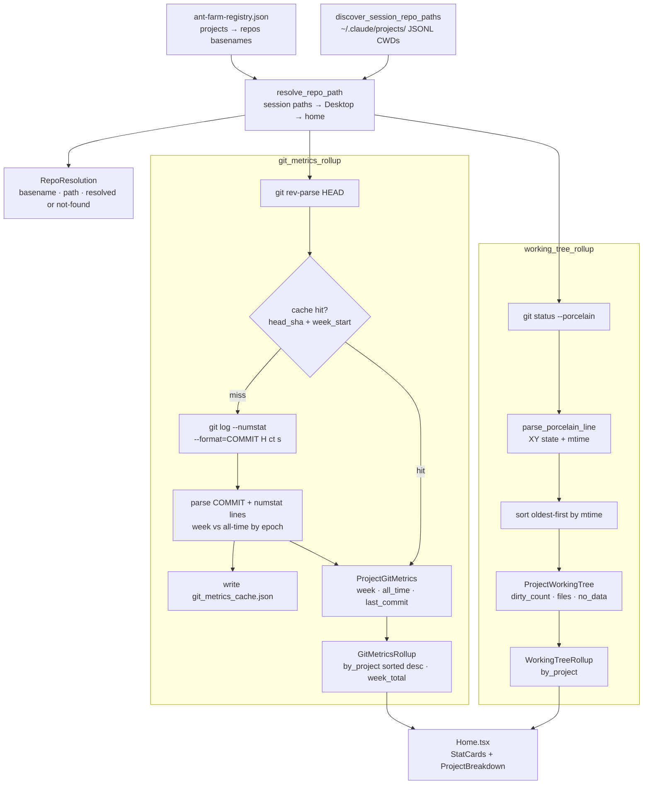

# Git Metrics & Working Tree

**Parent topic:** [Features](../features.md)

Ant Farm surfaces two complementary views of your repositories: *commit metrics* (how much work has landed) and *working-tree state* (what is still uncommitted). Both are computed entirely by shelling out to the local `git` binary — zero API calls, no remote requests, no authentication tokens required.

---

## Overview

Every time the Home dashboard opens, the frontend fires two independent Tauri IPC calls in parallel:

| Tauri command | Returns | Purpose |
| --- | --- | --- |
| `git_metrics_rollup` | `GitMetricsRollup` | Commits, lines added/removed, files changed — week and all-time |
| `working_tree_rollup` | `WorkingTreeRollup` | Uncommitted files per project, sorted oldest-first |

Both commands iterate the same registry-based project list. If a repository cannot be located on disk the entry is marked `no_data: true` and skipped rather than causing an error.

See [Architecture: Backend](../architecture/backend.md) for how Tauri commands are registered, and [Architecture: Local Data Sources](../architecture/data-sources.md) for the registry file format.

---

## Repository Resolution

Both commands share the same two-step resolution pipeline before any `git` subprocess is spawned.

### Step 1 — Session discovery

`discover_session_repo_paths()` scans `~/.claude/projects/` and reads the first `.jsonl` file in each project folder to extract the `cwd` that Claude Code used. It builds a `HashMap<String, PathBuf>` keyed by the directory **basename** of each CWD. This means that if you have ever run Claude Code inside `/Users/you/Desktop/ant-farm`, the entry `"ant-farm" → /Users/you/Desktop/ant-farm` is available without any config.

### Step 2 — `resolve_repo_path`

`resolve_repo_path(basename, session_paths)` looks up the registry basename from the project’s `repos` field. It tries two variants of the name: the basename as written, and a dash-stripped form (e.g. `"ant-farm"` → `"antfarm"`). For each variant it checks, in order:

1.  The session-discovered CWD map (requires `.git/` to exist there)
2.  `~/Desktop/<variant>`
3.  `~/<variant>`

The first match that has a `.git/` directory is returned. If none match, `resolve_repo_path` returns `None` and the repo is marked `not-found` in the `RepoResolution` list.

The registry itself is loaded from `ant-farm-registry.json` at the brain root. It maps project slugs to `{ repos: Vec<String> }`. See [Features: Projects](../features/projects.md) for the full registry format and how it is shared with the project grid.

---

## Commit Metrics — `git_metrics_rollup`

### What it does

`git_metrics_rollup()` iterates every project in the registry, resolves each listed repo, and runs a single `git log` invocation per repo to accumulate commit and line-change counts for two windows:

-   **`week`** — commits and changes since the configurable week-start boundary
-   **`all_time`** — the entire reachable history

Results are aggregated at the project level (`ProjectGitMetrics`) and then summed into a cross-project `week_total`.

### The `git log` command

```
git -C <repo_path> log --numstat --format=COMMIT %H %ct %s
```

`--numstat` emits one tab-separated line per file per commit: `added\tremoved\tpath`. Binary files show `-` for both counts (parsed as `0`). `--format=COMMIT %H %ct %s` inserts a sentinel marker before each commit with the 40-character SHA, the Unix timestamp (`%ct`), and the subject line.

The parser walks the output line by line:

-   A line starting with `COMMIT` sets `current_ts`. If `ts >= week_start_epoch` the commit is counted in both `week` and `all_time`; otherwise only in `all_time`. The first `COMMIT` line seen becomes `last_commit_ts` / `last_commit_subject`.
-   Any non-empty line that does not start with `COMMIT` is treated as a numstat row. `added` and `removed` are parsed as `i64` (binary `-` → `0`). If `current_ts >= week_start_epoch` the file is also counted in the week window.

### Week boundary

The week start is computed from the user’s `reset_weekday` setting (0 = Monday … 6 = Sunday). The backend calculates how many days ago the reset weekday last occurred, then uses local midnight of that date as the epoch boundary. This means the “week” window is always aligned to the user’s configured reset day, not a fixed UTC boundary.

### Cache layer

Running `git log --numstat` over a large history is slow. `git_metrics_rollup` maintains a persistent cache at `<app_data_dir>/git_metrics_cache.json` with type `GitMetricsCache`:

```
GitMetricsCache {
  repos: HashMap<String, GitRepoCacheEntry>
}

GitRepoCacheEntry {
  head_sha: String,       // result of git rev-parse HEAD
  week_start: String,     // "YYYY-MM-DD" of the current reset boundary
  week: GitPeriodMetrics,
  all_time: GitPeriodMetrics,
  last_commit_ts: u64?,
  last_commit_subject: String?
}
```

A cache entry is valid when both `head_sha` matches the current `HEAD` and `week_start` matches today’s reset boundary. If either differs (new commit landed, or the week rolled over), `compute_git_metrics_for_repo` is called and the entry is replaced. The updated cache is written back to disk after all projects are processed.

### Tolerant behavior

If a repo cannot be resolved, `git rev-parse HEAD` fails, or `git log` exits non-zero, the project’s `no_data` flag is set to `true` and zero-value metrics are used. The rollup continues with remaining repos; no panic or error surface to the frontend.

### Output

```
GitMetricsRollup {
  by_project: ProjectGitMetrics[],   // sorted by week.commits descending
  week_total: GitPeriodMetrics,      // sum across all resolved repos
  resolutions: RepoResolution[]      // one entry per repo basename in registry
}
```

`by_project` is sorted by `week.commits` descending so the most active project appears first.

---

## Working-Tree Tracking — `working_tree_rollup`

### What it does

`working_tree_rollup()` checks every resolved repo for uncommitted modifications, additions, deletions, and untracked files. Results are collected per project and sorted **oldest-first** by file modification time so that stale, forgotten changes are immediately visible at the top of the list.

### The `git status` command

```
git -C <repo_path> status --porcelain
```

`--porcelain` outputs a stable, script-friendly format. Each line starts with two status characters (`XY`) followed by a space and the file path. The backend skips ignored entries (lines where `X == '!'`).

### State mapping

`xy_to_state(x, y)` converts the two-character XY code to a human-readable label:

| XY pattern | Label |
| --- | --- |
| `??` | `untracked` |
| `A_` | `added` |
| `D_` or `_D` | `deleted` |
| `R_` or `C_` | `renamed` |
| `M_` or `T_` | `staged` |
| `_M` or `_T` | `modified` |
| anything else | `changed` |

Renamed files use the destination path (the part after `->` in the porcelain line).

### Oldest-first sort

After collecting all `DirtyFile` entries for a project, the list is sorted by `mtime` ascending:

```
// Sort oldest-first: lowest mtime = sat longest = stale work
all_files.sort_by(|a, b| match (a.mtime, b.mtime) {
    (Some(ta), Some(tb)) => ta.cmp(&tb),
    (None, Some(_))      => Ordering::Greater,
    (Some(_), None)      => Ordering::Less,
    (None, None)         => Ordering::Equal,
});
```

Files whose `mtime` cannot be read (e.g. deleted before the scan) sort to the end.

### Output

```
WorkingTreeRollup {
  by_project: ProjectWorkingTree[]
}

ProjectWorkingTree {
  slug: String,
  dirty_count: u32,
  files: DirtyFile[],   // oldest-first
  no_data: bool
}

DirtyFile {
  path: String,     // repo-relative path
  state: String,    // see table above
  mtime: number?    // Unix seconds, null if unreadable
}
```

---

## Data Flow



---

## Type Reference

### `GitPeriodMetrics`

```typescript
interface GitPeriodMetrics {
  commits: number;
  lines_added: number;
  lines_removed: number;
  files_changed: number;
}
```

Used for both the `week` and `all_time` fields of every `ProjectGitMetrics`, and for `week_total` in the rollup. All fields are integers; `lines_added` and `lines_removed` are `i64` in Rust (binary files contribute `0`).

### `ProjectGitMetrics`

```typescript
interface ProjectGitMetrics {
  slug: string;
  week: GitPeriodMetrics;
  all_time: GitPeriodMetrics;
  last_commit_ts: number | null;  // Unix seconds of most recent commit
  last_commit_subject: string | null;
  no_data: boolean;               // true when no repo could be resolved
}
```

`last_commit_ts` / `last_commit_subject` reflect the most recent commit across all repos associated with the project (highest timestamp wins when a project has multiple repos).

### `RepoResolution`

```typescript
interface RepoResolution {
  basename: string;      // as written in the registry
  path: string | null;   // absolute path if resolved, null otherwise
  status: string;        // "resolved" | "not-found"
}
```

The `resolutions` array in `GitMetricsRollup` has one entry per repo basename across all registry projects. It is primarily useful for debugging which repos Ant Farm could and could not find.

### `GitMetricsRollup`

```typescript
interface GitMetricsRollup {
  by_project: ProjectGitMetrics[];
  week_total: GitPeriodMetrics;
  resolutions: RepoResolution[];
}
```

### `DirtyFile`

```typescript
interface DirtyFile {
  path: string;       // repo-relative
  state: string;      // "untracked" | "added" | "deleted" | "renamed" | "staged" | "modified" | "changed"
  mtime: number | null; // Unix seconds
}
```

### `ProjectWorkingTree`

```typescript
interface ProjectWorkingTree {
  slug: string;
  dirty_count: number;
  files: DirtyFile[];  // sorted oldest-first by mtime
  no_data: boolean;    // true when no repo could be resolved
}
```

### `WorkingTreeRollup`

```typescript
interface WorkingTreeRollup {
  by_project: ProjectWorkingTree[];
}
```

---

## Where Metrics Surface

### Home dashboard (`src/pages/Home.tsx`)

The `Home` component invokes both commands on mount:

```typescript
invoke<GitMetricsRollup>("git_metrics_rollup").then(setGitMetrics);
invoke<WorkingTreeRollup>("working_tree_rollup").then(setWtData);
```

The “Git this week” stat card group is rendered only when `week_total.commits > 0`, so projects with no git history don’t produce empty cards. Three `StatCard` elements are shown:

-   **Commits** — `gitMetrics.week_total.commits`
-   **Net lines** — `lines_added - lines_removed` (formatted with `fmtNet`, which adds `+`/`−` signs)
-   **Files touched** — `week_total.files_changed`

### Project breakdown (`src/components/ProjectBreakdown.tsx`)

The `ProjectBreakdown` component accepts an optional `dirtyBySlug: Record<string, number>` prop. Home builds this from the working-tree rollup:

```typescript
dirtyBySlug={
  Object.fromEntries(
    wtData.by_project
      .filter((p) => !p.no_data && p.dirty_count > 0)
      .map((p) => [p.slug, p.dirty_count])
  )
}
```

Projects with `no_data: true` or `dirty_count === 0` are excluded from the map, so no badge is shown for them. Projects with uncommitted files show a count badge (e.g. “3 uncommitted”).

### Wrapped (`src/pages/Wrapped.tsx`)

The Wrapped recap view consumes `linesAdded`, `linesRemoved`, and `commits` from `WrappedStats`. These are pulled from the same `git_metrics_cache.json` on the backend — the Wrapped command reads the cache directly rather than re-running `git log`. See [Features: Usage, Cost & Wrapped](../features/usage.md) for the Wrapped data model.

---

## Observe-First, Zero-API

Both `git_metrics_rollup` and `working_tree_rollup` are purely local:

-   No network requests are made
-   No git hosting credentials are required
-   The registry file is read-only; neither command modifies it
-   The only write is the cache file at `<app_data_dir>/git_metrics_cache.json`

The cache invalidation strategy (HEAD SHA + week\_start) ensures correctness with minimal re-computation: a newly landed commit triggers a full `git log` re-scan for that repo; otherwise the cached numbers are returned instantly.

---

## Extending Git Metrics

To add a new field to the metrics (e.g. a per-author breakdown):

1.  Add the field to `GitPeriodMetrics` in both `src-tauri/src/main.rs` (Rust struct with `#[derive(Serialize, Deserialize, Default)]`) and `src/types.ts`.
2.  Populate it inside `compute_git_metrics_for_repo` by parsing additional fields from the `git log` output or a separate `git shortlog` call.
3.  Invalidate any cached entries by bumping a `cache_version` field in `GitMetricsCache` (or simply clear the file during development).
4.  Consume the field in the frontend component of your choice.

The cache key is the absolute repo path; entries for different repos are independent.

---

## Related Topics

-   [Features: Projects](../features/projects.md) — registry format, project grid, how repo basenames are declared
-   [Features: Usage, Cost & Wrapped](../features/usage.md) — Wrapped reuses the git metrics cache for commit/lines stats
-   [Architecture: Backend](../architecture/backend.md) — Tauri command registration, threading model
-   [Architecture: Local Data Sources](../architecture/data-sources.md) — brain root, registry file, app data dir
