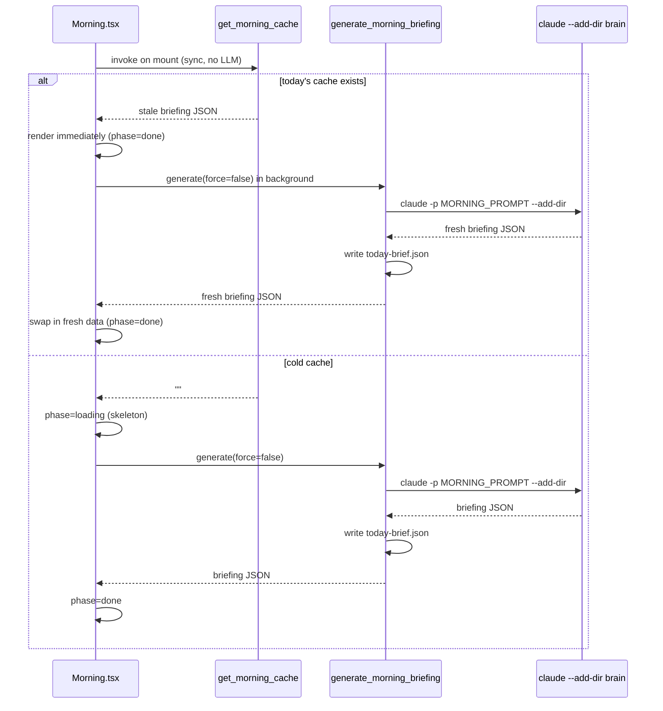

# Morning & Planning

**Parent topic:** [Features](../features.md)

The Morning and Planning subsystem is the “chief of staff” layer of Ant Farm. It splits across two pages – `Morning` (daily briefing and live coaching) and `Tonight` (nightly plan-locking flow) – but both pages share the same underlying pattern: a local headless `claude` run reads the brain directory read-only via `--add-dir` and returns structured output. No API key lives in the app; the binary on disk drives everything.

**Key sources:**

-   `src-tauri/src/morning.rs` – `generate_morning_briefing`, `morning_chat_send`, `morning_insight`, `refresh_whoop`, `get_morning_cache`, `get_whoop_today`
-   `src-tauri/src/planning.rs` – `plan_chat_send`, `lock_tomorrow_plan`, `get_tomorrow_plan`
-   `src-tauri/src/chat.rs` – shared `run_headless` runner and `ChatMessage`/`ChatThread` types
-   `src/pages/Morning.tsx` – briefing UI, stale-while-revalidate shell, task tracker, insight card
-   `src/pages/Tonight.tsx` – planning chat UI and lock button

---

## Morning Briefing

### How the briefing is generated

`generate_morning_briefing` is the primary Tauri command exposed by `morning.rs`. The frontend calls it with two parameters:

| Parameter | Type | Meaning |
| --- | --- | --- |
| `now` | `String` | Current local date-time string prepended to the prompt |
| `force` | `bool` | Skip the cache check and regenerate from scratch |

Internally the command calls `run_morning`, which spawns a child process:

```
claude -p "<now_prefix> + MORNING_PROMPT" \
       --output-format stream-json \
       --verbose \
       --permission-mode dontAsk \
       --add-dir ~/Desktop/CD_claude \
       --model claude-haiku-4-5-20251001
```

The `--add-dir` flag is the only path by which the model sees the brain. Nothing is written back; the brain stays strictly read-only from the app’s perspective. See [Local Data Sources](../architecture/data-sources.md) for the full file layout.

The runner reads NDJSON lines from stdout, pulls the `"result"` field from the line where `"type" == "result"`, and returns that string. A 120-second wall-clock timeout kills the child if the model hangs.

### MORNING\_PROMPT and the Captain Jack persona

`MORNING_PROMPT` (defined in `morning.rs`) instructs the model to behave as a chief-of-staff with the “Captain Jack” persona. The rules embedded in the prompt are:

-   No em dashes
-   Direct, warm but sharp tone
-   Summer context: check `active/school-schedule.md` before listing school commitments

The prompt declares the exact brain files to read via `--add-dir`:

```
active/whoop-today.json
CLAUDE.md
active/now.md
active/tomorrow-plan.md
active/school-schedule.md
```

The model is instructed to output **only** a strict JSON object – no prose, no code fences, nothing else.

### Briefing JSON shape

The `MorningBriefing` TypeScript interface in `Morning.tsx` maps directly to what the model must produce:

```typescript
interface MorningBriefing {
  greeting: string;          // short warm opener, 10 words max
  date_label: string;        // e.g. "JUN 16 · OPEN DAY" or "JUN 17 · SCHOOL 8:30-3:15"
  health: {
    recovery: number;        // integer 0-100 (WHOOP recovery score)
    sleep_hours: number;     // float, 1 decimal place
    sleep_perf: number;      // integer 0-100 (WHOOP sleep performance %)
    hrv: number;             // float ms
    rhr: number;             // integer bpm
    strain: number;          // float
    read: string;            // one line: how the numbers shape today's work
  };
  day_line: string;          // one sentence: energy level + key anchor
  commitments: string[];     // hard-scheduled items with times, [] if none
  tasks: Array<{
    id: string;              // e.g. "t1"
    text: string;            // concrete outcome in plain English
    detail: string;          // time estimate or context, 8 words max
  }>;
  agent_note?: string;       // optional proactive line; omitted if nothing useful
  auto_planned?: boolean;    // true when the model derived tasks from scratch
}
```

Task rules enforced by the prompt: 3-5 priorities, written as founder sticky notes (concrete outcomes), ordered by leverage against recovery. Engineering jargon – build, deploy, git, npm run, commit hash, migration – is forbidden in task text. The goal, not the steps.

If `active/whoop-today.json` is missing or its `fetched_at` date is not today, all health fields are set to `0` and `read` becomes `"No Whoop data for today."`.

### Plan signature and cache

`run_morning` checks `active/today-brief.json` before spawning the model:

```
cache key = date (YYYY-MM-DD) + plan_sig
```

`plan_sig` is `"YYYY-MM-DD|<locked-timestamp>"` when `active/tomorrow-plan.md` starts with `# Plan for <today> (LOCKED ...)`, or `"none"` when no locked plan exists for today. A re-lock during the day produces a new timestamp, which naturally busts the cache.

Cache hit behavior: if both `date` and `plan_sig` match, the cached `briefing` field is returned immediately – no LLM call.

If `plan_sig == "none"` and `force` is `false`, the command returns the sentinel `{"needs_plan":true}` instead of generating a briefing. The UI transitions to a `needs_plan` phase that prompts the user to go to the Tonight page and lock a plan first.

### `get_morning_cache`

A synchronous, non-blocking command that reads `active/today-brief.json` and returns the `briefing` field if the cached date matches today. Returns an empty string otherwise. Used by the frontend for the instant-shell phase on mount (see below).

### Stale-while-revalidate rendering



On mount the UI also fires `refresh_whoop` (fire-and-forget) and `get_whoop_today` (to show a raw WHOOP card while the briefing loads). The routine checklist items and their check-state are hoisted out of the loading phase so the panel is never empty on a warm load.

---

## WHOOP Integration

### `refresh_whoop`

An async Tauri command that spawns:

```
/bin/zsh -lc "node ~/Desktop/CD_claude/tools-built/whoop-report/whoop-fetch.cjs"
```

The CJS script is responsible for hitting the WHOOP API and writing `active/whoop-today.json` to the brain. Ant Farm does not speak to the WHOOP API directly; it delegates entirely to the external script. Timeout: 90 seconds.

`refresh_whoop_blocking` is a synchronous variant called from the mobile HTTP server thread – same logic, same timeout, no `async_runtime`.

### `get_whoop_today`

Reads `active/whoop-today.json` synchronously. Returns the parsed JSON value only if its `fetched_at` field starts with today’s date string; returns `null` otherwise. The frontend uses this to render a `WhoopRawCard` while the full briefing is still generating.

See [Local Data Sources](../architecture/data-sources.md) for `whoop-today.json` field names and the brain directory layout.

---

## Morning Chat

### `morning_chat_send`

A Tauri command for multi-turn follow-up conversation on the morning panel. Parameters:

| Parameter | Type | Meaning |
| --- | --- | --- |
| `date_key` | `String` | YYYY-MM-DD, identifies the session file |
| `briefing_json` | `String` | The current briefing JSON, embedded on cold start |
| `message` | `String` | User’s message |
| `now` | `String` | Current local date-time |

Session IDs are persisted to `~/.antfarm/morning-sessions/{date_key}.txt`. On the first turn (cold start) the model receives `MORNING_CHAT_PROMPT` plus the full briefing JSON and the brain via `--add-dir`. On subsequent turns (`--resume <session_id>`) only the new message is sent; the resumed session carries all prior context.

`MORNING_CHAT_PROMPT` is defined in `morning.rs`:

```
You are Connor's morning agent (Captain Jack). You know his day. Help him through it:
answer follow-ups, react to 'I finished X' by suggesting the next move, recommend, and
when something is a real task offer to dispatch it to his agents (1 agent / swarm /
orchestrator). Warm, sharp, short. No em dashes.
```

The chat uses `claude-haiku-4-5-20251001` for speed. `run_headless` (from `chat.rs`) handles the stream-json reading and session ID capture.

The [Voice & Mobile](../features/voice-and-mobile.md) module exposes the same morning chat via the local HTTP bridge through `morning_chat_turn` – the public function that wraps `morning_turn_core` and persists the session.

---

## Morning Insight

### `morning_insight`

An on-demand Tauri command that generates a single coaching recommendation for right now. Parameters: `done_summary` (a plain-English summary of what the user has checked off so far) and `now`.

`INSIGHT_PROMPT` (in `morning.rs`) instructs the model to give one short specific recommendation based on the current state – tasks done, tasks pending, recovery score, and brain context. Example voice from the prompt:

```
"Coffee and breakfast in, you're fueled. Recovery's middling, so knock out the Jake points
while you're sharp, then take your workout as the break."
```

Rules: 1-2 sentences, conversational, specific, no fluff, no em dashes.

The `InsightCard` component in `Morning.tsx` builds `doneSummary` from the routine checklist and work-task check state, then calls `morning_insight` automatically when items are checked. A 1.5-second debounce prevents rapid re-calls.

---

## Tonight: Nightly Plan-Locking

The `Tonight` page (`src/pages/Tonight.tsx`) and `planning.rs` implement the nightly flow for locking tomorrow’s plan. The model, prompt, and session-persistence pattern mirror the morning chat, but the output is Markdown written to the brain rather than JSON returned to the UI.

### `PLAN_CHAT_PROMPT`

Defined in `planning.rs`:

```
You are Connor's nightly planning partner / chief of staff. It is the night before. Your
job: help him LOCK what he works on tomorrow. Read the brain via --add-dir: CLAUDE.md,
active/now.md, active/tomorrow-plan.md, active/whoop-today.json, and project decisions.
Ask sharp questions ONE or TWO at a time -- hard commitments + times, the ONE big rock
that must move tomorrow, what he's mid-build on (Roastlytics demo, Antfarm, Golden Bean),
personal (workout/reading), when he wants to start. Push him to DECIDE; don't let him
stay vague. Reference what he's actually working on. When the day feels set, tell him to
hit 'Lock tomorrow's plan.' Warm, direct, short. No em dashes.
```

### `plan_chat_send`

A Tauri command that sends one user message and returns the model’s reply. Session IDs are persisted to `~/.antfarm/plan-sessions/{date_key}.txt`, where `date_key` is today’s date (`YYYY-MM-DD`). Cold start: embeds `PLAN_CHAT_PROMPT` plus the user message and the brain via `--add-dir`. Warm resume: `--resume <session_id>` with the message only.

Model: `claude-haiku-4-5-20251001`.

### `lock_tomorrow_plan`

When the user clicks “Lock tomorrow’s plan” in the UI, this Tauri command fires. It resumes the current plan session (or starts cold if none exists) with a lock instruction:

```
Output ONLY the locked plan as markdown, no preamble.
First line EXACTLY: '# Plan for {tomorrow}'.
Sections: ## Big rock; ## Commitments (time + event, [] if none);
## Work blocks (ordered by leverage); ## Personal; ## Notes.
Base it on our whole conversation + the brain.
Plain founder language, no engineering/build/deploy/git jargon.
```

After the model replies, the backend:

1.  Strips any markdown code fences the model may have wrapped the output in.
2.  Appends `(LOCKED <now>)` to the first line, producing: `# Plan for YYYY-MM-DD (LOCKED <timestamp>)`
3.  Writes the result to `active/tomorrow-plan.md` in the brain.

The locked plan is then returned to the UI, which shows a “Tomorrow is locked” badge.

`run_lock_now` is a public wrapper around `lock_turn_core` plus the file write, callable from the voice handler without going through Tauri IPC. See [Voice & Mobile](../features/voice-and-mobile.md) for how this is wired.

### `get_tomorrow_plan`

A Tauri command that reads `active/tomorrow-plan.md` synchronously and returns:

```rust
pub struct TomorrowPlan {
    pub locked: bool,        // true when first line contains "(LOCKED" and date == tomorrow
    pub target_date: String, // YYYY-MM-DD parsed from "# Plan for ..."
    pub markdown: String,    // raw markdown content
}
```

`locked` is `true` only when the file’s first-line date matches tomorrow’s date **and** the header contains the `(LOCKED` marker. A plan from two nights ago is not considered locked.

### Sidebar plan nudge

`Sidebar.tsx` calls `get_tomorrow_plan` on the sidebar items and checks `p.locked`. When the plan is not locked, a visual nudge dot is displayed on the “Tonight” navigation item. After 8 pm this nudge becomes more prominent. See [Frontend Architecture](../architecture/frontend.md) for the sidebar component structure.

---

## Shared Chat Infrastructure

Both the morning chat and the planning chat delegate to `run_headless` in `chat.rs`. This function:

1.  Spawns `claude` with the provided argument vector.
2.  Reads NDJSON lines from stdout in a background thread.
3.  Captures the `session_id` from the first line that carries it (the `"system"` init line in stream-json format).
4.  Extracts `result_text` from the line where `"type" == "result"`.
5.  Returns `(result_text, Option<session_id>)`.
6.  Kills the child and returns whatever it has if the 120-second wall clock elapses.

`ChatMessage` and `ChatThread` (defined in `chat.rs`) are the shared data types used by the overnight harness chat as well. `ChatMessage` fields: `id`, `role`, `text`, `ts`, `plan_path`, `plan_id`, `armed`, `error`. These are serialized with `camelCase` for the frontend.

For the morning and planning flows, threads are not persisted to `~/.antfarm/chats/` – only the session IDs are persisted (one `.txt` file per date). The nightly planner does not use a `ChatThread`; it manages session state directly.

---

## Brain Files Referenced

| File | Used by | Purpose |
| --- | --- | --- |
| `active/whoop-today.json` | `MORNING_PROMPT`, `INSIGHT_PROMPT`, `PLAN_CHAT_PROMPT` | WHOOP recovery, sleep, HRV, RHR, strain |
| `CLAUDE.md` | All prompts | Project context and priorities |
| `active/now.md` | All prompts | Current focus and near-term work |
| `active/tomorrow-plan.md` | `MORNING_PROMPT`, `PLAN_CHAT_PROMPT`, `lock_tomorrow_plan` | Locked plan for tomorrow; also read at morning to set `plan_sig` |
| `active/school-schedule.md` | `MORNING_PROMPT` | School schedule for summer/term context |
| `active/today-brief.json` | `run_morning`, `get_morning_cache` | Morning briefing cache |

The brain path is `~/Desktop/CD_claude`. All of these files are passed read-only via `--add-dir`; the only file the app writes in the brain directory is `active/today-brief.json` (cache) and `active/tomorrow-plan.md` (on lock). See [Local Data Sources](../architecture/data-sources.md) for more on the brain layout.

---

## Connection to Dispatch

The locked plan becomes the backbone of the next morning’s briefing: when `MORNING_PROMPT` detects a locked plan for today, it uses it as the source of truth for `commitments` and `tasks` rather than auto-deriving from the brain. After the briefing is reviewed, the user can dispatch individual tasks to headless agent runs directly from the Morning panel. See [Dispatch](../features/dispatch.md) for how those runs are fired and tracked, and [Overnight Harness](../features/overnight-harness.md) for multi-step plans.

The Captain Jack persona used in the morning briefing, morning chat, and the assistant layer is also the voice of [Voice & Mobile](../features/voice-and-mobile.md), where it can accept voice commands to lock the plan or dispatch work hands-free.

---

## Related Topics

-   [Local Data Sources](../architecture/data-sources.md) – brain directory, `whoop-today.json`, `plan-sessions/`
-   [Dispatch](../features/dispatch.md) – turning planned tasks into headless agent runs
-   [Voice & Mobile](../features/voice-and-mobile.md) – Captain Jack over voice; hands-free plan locking
-   [Frontend Architecture](../architecture/frontend.md) – sidebar plan nudge component
-   [Features Overview](../features.md) – all feature subsystems
