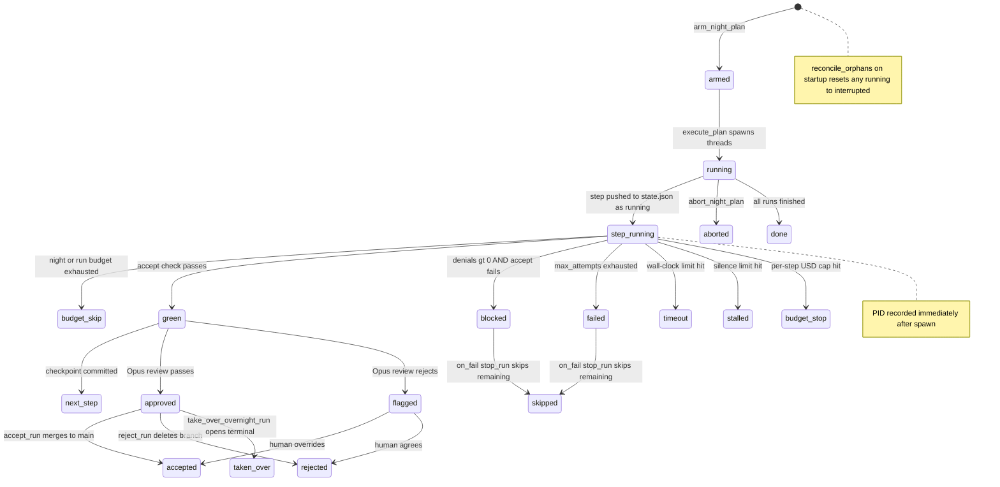

# Overnight Harness

**Parent topic:** [Features](../features.md)

The overnight harness is Ant Farm’s unattended, multi-step agent executor. Where [Dispatch](../features/dispatch.md) fires a single headless `claude -p` run and streams its output live, the harness executes a structured JSON *night plan* — a list of runs, each broken into sequential steps — while you sleep. Runs execute in parallel (up to `max_parallel` threads), every step is budget-gated, and each completed run is queued for human review before any changes reach your main branch.

The entire implementation lives in `src-tauri/src/harness.rs` (~1 843 lines), with chat-driven plan authoring in `src-tauri/src/chat.rs`. The frontend Agents panel in `src/pages/Workspace.tsx` consumes the plan states and exposes the review UI.

---

## Lifecycle overview



---

## Plan spec

A night plan is a JSON file that conforms to the `NightPlan` struct. Every field that maps to a Tauri command argument uses `camelCase` in JSON (serde `rename_all = "camelCase"`).

### Top-level fields

| Field | Type | Description |
| --- | --- | --- |
| `plan_id` | `String` | Unique identifier; used as the directory name under `~/.antfarm/plans/`. |
| `armed` | `bool` | Must be `false` when authored; set to `true` by `arm_night_plan` before execution. |
| `budgets` | `Budgets` | Three spending caps (see below). |
| `defaults` | `PlanDefaults` | Model, wall clock, silence, and permission settings shared across steps. |
| `max_parallel` | `u32` | Maximum simultaneous run threads (default `3`; capped in practice by CPU). |
| `runs` | `Vec<RunSpec>` | Ordered list of runs; consumed from a `VecDeque` by the worker pool. |

### Budgets

```json
{
  "per_step_usd": 0.30,
  "per_run_usd": 2.00,
  "per_night_usd": 10.00
}
```

`Budgets` encodes three ascending thresholds (`per_step_usd <= per_run_usd <= per_night_usd`). Validation enforces this ordering; a plan with inverted budgets is rejected by `validate_plan_file` before it can be armed.

-   **`per_step_usd`** — hard cap per individual step invocation. When the running estimate (derived from output token counts) exceeds this value, the subprocess is `kill()`\-ed and the step status is set to `budget_stop`.
-   **`per_run_usd`** — cumulative cap for all steps in a single run. Checked at the start of each step; if already exceeded the step receives `budget_skip`.
-   **`per_night_usd`** — cumulative cap for the entire plan. Checked both at the start of each run (marking the whole run `budget_skip`) and at the start of each step. A shared `Arc<Mutex<PlanState>>` holds the running total so all parallel worker threads observe each other’s spend.

### PlanDefaults

```json
{
  "model": "claude-sonnet-4-6",
  "max_wall_minutes": 30,
  "silence_minutes": 5,
  "max_attempts": 2,
  "permission_mode": "dontAsk"
}
```

Individual steps may override `model` and `max_attempts` via `StepSpec.model` and `StepSpec.max_attempts`.

### RunSpec

```json
{
  "run_id": "add-dark-mode",
  "project_path": "/Users/me/myrepo",
  "goal": "Implement dark mode toggle in the settings panel",
  "setup": "npm ci",
  "on_fail": "stop_run",
  "steps": [...]
}
```

| Field | Required | Description |
| --- | --- | --- |
| `run_id` | Yes | Kebab-case identifier; must be unique within the plan. |
| `project_path` | Yes | Absolute path to the git repo. Validation checks this is a real directory. |
| `goal` | Yes | One-sentence description injected into every step prompt. |
| `setup` | No | Shell command run (via `/bin/zsh -c`) in the repo before steps begin. Typically `npm ci` or `cargo fetch`. |
| `on_fail` | No | `"stop_run"` (default) — remaining steps are marked `skipped` when any step fails. `"continue"` — subsequent steps still execute. |
| `steps` | Yes | Sequential list of `StepSpec` objects. |

### StepSpec

```json
{
  "id": "write-toggle-component",
  "prompt": "Create src/components/DarkModeToggle.tsx ...",
  "accept": "npm run build && npm test -- --testPathPattern=DarkMode",
  "max_attempts": 2,
  "model": "claude-sonnet-4-6"
}
```

`accept` is a shell command that exits non-zero on failure. The harness runs it after every attempt in the step’s worktree. An empty `accept` is a validation error.

---

## Worktree isolation

Every run gets a dedicated git worktree at:

```
{project_path}/.antfarm-worktrees/{run_id}
```

`create_worktree` (line 249) branches off the current `HEAD` commit (`base_commit`) and creates an `antfarm/{run_id}` branch. Runs within the same plan branch from the same `HEAD` independently and never see each other’s uncommitted output.

Before spawning Claude, `write_allowlist` copies a pre-approved `~/.antfarm/allowlists/{project_slug}.json` (or `_default.json` fallback) into `.claude/settings.json` inside the worktree and adds that path to the worktree’s `info/exclude` so it is invisible to `git status`. The harness aborts with an error if no allowlist is found — unattended runs require an explicit permission budget.

`git worktree add` is serialized behind a `git_lock: Arc<Mutex<()>>` shared by all parallel worker threads to avoid concurrent corruption of `.git` metadata.

See [Local Data Sources](../architecture/data-sources.md) for the full directory tree.

---

## Step execution

Each step in `execute_run` follows this sequence:

1.  **Push as `running`** — `StepState` is appended to the run’s step list and persisted to `state.json` *before* Claude is spawned (H2 invariant). If the process crashes here, `reconcile_orphans` will mark it `interrupted` on the next startup.
    
2.  **Spawn Claude** — `run_step_process` spawns `claude -p {prompt} --output-format stream-json --verbose --permission-mode {permission_mode} --model {model}` with `cwd` set to the worktree. The PID is captured immediately from `child.id()` and written to `StepState.pid`.
    
3.  **Supervise** — a background thread pipes stdout lines through an `mpsc` channel. The supervisor loop checks four kill conditions every 5 s:
    
    -   `started.elapsed() > max_wall` → `timeout`
    -   `last_line.elapsed() > max_silence` → `stalled`
    -   `est_cost > step_cap_usd` → `budget_stop`
    -   `aborts[plan_id] == true` → `aborted`
4.  **Parse result** — on the `type: "result"` stream-json line, the harness reads `total_cost_usd`, the last 600 characters of `result` as `result_tail`, and the length of the `permission_denials` array (H1: parsed directly from the result line, not inferred from process exit code).
    
5.  **Accept check** — `run_accept` runs the `step.accept` shell command in the worktree via `/bin/zsh -c`. On success (`exit 0`) the step is checkpointed: `git add -A && git commit -m "antfarm checkpoint: {step_id} green"`.
    
6.  **Blocked rule (H0)** — `dontAsk` never aborts a step on a permission denial alone. A step is classified `blocked` only when `permission_denials > 0` AND the accept check fails. This prevents false-positive aborts on benign tool calls that were gracefully declined.
    
7.  **Retry / escalation** — on a failed accept check (and `permission_denials == 0`) the worktree is reset (`git reset --hard && git clean -fd`) and the step retries with an escalated model tier: Haiku → Sonnet → Opus. Attempt 1 uses the base model; each subsequent attempt bumps one tier (capped at Opus). The retry prompt includes the accept command’s failure output.
    

### Model tier escalation

```
attempt 1 → base model (e.g. claude-haiku-4-5-20251001)
attempt 2 → sonnet     (claude-sonnet-4-6)
attempt 3 → opus       (claude-opus-4-8)
```

The escalation is computed by `escalated_model(base, attempt)` (line 204). If `max_attempts` is 2 and the base model is Sonnet, attempt 2 escalates to Opus.

---

## Parallel execution

`execute_plan` (line 840) spawns `max_parallel` Rust threads that all pull from a shared `Arc<Mutex<VecDeque<RunSpec>>>`. Each worker loops until the queue is empty.

The `PlanState` and its running cost total are shared via `Arc<Mutex<PlanState>>`. Each worker holds the lock only for the brief moment it needs to add the run’s cost delta and write `state.json`. The `git_lock` mutex serializes worktree creation.

On macOS, `caffeinate -i -s` is spawned alongside the worker pool to prevent the machine from sleeping mid-run. It is killed when the plan finishes.

---

## Post-run review

When a run completes with at least one `green` step and has not overrun the night budget, the harness runs two Opus calls automatically:

1.  **`summarize_run`** — generates a prose summary of the diff from `base_commit` to `HEAD`, stored in `RunState.summary`.
2.  **`review_run`** — performs an Opus code-review of the same diff against the run goal. Returns `review_verdict` (`"approve"` or `"reject"`) and `review_notes`.
    -   `"approve"` → `RunState.status = "approved"`
    -   anything else → `RunState.status = "flagged"`

Both calls charge against `RunState.cost_usd` and the plan’s night total.

### Human review commands

| Command | Signature | Behaviour |
| --- | --- | --- |
| `harness_run_diff` | `(plan_id, run_id) → String` | Returns `git diff {base_commit}...HEAD` plus any uncommitted changes. |
| `harness_run_summary` | `(plan_id, run_id) → String` | Returns `git diff --stat` between base and HEAD. |
| `accept_run` | `(plan_id, run_id) → String` | Squash-merges the run branch into the repo’s main worktree with `git merge --squash`. Sets status `"accepted"` or `"conflict"`. |
| `reject_run` | `(plan_id, run_id) → ()` | Removes the worktree (`git worktree remove --force`) and deletes the branch. Sets status `"rejected"`. |
| `take_over_overnight_run` | `(plan_id, run_id) → ()` | Finds the last captured `session_id` for the run and calls `dispatch::open_terminal_resume` to resume it in a terminal — hands off to a human. |

When `accept_run` encounters a merge conflict the status is set to `"conflict"` and the caller is advised to use `take_over_overnight_run` instead.

---

## Crash recovery — `reconcile_orphans`

```rust
pub fn reconcile_orphans()  // called once at startup from main.rs
```

On every fresh startup, `reconcile_orphans` scans every `~/.antfarm/plans/*/state.json` and marks any entry still in `"running"` status:

-   `StepState.status = "running"` → `"interrupted"`
-   `RunState.status = "running"` → `"interrupted"`
-   `PlanState.status = "running"` → `"aborted"`

This covers crashes, force-quits, and power loss. Because the step is pushed to `state.json` *before* Claude is spawned (H2), the crash always leaves an honest `"running"` record that `reconcile_orphans` can flip, rather than a step that disappeared silently.

The reconciliation is idempotent: if a plan is already in a terminal state (`"done"`, `"aborted"`, etc.) it is untouched.

---

## Plan state on disk

Plans are stored under `~/.antfarm/plans/`:

```
~/.antfarm/plans/
└── {plan_id}/
    └── state.json       # PlanState serialized to JSON (pretty-printed)
```

`state.json` is written atomically by `save_state` after every cost update and status transition. The file is never read back into memory as the authoritative plan state during a live run — the `Arc<Mutex<PlanState>>` in RAM is the source of truth. `list_plan_states` (used by the frontend) reads all `state.json` files from disk and augments `updated_at` from the file’s `mtime`.

Authored plans (from `author_plan` / `build_from_chat`) are saved to `~/.antfarm/plans-authored/{plan_id}.json` before being armed.

---

## Plan lifecycle commands

### Arming

```
arm_night_plan(plan_path: String) → Result<String, String>
```

Reads a plan JSON from disk, inserts `plan_id → false` into the `HarnessState.aborts` map, then calls `execute_plan` on a background thread and immediately returns the `plan_id`. The plan must have `armed: false` on disk; the harness sets it to `true` internally.

```
abort_night_plan(plan_id: String) → Result<(), String>
```

Sets `aborts[plan_id] = true`. All worker threads check this flag in their supervisor loop and kill the active subprocess within the next 5-second tick.

### Listing

```
list_plan_states() → Result<Vec<PlanState>, String>
```

Reads every `state.json` under `~/.antfarm/plans/` and returns the full plan/run/ step tree. The Workspace Agents panel polls this on a 5-second interval to drive its UI.

### Validation

```
validate_plan_file(plan_path: String) → Result<PlanValidation, String>
```

Parses and validates a plan file without arming it. Returns a `PlanValidation` containing `ok`, `errors`, `warnings`, and a `PlanSummary` (run count, step count, model list, budget values). Called by the chat panel when a plan message is received so the UI can show a validation readout before arming.

---

## Authoring plans

### `author_plan` / `propose_plan`

Both commands invoke Claude Opus against the target repository and return structured JSON — no streaming, 3-minute wall-clock cap.

```
author_plan(description, project_path) → Result<AuthorResult, String>
```

Sends `PLAN_AUTHOR_PROMPT` to Opus. The model inspects the repo, decomposes the request into parallel runs (one per independently-shippable unit), assigns per-step models by difficulty, and emits a complete `NightPlan` JSON object. The result is saved to `~/.antfarm/plans-authored/authored-{unix_ts}.json` and validated. Returns `AuthorResult { plan_path, validation }`.

Key authoring rules embedded in the prompt:

-   `armed` must be `false`.
-   Budgets must satisfy `per_step <= per_run <= per_night` with all values `> 0`.
-   Every `step.accept` must be a real shell command that exits non-zero on failure.
-   Runs are independent and branch from current `main`; tightly coupled work belongs in the same run, not across runs.

```
propose_plan(description, project_path) → Result<ProposalResult, String>
```

Does not produce a plan. Instead, Opus inspects the repo and returns a `ProposalResult` containing `scope` (1–2 sentences on what the task actually involves), 2–3 `options` (each with a title, summary, and tradeoff), and `questions` (open decisions the human should resolve before building). Useful as a preflight before committing to a full `author_plan` call.

### Chat-driven authoring (`chat.rs`)

The Workspace chat panel provides a conversational path to a night plan:

| Command | Behaviour |
| --- | --- |
| `load_chat(key)` | Loads a `ChatThread` from `~/.antfarm/chats/{key}.json`. |
| `send_chat_message(key, project_path, text)` | Appends the user message and runs a Sonnet chat turn. Turn 1 does a cold repo read with `CHAT_AGENT_PROMPT`; subsequent turns resume via `--resume {session_id}` — only the new user text is sent, skipping a cold repo re-read. |
| `build_from_chat(key, project_path)` | Synthesises the conversation transcript into an `author_plan` call. The plan path and ID are embedded in the returned `ChatThread` message. |
| `arm_chat_plan(key, message_id)` | Arms the plan referenced by a specific chat message, marking the message as `armed: true` in the thread. |

Chat threads are persisted to `~/.antfarm/chats/` as JSON. The session ID captured from the stream-json `init` line is stored in `ChatThread.session_id` and reused for warm resumes.

---

## Stale worktree cleanup

```
list_stale_worktrees(days: u64) → Result<Vec<String>, String>
```

Returns the paths of all worktrees whose run has reached a terminal status (`accepted`, `rejected`, `done`, `failed`) AND whose directory `mtime` is older than `days` days. The caller is responsible for removing them (typically via `git worktree remove --force` and `git worktree prune`).

See [Local Data Sources](../architecture/data-sources.md) for the `.antfarm-worktrees/` layout and how it relates to the broader file hierarchy.

---

## `HarnessState` — shared abort map

```rust
#[derive(Default)]
pub struct HarnessState {
    pub aborts: Arc<Mutex<HashMap<String, bool>>>,
}
```

`HarnessState` is registered as a Tauri managed state (`app.manage(HarnessState::default())`) and is available to every `#[tauri::command]` handler as `State<'_, HarnessState>`.

The `aborts` map is the only shared mutable state the harness exposes across command calls. Each plan has its own entry (`plan_id → bool`); a `true` value causes all supervisor loops for that plan to kill their subprocess and exit.

---

## Developer self-test commands

These commands arm real mini-plans against the antfarm repository itself. They are useful for verifying harness routing without writing test files.

| Command | What it tests |
| --- | --- |
| `dev_test_harness(fail_accept?)` | Green-path: step runs, `npm run build` is the accept. If `fail_accept=true`, uses `false` as the accept command instead. |
| `dev_test_3step_fail` | Step 1: `true` (green). Step 2: `false` (2 retries → failed). Step 3: `true` (skipped by `on_fail stop_run`). |
| `dev_test_budget_gate` | Sets `per_night_usd = 0.00001`. Step 1 runs; after it completes, the accumulated cost exceeds the night cap, so step 2 is `budget_skip`. |
| `dev_test_parallel` | Two independent runs with `max_parallel: 2`. Both should appear as `running` simultaneously in the Agents view. |
| `dev_test_escalation` | `accept: "false"`, `max_attempts: 2`, base model Haiku. Forces two attempts and confirms model escalates to Sonnet. |

Each command returns a string with the `plan_id` and `run_id` so you can track the run with `list_plan_states`.

---

## Plan JSON skeleton

```json
{
  "plan_id": "my-plan-2026-06-25",
  "armed": false,
  "budgets": {
    "per_step_usd": 0.30,
    "per_run_usd": 2.00,
    "per_night_usd": 10.00
  },
  "defaults": {
    "model": "claude-sonnet-4-6",
    "max_wall_minutes": 30,
    "silence_minutes": 5,
    "max_attempts": 2,
    "permission_mode": "dontAsk"
  },
  "max_parallel": 3,
  "runs": [
    {
      "run_id": "add-dark-mode",
      "project_path": "/Users/me/myrepo",
      "goal": "Implement a dark-mode toggle in the settings panel",
      "setup": "npm ci",
      "on_fail": "stop_run",
      "steps": [
        {
          "id": "write-component",
          "prompt": "Create src/components/DarkModeToggle.tsx with a controlled toggle ...",
          "accept": "npm run build && npm test -- --testPathPattern=DarkMode",
          "max_attempts": 2,
          "model": "claude-sonnet-4-6"
        }
      ]
    }
  ]
}
```

Place the file anywhere accessible (e.g. `~/.antfarm/plans-authored/`) and arm it via `arm_night_plan` or the chat panel’s “Arm” button.

---

## Contrast with Dispatch

The [Dispatch](../features/dispatch.md) subsystem is the single-shot sibling of the harness: one project, one prompt, one streamed run, immediate human presence. Use Dispatch when you want to observe a run live. Use the overnight harness when you want to queue up a batch of independent changes, let them run while you sleep, and review diffs the next morning.

Key differences:

|  | Dispatch | Overnight Harness |
| --- | --- | --- |
| Steps | 1 | Multiple, sequential within a run |
| Runs | 1 | Multiple, parallel across runs |
| Review | Live streaming | Deferred diff review |
| Budget enforcement | None | Three-tier (`per_step`, `per_run`, `per_night`) |
| Worktree | Inline or new | Always isolated `.antfarm-worktrees/{run_id}` |
| Crash recovery | N/A | `reconcile_orphans` on startup |

---

## Related topics

-   [Dispatch](../features/dispatch.md) — single-shot headless agent runs
-   [Architecture: Backend](../architecture/backend.md) — Tauri command surface and threading model
-   [Architecture: Local Data Sources](../architecture/data-sources.md) — `~/.antfarm/` file layout
-   [Sessions](../features/sessions.md) — session IDs captured during harness runs and available for `take_over_overnight_run`
