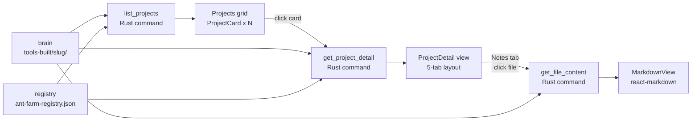

# Projects

**Parent topic:** [Features](../features.md)

The Projects subsystem is the primary entry point into your project brain. It presents a responsive card grid of every project Ant Farm finds in the brain’s `tools-built/` directory, then offers a five-tab detail view for deep inspection of any individual project: its overview README, ideas, notes, auto-filed sessions, and a dispatch launch pad. All data is read from local files; no API calls are made at any stage.

---

## Data model

Two TypeScript types underpin the feature, defined in `src/types.ts`.

### `Project` (grid card)

```typescript
export interface Project {
  slug: string;           // directory name under tools-built/
  name: string;           // extracted from the first H1 in README.md
  status: string | null;  // extracted from "Status: …" line in README.md
  last_activity: number | null; // unix epoch seconds — newest mtime in the project dir
  idea_count: number;     // bullet lines in ideas.md
  decision_count: number; // bullet lines in decisions.md
  repos: string[];        // repo basenames from ant-farm-registry.json
}
```

### `ProjectDetail` (detail view)

```typescript
export interface ProjectDetail {
  slug: string;
  name: string;
  status: string | null;
  last_activity: number | null;
  repos: string[];
  readme: string | null;         // full text of README.md, if present
  ideas: string | null;          // full text of ideas.md, if present
  notes_files: string[];         // filenames under notes/ (not content)
}
```

`notes_files` carries only names — content is fetched on demand by a separate `get_file_content` call when the user clicks a file in the Notes tab.

### `RepoPath`

```typescript
export interface RepoPath {
  repo: string;   // basename as stored in registry (e.g. "antfarm")
  path: string;   // resolved absolute path on disk (e.g. "/Users/…/Desktop/antfarm")
}
```

`RepoPath` is used exclusively by the Dispatch tab to provide a working directory for `claude -p` runs. See [Dispatch](../features/dispatch.md) for dispatch mechanics.

---

## Backend commands

Four `#[tauri::command]` functions in `src-tauri/src/main.rs` serve this feature.

### `list_projects() -> Vec<Project>`

Registered in `src-tauri/src/main.rs` at line 295.

```
brain_root()  →  ~/Desktop/CD_claude
tools_dir     →  ~/Desktop/CD_claude/tools-built/
registry      →  ~/Desktop/CD_claude/ant-farm-registry.json
```

For each subdirectory in `tools-built/`:

1.  Treats the directory name as the `slug`.
2.  Calls `extract_h1(README.md, slug)` to get the human `name`. Falls back to the slug if the README is absent or has no `# …` heading.
3.  Calls `extract_status(README.md)` to scan lines for a `Status: …` prefix. Returns `None` if absent.
4.  Calls `newest_mtime(project_dir)` recursively to find the most recently modified file in the entire directory tree — this becomes `last_activity`.
5.  Calls `count_bullets(ideas.md)` / `count_bullets(decisions.md)` counting lines that begin with `-` or `*` .
6.  Looks up `registry.projects.get(&slug)` to get the `repos` list. If the slug is absent from the registry, `repos` is an empty `Vec`.

Results are sorted descending by `last_activity` (most recent first). If `tools_dir` cannot be read (brain absent or unmounted), the command returns an empty `Vec` rather than erroring.

### `get_project_detail(slug: String) -> Option<ProjectDetail>`

Registered at line 345. Returns `None` if `tools-built/<slug>/` does not exist.

For the matching directory it reads:

| Field | Source |
| --- | --- |
| `name` | `extract_h1(README.md, slug)` |
| `status` | `extract_status(README.md)` |
| `last_activity` | `newest_mtime(project_dir)` |
| `repos` | `registry.projects.get(&slug).repos` |
| `readme` | `fs::read_to_string(README.md)` — `None` if absent |
| `ideas` | `fs::read_to_string(ideas.md)` — `None` if absent |
| `notes_files` | filenames in `notes/` subdir, or `[]` if missing |

`notes_files` lists only file names (not content) so the initial detail fetch stays cheap regardless of how many notes exist.

### `get_file_content(slug: String, filename: String) -> Option<String>`

Registered at line 391. Serves note file content lazily when the user selects a file in the Notes tab.

Security hardening: the function returns `None` immediately if `filename` contains `/`, `\`, or starts with `.`. This prevents path traversal out of the `notes/` directory.

Resolved path:

```
~/Desktop/CD_claude/tools-built/<slug>/notes/<filename>
```

Returns `None` if the file cannot be read; the UI renders an empty-state message in that case.

### `get_project_paths(slug: String) -> Vec<RepoPath>`

Registered at line 1805. Converts registry repo basenames into absolute on-disk paths for the Dispatch tab.

Resolution strategy (tried in order, first match wins):

1.  **Session-discovered CWDs** — `discover_session_repo_paths()` scans `~/.claude/projects/**/*.jsonl` and extracts CWDs from the first JSONL in each project directory. If the path basename matches the repo name and the directory contains a `.git` folder, it is used.
2.  **`~/Desktop/<repo>`** — checks if `~/Desktop/<repo>/.git` exists.
3.  **`~/<repo>`** — checks if `~/<repo>/.git` exists.

Both the exact basename and a dash-stripped variant (`ant-farm` → `antfarm`) are tried at each step. If no match is found the repo is silently omitted from the result. The Dispatch tab shows a “No repos resolved” message when the slice is empty.

---

## Local file layout

```
~/Desktop/CD_claude/                   ← brain_root()
├── ant-farm-registry.json             ← registry: { "projects": { "<slug>": { "repos": […] } } }
└── tools-built/
    └── <slug>/                        ← one directory per project
        ├── README.md                  ← name (H1), status ("Status: …" line)
        ├── ideas.md                   ← bullet list; count used for badge
        ├── decisions.md               ← bullet list; count used for badge
        └── notes/
            ├── sprint-notes.md        ← arbitrary note files (names listed, content lazy)
            └── …
```

All files under `tools-built/` are opened read-only. Ant Farm never writes to the brain. See [Local Data Sources](../architecture/data-sources.md) for the full file map.

---

## Data flow: end-to-end



---

## Projects grid — `src/pages/Projects.tsx`

`Projects` is a React function component rendered at the `/projects` route.

On mount it fires three parallel `invoke` calls:

| Command | Purpose |
| --- | --- |
| `list_projects` | Project list with counts and metadata |
| `git_metrics_rollup` | Per-project git stats (week commits, net lines) |
| `working_tree_rollup` | Per-project dirty-file counts |

Results from the two rollup commands are indexed by slug into `gitBySlug` and `dirtyBySlug` maps (both computed with `useMemo`). These are passed down to each `ProjectCard` alongside the project data.

The grid uses CSS `grid` with `auto-fill` and `minmax(280px, 1fr)` columns — it reflows as the window resizes without any JavaScript breakpoint logic.

Loading state shows `"Scanning brain…"` while the `list_projects` promise is in-flight. On error, a bordered red panel displays the raw error message. If the brain directory has no subdirectories, the empty state reads `"No projects found in tools-built/"`.

---

## Project card — `src/components/ProjectCard.tsx`

`ProjectCard` is a `<Link>` element that navigates to `/projects/<slug>` on click.

```typescript
interface Props {
  project: Project;
  gitMetrics?: ProjectGitMetrics;
  dirtyCount?: number;
}
```

Visual layout (top to bottom):

1.  **Header row** — project name (left) and two optional badges (right):
    
    -   Amber `"N uncommitted"` badge when `dirtyCount > 0`.
    -   `StatusBadge` when `project.status` is non-null.
2.  **Pill row** — a horizontal wrap of small `Pill` components:
    
    -   `idea_count` pills with a lightbulb icon (hidden if zero).
    -   `decision_count` pills with a zap icon (hidden if zero).
    -   One `GitBranch` pill per repo basename.
    -   If `gitMetrics` has weekly commits, two extra pills: commit count (`Nc`) and net line delta formatted by `fmtNet`.
3.  **Timestamp** — `relativeTime(project.last_activity)` at the bottom in muted zinc text.
    

**`StatusBadge` color logic:** the badge dot is `bg-emerald-400` if the status string contains `"live"` or `"active"`, `bg-amber-400` if it contains `"sprint"` or `"build"`, and `bg-zinc-500` otherwise. The badge text is truncated at 40 characters.

**`relativeTime`** (`src/lib/relativeTime.ts`) accepts a Unix epoch in seconds (not milliseconds) and returns human strings: `"just now"`, `"Nm ago"`, `"Nh ago"`, `"Nd ago"`, `"Nmo ago"`, `"Ny ago"`.

---

## Project detail view — `src/pages/ProjectDetail.tsx`

`ProjectDetail` is rendered at `/projects/:slug`. It maintains its own state machine and uses lazy loading so secondary data (sessions, dispatch paths, note content) is fetched only when the relevant tab is opened.

### State

| State variable | Type | Loaded when |
| --- | --- | --- |
| `detail` | `ProjectDetail | null` | On mount |
| `gitMetrics` | `ProjectGitMetrics | null | undefined` | On mount (parallel) |
| `workingTree` | `ProjectWorkingTree | null | undefined` | On mount (parallel) |
| `projSessions` | `SessionMeta[] | null` | Sessions tab opened (once) |
| `dispatchPaths` | `RepoPath[] | null` | Dispatch tab opened (once) |
| `projectRuns` | `RunRecord[] | null` | After dispatchPaths resolves |
| `noteContent` | `string | null` | Note file clicked |

`undefined` means “still loading”; `null` means “loaded but empty or errored”. The `GitSummaryLine` component renders nothing when `metrics === undefined`, and `"no git data"` when `metrics === null`.

### Tabs

| Tab ID | Label | Data source |
| --- | --- | --- |
| `overview` | Overview | `detail.readme` via `MarkdownView`; `WorkingTreeSection` above |
| `ideas` | Ideas | `detail.ideas` via `MarkdownView` |
| `notes` | Notes (N) | `detail.notes_files` list + `get_file_content` on click |
| `sessions` | Sessions | `list_sessions` filtered by `project_slug === slug` |
| `dispatch` | Dispatch | `get_project_paths` + `DispatchPanel` |

Switching away from Notes clears `selectedNote` and `noteContent` so the panel is fresh on return.

### Overview tab

The overview renders a `WorkingTreeSection` card above the README. `WorkingTreeSection` shows `"all committed"` if `dirty_count === 0`, or a table of `DirtyFile` entries color-coded by state: `modified`/`changed` → amber, `staged` → sky, `added` → emerald, `deleted` → rose, `renamed` → purple, `untracked` → zinc. Each row shows the file path and the file’s own `mtime` formatted by `relativeTime`.

If no `README.md` exists, the tab renders an empty-state `"No README found for this project."` message.

### Ideas tab

Renders `detail.ideas` via `MarkdownView`. If `ideas.md` is absent (`detail.ideas === null`), shows `"No ideas.md found for this project."`.

### Notes tab

A two-column layout: a narrow left column lists note filenames from `detail.notes_files`; the right panel renders the selected file’s content via `MarkdownView`. Clicking a filename calls `get_file_content(slug, filename)` which loads only that file. The UI shows a pulse animation while the file loads.

### Sessions tab

Calls `list_sessions` once on first open and filters the full list to entries where `session.project_slug === slug`. Sessions are auto-filed by the backend when a session CWD matches a known project repo. See [Sessions](../features/sessions.md) for session-matching details.

### Dispatch tab

Calls `get_project_paths(slug)` once on first open, then passes `dispatchPaths[0].path` to `DispatchPanel`. The run history below the panel lists `RunRecord` entries from `list_runs` for the same path. See [Dispatch](../features/dispatch.md) for the full dispatch flow.

### Header

The detail header shows:

-   Project name (H1).
-   `status` badge (rounded pill in `bg-zinc-800`).
-   `relativeTime(last_activity)` timestamp.
-   Each repo basename as a monospace pill.
-   `GitSummaryLine`: when git data is available, one text line summarising `week.commits`, `fmtNet` of net lines, and the most recent commit timestamp plus up to 72 characters of the commit subject.

---

## MarkdownView — `src/components/MarkdownView.tsx`

`MarkdownView` wraps `react-markdown` with a full set of custom renderers that apply the app’s dark Tailwind theme. It is used for README, ideas, and note file content — any field that carries raw Markdown text.

```typescript
interface Props {
  content: string;
  className?: string;   // forwarded to the outer div (e.g. "max-w-2xl")
}
```

Key rendering choices:

| Element | Treatment |
| --- | --- |
| `h1` | `text-xl font-bold text-zinc-100` |
| `h2` | `text-base font-semibold text-zinc-200` |
| `h3` | `text-sm font-semibold text-zinc-300` |
| `p` | `text-sm text-zinc-300 leading-relaxed` |
| `a` | Rendered as a non-navigating `<span class="text-indigo-400">` (links in brain notes should not open a browser) |
| `code` | Inline: `bg-zinc-800 text-zinc-200 px-1.5 rounded text-xs font-mono` |
| `pre` | Block: dark `bg-zinc-900` with overflow-x-auto |
| `blockquote` | Left-border `border-zinc-700` with italic muted text |

The `<a>` override is intentional: brain notes may contain Markdown links that point to local files or web URLs. Ant Farm keeps all navigation internal and never opens the system browser from note content.

---

## Registry and slug resolution

### The registry file

`ant-farm-registry.json` lives at `brain_root()` and has this shape:

```json
{
  "projects": {
    "ant-farm": {
      "repos": ["antfarm"]
    },
    "some-other-project": {
      "repos": ["repo-a", "repo-b"]
    }
  }
}
```

The outer keys are **project slugs** — they must match the directory names under `tools-built/` exactly. The `repos` array contains **repo basenames** as they appear in session CWDs or on disk, which may differ from the slug.

### The slug/repo name landmine

A common source of confusion: the registry key (slug) does not have to match the repo name. For example, Ant Farm itself has:

-   **Brain directory:** `~/Desktop/CD_claude/tools-built/ant-farm/`
-   **Registry key (slug):** `"ant-farm"`
-   **Registry repo value:** `"antfarm"` (no dash)
-   **Local folder:** `~/Desktop/antfarm`

`get_project_paths` must resolve `"antfarm"` → `/Users/…/Desktop/antfarm` even though the slug is `"ant-farm"`. The `resolve_repo_path` function handles this by also trying the dash-stripped variant of the basename, so `ant-farm` → `antfarm` is found automatically.

If a repo cannot be resolved (absent from session CWDs, `~/Desktop`, and `~/`), it is silently dropped. The Dispatch tab shows `"No repos resolved for this project. Add repos to the registry."` when the resulting slice is empty.

### Tolerant behavior when the brain is missing

`load_registry()` returns an empty `Registry::default()` (no projects, no repos) if `ant-farm-registry.json` cannot be read. `list_projects()` returns `vec![]` if `tools-built/` is unreadable. No panics, no error dialogs — the grid shows the empty-state message.

---

## Adding a new project to the brain

This is not done through the app UI; Ant Farm is read-only against the brain. To add a project:

1.  Create `~/Desktop/CD_claude/tools-built/<slug>/README.md` with a `# Project Name` heading and optionally a `Status: …` line.
2.  Add a `"<slug>": { "repos": ["<basename>"] }` entry to `ant-farm-registry.json`.
3.  Ensure the repo exists on disk at a path discoverable by `resolve_repo_path` (session CWD, `~/Desktop/<basename>`, or `~/<basename>`).
4.  Relaunch or navigate away and back to `/projects` — `list_projects` is called fresh on every mount.

---

## Related topics

-   [Git Metrics](../features/git-metrics.md) — per-project commit count, net lines, and last-commit details surfaced in the card and detail header.
-   [Sessions](../features/sessions.md) — how sessions are auto-filed to projects and surfaced in the Sessions tab.
-   [Dispatch](../features/dispatch.md) — the Dispatch tab mechanics: worktree isolation, permission modes, and live streaming runs.
-   [Local Data Sources](../architecture/data-sources.md) — the full map of brain files, the registry, and session directories.
-   [Backend](../architecture/backend.md) — the Tauri command surface, threading model, and file-watching setup.
