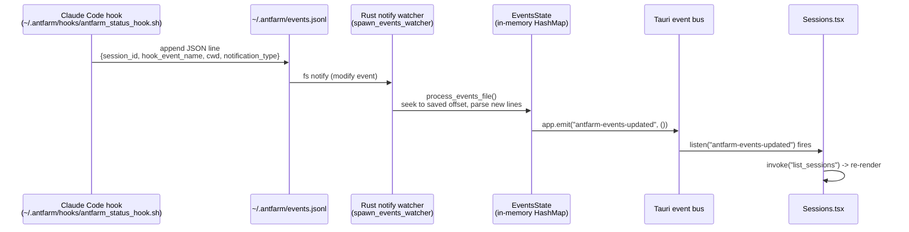

# Sessions & Push Status

**Parent topic:** [Features](../features.md)

**Prerequisites:** [Getting Started](../getting-started.md) — hook install required for push-based status.

The Sessions page is the real-time window into every active and recent Claude Code and Cowork agent session on your machine. It merges two independent providers into a single sorted list, auto-files each session under the right project, and surfaces precise lifecycle statuses driven by Claude Code hooks rather than polling.

---

## Overview

Sessions are discovered entirely from the local filesystem and the process table. No API call is ever made. Two providers are merged:

| Provider | Source files | Session ID |
| --- | --- | --- |
| `claude-code` | `~/.claude/projects/*/*.jsonl` | JSONL filename stem |
| `cowork` | `~/Library/Application Support/Claude/local-agent-mode-sessions/**/*.json` | `sessionId` field in JSON |

Both providers feed the same `SessionMeta` shape and the same `SessionRow` component. The union is sorted globally by `last_activity` (descending) and then grouped by `project_slug` in the UI.

---

## The `SessionMeta` Type

Defined in `src/types.ts`:

```ts
export interface SessionMeta {
  id: string;
  provider: "claude-code" | "cowork";
  repo_path: string | null;
  title: string | null;
  started_at: number | null;   // unix seconds
  last_activity: number;       // unix seconds
  token_totals: TokenTotals | null;
  status: "running" | "idle" | "needs_permission" | "waiting" | "done";
  project_slug: string | null;
  attention: boolean;
}
```

And the mirrored Rust struct in `src-tauri/src/main.rs`:

```rust
struct SessionMeta {
    id: String,
    provider: String,           // "claude-code" | "cowork"
    repo_path: Option<String>,
    title: Option<String>,
    started_at: Option<u64>,    // unix secs
    last_activity: u64,         // unix secs
    token_totals: Option<TokenTotals>,
    status: String,             // "running" | "idle" | "needs_permission" | "waiting" | "done"
    project_slug: Option<String>,
    attention: bool,            // true when status is needs_permission
}
```

**Key fields:**

-   `id` — for Claude Code sessions, the JSONL filename stem (UUID-like); for Cowork, the `sessionId` field from the session JSON or the filename if parsing fails.
-   `provider` — always the literal string `"claude-code"` or `"cowork"`.
-   `repo_path` — for Claude Code, the `cwd` field extracted from the first message in the JSONL; for Cowork, the first entry of `userSelectedFolders`.
-   `last_activity` — for Claude Code, the JSONL file’s mtime; for Cowork, `lastActivityAt` (milliseconds divided by 1000) falling back to file mtime.
-   `token_totals` — summed from the usage cache populated by `usage_rollup`; see [Usage](../features/usage.md) for how token totals are computed.
-   `attention` — set `true` only when the event-derived status is `"needs_permission"` and the session is still live and recent.

---

## Session Status Values

Status is determined in two phases: a baseline heuristic, then an event-derived override.

### Phase 1 — Baseline Heuristic (`session_status`)

`src-tauri/src/main.rs`, function `session_status(last_activity_secs, has_live)`:

```rust
fn session_status(last_activity_secs: u64, has_live: bool) -> &'static str {
    let now = now_unix();
    let age = now.saturating_sub(last_activity_secs);
    if has_live && age < 120 {
        "running"
    } else if has_live && age < 600 {
        "waiting"
    } else if last_activity_secs >= (now / 86400) * 86400 {
        "idle"
    } else {
        "done"
    }
}
```

`has_live` is `true` when `count_live_claude()` finds at least one `claude` process in `ps ax`. The thresholds are:

| Condition | Status |
| --- | --- |
| Live process + activity within 2 minutes | `running` |
| Live process + activity within 10 minutes | `waiting` |
| Activity today (since midnight UTC) | `idle` |
| Older than today | `done` |

### Phase 2 — Event-Derived Override

After the baseline list is built, `list_sessions` merges in statuses from the in-memory `EventsState`. A hook event always wins over the heuristic:

```rust
for session in &mut sessions {
    if let Some(ev) = event_map.sessions.get(&session.id) {
        session.status = ev.status.clone();
        session.attention = ev.attention;
        // Stale-guard: clear attention if no live process or age > 10 min
        if session.attention {
            let age = now_unix().saturating_sub(session.last_activity);
            if !has_live || age > 600 {
                session.attention = false;
            }
        }
    }
}
```

Hook events map to statuses as follows:

| `hook_event_name` | `notification_type` | Derived status | `attention` |
| --- | --- | --- | --- |
| `SessionStart` | — | `running` | `false` |
| `Stop` | — | `idle` | `false` |
| `SessionEnd` | — | `done` | `false` |
| `Notification` | `permission_prompt` | `needs_permission` | `true` |
| `Notification` | anything else | `idle` | `false` |

---

## Push-Based Status: The Full Event Path

Status updates flow from the Claude Code hook all the way to the UI without any polling loop.



**Step by step:**

1.  The Claude Code hook script (`~/.antfarm/hooks/antfarm_status_hook.sh`) runs on each lifecycle event (`SessionStart`, `Stop`, `SessionEnd`, `Notification`) with `async: true` in `~/.claude/settings.json`. It appends a JSON line to `~/.antfarm/events.jsonl`.
2.  The Rust backend watches the `~/.antfarm/` directory with `notify::RecommendedWatcher` (non-recursive, directory-level). Any change to `events.jsonl` triggers `process_events_file`.
3.  `process_events_file` maintains a byte offset (persisted to `app_data_dir()/events_offset.json`) so it only reads new bytes since last run. If the file shrinks (rotation), the offset resets to 0. Each new line is parsed as a `RawAntfarmEvent`. Unknown lines are silently skipped — the tolerant-parser contract.
4.  Parsed events update the `EventsState` HashMap, keyed by `session_id`.
5.  The watcher thread emits the Tauri event `"antfarm-events-updated"` on the app handle.
6.  `Sessions.tsx` registers a `listen("antfarm-events-updated", ...)` listener in its `useEffect`. On each event, it calls `invoke("list_sessions")` which reads the updated `EventsState` and returns fresh `SessionMeta` values.

This architecture means the UI reacts in milliseconds to a permission prompt or session end — without any polling timer.

---

## Tauri Commands

### `list_sessions`

```rust
#[tauri::command]
fn list_sessions(state: tauri::State<'_, EventsState>) -> Vec<SessionMeta>
```

Called by `Sessions.tsx` on mount and on every `"antfarm-events-updated"` event. Execution order:

1.  Load the registry from `~/Desktop/CD_claude/ant-farm-registry.json`.
2.  Count live `claude` processes via `ps ax`.
3.  Load the usage cache from `app_data_dir()/usage_cache.json`.
4.  Run `scan_claude_code_sessions` — reads `~/.claude/projects/**/*.jsonl`.
5.  Run `scan_cowork_sessions` — reads Cowork session JSON files (max 90 days back).
6.  Sort all sessions by `last_activity` descending.
7.  Merge event-derived statuses from `EventsState`.
8.  Return the unified list.

### `active_session_count`

```rust
#[tauri::command]
fn active_session_count() -> usize
```

Returns the count of live `claude` processes from `ps ax`. Used by the Sidebar to show the green badge on the Sessions nav entry. Polled every 30 seconds (not push-driven).

### `needs_you_count`

```rust
#[tauri::command]
fn needs_you_count(state: tauri::State<'_, EventsState>) -> usize
```

Returns the count of sessions in `EventsState` where `attention == true`. This is the “needs you” count used to alert when a permission prompt is waiting. Note: the stale-guard in `list_sessions` clears `attention` for dead or old sessions, but `needs_you_count` reads directly from the raw event map — callers using this for a badge should also account for staleness.

---

## Provider Details

### Claude Code Provider (`scan_claude_code_sessions`)

Source: `~/.claude/projects/` — each subdirectory is an encoded repo path (e.g., `-Users-alice-code-myapp`), and inside each directory are JSONL transcript files named by session UUID.

**Cheap parse strategy:** To avoid reading entire large transcripts, `cc_session_cheap_parse` reads only the first 8 KB of each JSONL file and extracts:

-   `title` from any line with `"type": "ai-title"` → `.aiTitle`
-   `cwd` from the first line that has a non-empty `.cwd` field
-   `started_at` from the first line with a `.timestamp` RFC 3339 string

Token totals are never re-parsed from the JSONL; they come from the pre-built usage cache. A JSONL file that fails to parse returns `(None, None, None)` and is included in the list with limited metadata — it never crashes the list.

**Project slug resolution** for Claude Code sessions uses two strategies:

1.  Parse `cwd` from the transcript, take the basename, look it up in the registry.
2.  Fall back to decoding the encoded directory name — `match_dir_to_slug` scans for the longest suffix match of any registry repo name against the directory name (e.g., `-myapp` in `-Users-alice-code-myapp`).

### Cowork Provider (`scan_cowork_sessions`)

Source: `~/Library/Application Support/Claude/local-agent-mode-sessions/**/*.json` — sessions are stored as `local_<id>.json` files nested under space and workspace subdirectories. Files older than 90 days are skipped.

Fields extracted from each JSON file:

| JSON field | Maps to |
| --- | --- |
| `sessionId` | `id` |
| `title` | `title` |
| `userSelectedFolders[0]` | `repo_path` |
| `createdAt` (ms epoch) | `started_at` (÷1000) |
| `lastActivityAt` (ms epoch) | `last_activity` (÷1000) |

If JSON parsing fails entirely, the filename is used as `id` and all other fields are `None`. Token totals come from the adjacent `audit.jsonl` file (`<session_dir_name>/audit.jsonl`), which uses `_audit_timestamp` in place of `timestamp` for date bucketing.

---

## Auto-Filing Under Projects

Each session is filed under a project slug via `repo_path` → registry lookup. The registry (`ant-farm-registry.json`) maps each slug to a list of repo folder names. For Claude Code sessions, the match is case-insensitive (`match_cwd_to_slug_ci`). For Cowork sessions, it is case-sensitive (`match_basename_to_slug`).

Sessions with no matching slug have `project_slug: null`. In the UI, they appear in an **Unfiled** section below all project groups.

If a session was filed by the event system (because the hook included a `cwd` that resolved to a slug), the event-derived `project_slug` is used as a fallback when the transcript parse did not find a `cwd`.

See [Projects](../features/projects.md) for how the brain registry is structured and how slugs are assigned.

---

## The Sessions Page (`src/pages/Sessions.tsx`)

On mount, `Sessions.tsx` calls `invoke("list_sessions")` and registers a Tauri event listener:

```ts
listen("antfarm-events-updated", () => {
  invoke<SessionMeta[]>("list_sessions")
    .then(setSessions)
    .catch(() => {});
}).then((fn) => { unlisten = fn; });
```

The listener is torn down in the cleanup function returned from `useEffect`.

**Grouping logic:**

```ts
const byProject: Record<string, SessionMeta[]> = {};
const unfiled: SessionMeta[] = [];
for (const s of sessions) {
  if (s.project_slug) {
    (byProject[s.project_slug] ??= []).push(s);
  } else {
    unfiled.push(s);
  }
}
```

Project groups are sorted by the most recent `last_activity` within the group. Each `SessionRow` is keyed `{provider}:{id}` to avoid key collisions between the two providers.

The header shows an “N active” badge (green) when `sessions.filter(s => s.status === "running").length > 0`.

---

## The `SessionRow` Component (`src/components/SessionRow.tsx`)

Each row renders: a status dot, a status label, the session title (truncated), a provider badge, estimated cost, and relative time.

Status dot colors (Tailwind classes):

| Status | Dot class |
| --- | --- |
| `running` | `bg-emerald-400 animate-pulse` |
| `needs_permission` | `bg-amber-400` |
| `waiting` | `bg-amber-300` |
| `idle` | `bg-zinc-500` |
| `done` | `bg-zinc-700` |

Status label text:

| Status | Label |
| --- | --- |
| `running` | Running |
| `needs_permission` | Needs permission |
| `waiting` | Waiting on you |
| `idle` | Idle |
| `done` | Done |

The `needs_permission` and `waiting` statuses use amber text (`text-amber-400 font-medium` and `text-amber-300`).

Provider badge:

-   `cowork` → `bg-violet-900/50 text-violet-300`, label “cowork”
-   `claude-code` → `bg-zinc-800 text-zinc-500`, label “code”

Token cost is rendered with `fmtDollars(session.token_totals.est_dollars)` from `src/lib/relativeTime`. If `token_totals` is `null` (cache miss), the cost column is a blank spacer.

---

## The Sidebar Badge

The Sidebar (`src/components/Sidebar.tsx`) polls `active_session_count` every 30 seconds and shows a green badge next to the Sessions nav entry:

```ts
{label === "Sessions" && liveCount > 0 && (
  <span className="...bg-emerald-900/60 text-emerald-400...">
    {liveCount}
  </span>
)}
```

This badge reflects the count of live `claude` processes (from `ps ax`), not the count of `SessionMeta` objects with `status === "running"`. The two can differ briefly if a process ends between the 30-second poll and the next `list_sessions` call.

---

## Tolerant Parsing

The session providers are designed to survive undocumented format changes:

-   **Claude Code:** A JSONL line that fails `serde_json::from_str` is skipped silently. A file whose first 8 KB yields no `cwd` or `title` produces a `SessionMeta` with `null` for those fields — the session still appears in the list with its ID and mtime.
-   **Cowork:** A `.json` file that fails to parse falls back to `(filename, None, None, None, None)`. The session is included with minimal data.
-   **events.jsonl:** Each line is independently parsed. A line with an unknown `hook_event_name` is ignored via the `_ => continue` arm. A line missing `session_id` or `hook_event_name` is skipped.
-   **Offset tracking:** If `events.jsonl` shrinks (e.g., rotated), the offset resets to 0 and the file is reprocessed from the start. This prevents permanently missing events after rotation.

No error in any single file propagates to crash or empty the full session list.

---

## Attention and the “Needs You” Count

`attention: true` is the signal that a session needs human input right now. It is set when:

1.  A hook event with `hook_event_name: "Notification"` and `notification_type: "permission_prompt"` is received.
2.  The stale-guard does not clear it: `has_live` is `true` and the session’s `last_activity` is within the last 10 minutes.

The stale-guard prevents phantom “needs you” alerts from sessions that ended or timed out before the UI refreshed.

`needs_you_count` returns the raw count from `EventsState` — it does not apply the stale-guard. The Sessions page does not currently render a “needs you” count separately; the amber `needs_permission` status in each row and the `attention` field are the primary signals. Future sidebar badge wiring would call `needs_you_count` to show a red alert dot.

See [Architecture: Local Data Sources](../architecture/data-sources.md) for the full `events.jsonl` schema and [Dispatch](../features/dispatch.md) for how a “Take over” action uses the session context to hand off to a terminal.

---

## Related Topics

-   [Getting Started](../getting-started.md) — hook install steps for push-based status
-   [Architecture: Local Data Sources](../architecture/data-sources.md) — `events.jsonl`, Claude Code JSONL, and Cowork `audit.jsonl` schemas
-   [Features: Projects](../features/projects.md) — how the brain registry maps repos to slugs
-   [Features: Usage](../features/usage.md) — token totals and how the usage cache is built
-   [Features: Dispatch](../features/dispatch.md) — taking over a session and launching headless runs
