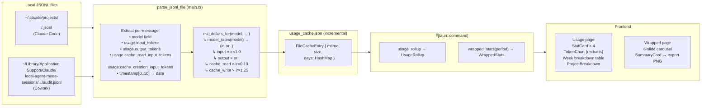

# Usage, Cost & Wrapped

**Parent topic:** [Features](../features.md)

The Usage page (`src/pages/Usage.tsx`) and the Wrapped recap (`src/pages/Wrapped.tsx`) give you a precise, local-only view of how many tokens you have consumed, what they cost, and how your productivity looks over a chosen period. Both pages are read-only — they pull from the same incremental file cache the backend maintains across every Claude Code and Cowork session.

No API call is made when you open either page. All data is derived from local JSONL files on disk. See [Local Data Sources](../architecture/data-sources.md) for how those files are located, and [Sessions & Push Status](../features/sessions.md) for the session provider that writes them.

---

## Data flow overview



---

## Backend: `usage_rollup`

**Command:** `usage_rollup` (registered in `main()` via `tauri::Builder`) **Return type:** `UsageRollup` (Rust) / `UsageRollup` (TypeScript interface in `src/types.ts`)

### Incremental cache

Every JSONL file is keyed in `usage_cache.json` by its absolute path. The cache entry stores `mtime` and `size`; if both match the current file on disk, the pre-parsed `DayBucket` map is reused. Only changed or new files are re-parsed. The page header shows `cached_files` vs `parsed_files` for this run.

```rust
struct FileCacheEntry {
    mtime: u64,
    size: u64,
    days: HashMap<String, DayBucket>,  // "YYYY-MM-DD" → DayBucket
}
```

### JSONL parsing (`parse_jsonl_file`)

Lines are filtered to `type == "assistant"`. For each qualifying line:

| JSONL field | Maps to |
| --- | --- |
| `message.model` | model identifier used for pricing |
| `message.usage.input_tokens` | `DayBucket.input` |
| `message.usage.output_tokens` | `DayBucket.output` |
| `message.usage.cache_read_input_tokens` | `DayBucket.cache_read` |
| `message.usage.cache_creation_input_tokens` | `DayBucket.cache_write` |
| `timestamp[0..10]` or `_audit_timestamp[0..10]` | date key (Claude Code uses `timestamp`; Cowork uses `_audit_timestamp`) |

The parser is tolerant: missing fields default to `0`; lines that fail to parse as JSON are skipped.

### Pricing model (`est_dollars_for`)

Cost is computed per message using the model read from that message’s `model` field. The rate table is in `model_rates`:

| Model identifier | Input rate ($/M) | Output rate ($/M) |
| --- | --- | --- |
| `claude-opus-4-8` | 5.00 | 25.00 |
| `claude-sonnet-4-6` | 3.00 | 15.00 |
| unknown / future | 4.00 (blended) | 20.00 (blended) |

Cache token multipliers are applied **from the message’s own input rate**:

```rust
fn est_dollars_for(model: &str, input: u64, output: u64, cache_read: u64, cache_write: u64) -> f64 {
    let (ir, or_) = model_rates(model);
    (input      as f64 * ir * 1.00       // direct input → input_rate × 1.0
        + output      as f64 * or_       // output → output_rate
        + cache_read  as f64 * ir * 0.10 // cache read → input_rate × 0.10
        + cache_write as f64 * ir * 1.25 // cache write → input_rate × 1.25
    ) / 1_000_000.0
}
```

Messages with `model == "<synthetic>"` return `0.0` and do not affect cost totals. All dollar figures produced by this function are estimates, not invoices.

### `DayBucket` and accumulation

`DayBucket` is the internal accumulator (not serialized to the frontend directly):

```rust
struct DayBucket {
    input: u64,
    output: u64,
    cache_read: u64,
    cache_write: u64,
    est_dollars: f64,
}
```

`total_tokens()` returns `input + output + cache_read + cache_write`.

Buckets are accumulated into `by_project_day: HashMap<slug, HashMap<date, DayBucket>>` — every directory under `~/.claude/projects/` is matched to a project slug via the registry, and every `audit.jsonl` found in the Cowork session tree is similarly attributed.

### Weekly window and cap

The weekly window is defined by `Settings { weekly_cap_tokens, reset_weekday }`:

```typescript
// src/types.ts
interface Settings {
  weekly_cap_tokens: number;
  reset_weekday: number; // 0=Mon … 6=Sun
}
```

The backend default (applied when `settings.json` is absent or unreadable):

```rust
impl Default for Settings {
    fn default() -> Self {
        Self {
            weekly_cap_tokens: 100_000_000, // 100 M tokens
            reset_weekday: 0,               // Monday
        }
    }
}
```

`week_start` is computed as today minus `days_since_reset` (`(today_dow + 7 - reset_dow) % 7`). `days_until_reset` is `0` when today is the reset day, otherwise `7 - days_since_reset`.

### `UsageRollup` shape

```typescript
// src/types.ts
interface UsageRollup {
  days: DayUsage[];          // last 14 calendar days, each with all four token categories
  week: WeekTotals;          // aggregated week window
  by_project: ProjectUsage[]; // all-time, sorted by est_dollars desc
  cached_files: number;
  parsed_files: number;
}

interface DayUsage {
  date: string;          // "YYYY-MM-DD"
  input: number;
  output: number;
  cache_read: number;
  cache_write: number;
  est_dollars: number;
  total_tokens: number;
}

interface WeekTotals {
  input: number;
  output: number;
  cache_read: number;
  cache_write: number;
  est_dollars: number;
  total_tokens: number;
  week_start: string;    // "YYYY-MM-DD"
  today: string;
  days_until_reset: number;
}

interface ProjectUsage {
  slug: string;
  name: string;
  input: number;
  output: number;
  cache_read: number;
  cache_write: number;
  est_dollars: number;
  total_tokens: number;
}
```

---

## Frontend: Usage page (`src/pages/Usage.tsx`)

The page invokes two Tauri commands on mount via `Promise.all`:

```typescript
Promise.all([
  invoke<UsageRollup>("usage_rollup"),
  invoke<Settings>("get_settings"),
]).then(([r, s]) => {
  setRollup(r);
  setSettings(s);
  setLoading(false);
});
```

`get_settings` reads `settings.json` from the app data directory (falling back to defaults). The Settings object is used solely to compute the cap percentage and the reset label.

### Stat cards (`StatCard`)

Four `StatCard` components sit in a 2×2 (mobile) / 1×4 (sm+) grid:

| Label | Value source | Sub-label |
| --- | --- | --- |
| Week tokens | `week.total_tokens` | `week.output` formatted |
| Est. cost | `week.est_dollars` | “est. — labeled, not exact” |
| Cap used | `(week.total_tokens / settings.weekly_cap_tokens) * 100` | `settings.weekly_cap_tokens` formatted |
| Resets in | `week.days_until_reset` (0 → “Today”, else `${n}d`) | `week.week_start` |

`StatCard` renders with an `accent` variant (indigo border + background) for the cost card only:

```typescript
// src/components/StatCard.tsx
interface Props {
  label: string;
  value: string;
  sub?: string;
  accent?: boolean;
}
```

### Token chart (`TokenChart`)

`TokenChart` uses [recharts](https://recharts.org/) to render a stacked `BarChart` over 14 days (`days` array from `UsageRollup`). The three stacked series, in render order:

| Series | `dataKey` | Fill color |
| --- | --- | --- |
| Output | `output` | `#6366f1` |
| Cache write | `cache_write` | `#4338ca` |
| Input | `input` | `#3730a3` |

Cache read is not stacked in the chart bars but appears in the custom tooltip. The `weekOnly` prop (default `false`) can filter the chart to only dates at or after `weekStart`; the Usage page always passes the full 14-day window.

```typescript
// src/components/TokenChart.tsx signature
function TokenChart({ days, weekStart, weekOnly = false }: {
  days: DayUsage[];
  weekStart: string;
  weekOnly?: boolean;
})
```

### Week breakdown table

A plain `<table>` shows each token category with its hardcoded rate and computed estimated cost. The inline `TRow` helper computes `est = (tokens / 1_000_000) * rate`:

| Row | Rate ($/M) |
| --- | --- |
| Output | 15.00 |
| Cache write | 3.75 |
| Input (direct) | 3.00 |
| Cache read | 0.30 |

These rates match the `claude-sonnet-4-6` pricing used as the UI display label. The backend `est_dollars` field is the authoritative per-model figure; the table rates are for display transparency only. A footer note reads: “Rates: Sonnet 4.6 pricing. All dollar figures are estimates, not invoices.”

### Per-project breakdown (`ProjectBreakdown`)

`ProjectBreakdown` renders `by_project` (all-time, sorted by `est_dollars` desc). Each row shows:

-   Project name (linked to `/projects/:slug` unless `slug == "unfiled"`)
-   Total tokens and estimated cost
-   A progress bar scaled to the highest-token project in the list

```typescript
// src/components/ProjectBreakdown.tsx signature
function ProjectBreakdown({ projects, compact = false, dirtyBySlug }: {
  projects: ProjectUsage[];
  compact?: boolean;
  dirtyBySlug?: Record<string, number>;
})
```

The `compact` prop (shows top 5) and `dirtyBySlug` badge are used by other callers; the Usage page passes neither.

---

## Backend: `wrapped_stats`

**Command:** `wrapped_stats(period: String)` where `period` is `"week"`, `"month"`, or `"all_time"`. **Return type:** `WrappedStats` (Rust, `#[serde(rename_all = "camelCase")]`) / `WrappedStats` (TypeScript).

### Period windows

| Period | Start | Previous start / end |
| --- | --- | --- |
| `week` | Current `week_start` | Previous 7-day window |
| `month` | today − 29 days | today − 59 days … today − 30 days |
| `all_time` | `2020-01-01` | none (no previous comparison) |

### Token aggregation

`wrapped_stats` runs the same incremental cache logic as `usage_rollup` — reading both `~/.claude/projects/` (Claude Code) and the Cowork session tree. It accumulates:

-   `period_days: HashMap<date, DayBucket>` — dates inside the chosen window
-   `prev_days: HashMap<date, DayBucket>` — dates inside the previous window
-   `by_project_period: HashMap<slug, DayBucket>` — per-project aggregate for the period

The `daily_tokens` sparkline covers the last 7 calendar days (clipped to the period window).

### Git metrics integration

`wrapped_stats` reads the git metrics cache (`git_metrics_cache.json`) to populate `linesAdded`, `linesRemoved`, and `commits`. For the `month` period it recomputes metrics live via `compute_git_metrics_since`. This data is also shown in [Git Metrics](../features/git-metrics.md).

### Dispatch run counts

`dispatch::load_all_runs()` filters run records by `started_at[0..10]` to count `runCount`, `runDone`, `runFailed`, and `runKilled` for the period. See [Dispatch](../features/dispatch.md).

### `WrappedStats` shape

```typescript
// src/types.ts
interface WrappedStats {
  period: string;
  periodStart: string;      // camelCase via serde rename_all
  periodEnd: string;
  totalTokens: number;
  totalCost: number;        // est_dollars for the period
  inputTokens: number;
  outputTokens: number;
  linesAdded: number;
  linesRemoved: number;
  commits: number;
  runCount: number;
  runDone: number;
  runFailed: number;
  runKilled: number;
  busiestDay: string | null;
  busiestDayTokens: number;
  currentStreak: number;    // consecutive days with >0 tokens (from today backward)
  longestStreak: number;    // longest consecutive run of active days in the period
  prevPeriodTokens: number;
  prevPeriodCost: number;
  dailyTokens: DailyTokenPoint[]; // last 7 days
  topProjectSlug: string | null;
  topProjectName: string | null;
  topProjectTokens: number;
}

interface DailyTokenPoint {
  date: string;
  tokens: number;
}
```

---

## Frontend: Wrapped page (`src/pages/Wrapped.tsx`)

### Period selector

Three period buttons (`week`, `month`, `all time`) each trigger a new `invoke("wrapped_stats", { period })` call, resetting the slide to 0.

### Slide carousel

Six slides auto-advance every 5 000 ms (except the final summary card). Clicking the left or right half of the slide area navigates backward/forward. A progress bar strip shows current position.

| Slide ID | Content | Key data |
| --- | --- | --- |
| `tokens` | Count-up to `totalTokens` (fmtK) | vs prev period via `vsHistory` hook pill; words / novels derived via `lib/wrapped.ts` |
| `cost` | Count-up to `totalCost × 100` cents | Displays as `$N.NN` |
| `lines` | Count-up to `linesAdded` | `linesRemoved`, `commits`, estimated focused hours |
| `runs` | Count-up to `runCount` | `runDone`, `runFailed`, `runKilled`, estimated agent-hours |
| `streak` | Count-up to `currentStreak` (days) | `longestStreak`, `busiestDay`, `topProjectName` |
| `card` | `SummaryCard` — exportable PNG | Sparkline of last 7 days, lines, runs, spend |

The `useCountUp` hook animates from 0 to `target` over 1 100 ms using a cubic-ease-out curve (`1 - (1 - p)^3`).

### `lib/wrapped.ts` helpers

All helper functions are pure arithmetic — no fabricated percentiles or global comparisons:

```typescript
// tokens × 0.75 ≈ words (standard LLM approximation)
export function tokensToWords(tokens: number): number

// average novel ≈ 90,000 words
export function wordsToNovels(words: number): number

// 50 lines changed per focused hour
export function linesToHours(linesChanged: number): number

// est. 15-min avg dispatch run → 0.25 agent-hours per run
export function runsToAgentHours(runs: number): number

// vs-own-history ratio: null when no prior period or all_time
export function vsHistory(current: number, prev: number, period: Period): string | null

export function fmtK(n: number): string   // 1234 → "1.2k", 1000000 → "1.0M"
export function fmtDate(iso: string): string // "2026-06-25" → "Jun 25"
```

`vsHistory` returns `null` for `all_time` (no `prevPeriodTokens`) and whenever either side is zero. The hook pill is omitted when `vsHistory` returns `null`.

### PNG export (`save_png_to_desktop`)

The final “card” slide renders an exportable `SummaryCard` `<div>` containing tokens, a 7-day `Sparkline` (inline SVG), lines added, run count, and spend. Pressing “save as PNG”:

1.  Calls `toPng(cardRef.current, { pixelRatio: 2, backgroundColor: "#1a212c" })` via `html-to-image`.
2.  Strips the `data:image/png;base64,` prefix.
3.  Calls `invoke("save_png_to_desktop", { filename, dataBase64 })`.
4.  The Rust handler base64-decodes and writes the file to `~/Desktop/antfarm-wrapped-{period}.png`.

---

## Settings and the weekly cap

Settings are persisted to `{app_data_dir}/settings.json` (read by `get_settings`, written by `save_settings`). The two fields relevant to the Usage page:

| Field | Type | Default | Meaning |
| --- | --- | --- | --- |
| `weekly_cap_tokens` | `u64` | `100_000_000` | Token budget per week; drives “Cap used %” |
| `reset_weekday` | `u8` (0–6) | `0` (Monday) | Day of week the week window resets |

`reset_weekday` encodes as `0 = Mon`, `1 = Tue`, …, `6 = Sun`. Values outside 0–6 are clamped via `.min(6)`. See [Frontend Architecture](../architecture/frontend.md) for where Settings are edited.

---

## Key constraints

**Observe-first / zero-API.** The Usage and Wrapped pages make no outbound API calls. All data is derived from local JSONL files. The pricing model is applied locally inside `est_dollars_for`; no external billing service is consulted.

**Tolerant parser.** `parse_jsonl_file` skips lines that fail JSON parsing and treats any missing usage field as `0`. This means corrupted or partial JSONL files will not break the rollup — they will simply undercount.

**Estimates, not invoices.** The `est_dollars` field is clearly labeled as an estimate throughout the UI (“est. — labeled, not exact”, “All dollar figures are estimates, not invoices.”). The per-model pricing table may lag behind Anthropic’s published rates; check `model_rates` in `src-tauri/src/main.rs` for the current values.

**Cache granularity.** The incremental cache operates at the file level (keyed by absolute path

-   mtime + size). If a session file is appended to, the entire file is re-parsed on the next `usage_rollup` or `wrapped_stats` call.

**Both providers counted.** Claude Code sessions (`~/.claude/projects/`) and Cowork sessions (`~/Library/Application Support/Claude/local-agent-mode-sessions/`) are both scanned and merged into the same rollup. The token source field on each `SessionMeta` does not filter the Usage page; all JSONL files found in either tree contribute.

---

## Related topics

-   [Sessions & Push Status](../features/sessions.md) — how sessions are discovered and their token totals surfaced live
-   [Git Metrics & Working Tree](../features/git-metrics.md) — the git data that also appears in Wrapped
-   [Dispatch](../features/dispatch.md) — the run records counted in `runCount` / `runDone` / `runFailed` / `runKilled`
-   [Local Data Sources](../architecture/data-sources.md) — the JSONL file layout and the Cowork audit path
-   [Frontend Architecture](../architecture/frontend.md) — where Settings are rendered and persisted
