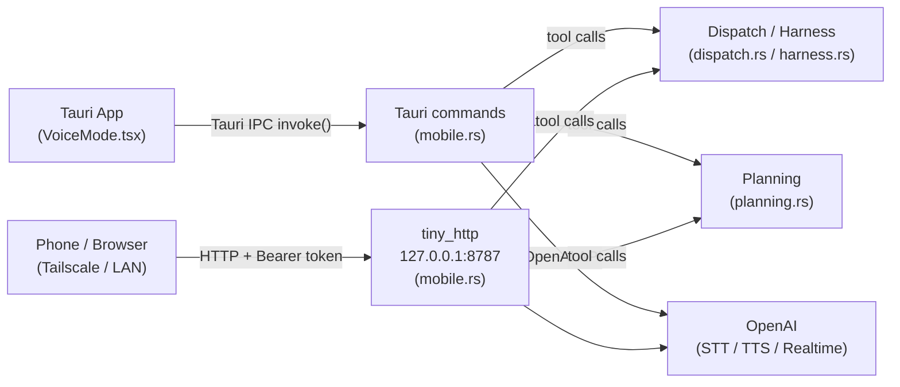

# Voice & Mobile

**Parent topic:** [Features](../features.md)

Ant Farm’s voice and mobile subsystem lets you talk to the app hands-free and reach it from a phone on your local network. Two independently useful pieces work together:

-   **Voice mode** — a full-screen Tauri page that uses the OpenAI Realtime API (WebRTC) for low-latency, bidirectional voice, with an automatic fallback to batch speech-to-text + text-to-speech when a WebRTC connection cannot be established.
-   **Mobile bridge** — a `tiny_http` server bound to `127.0.0.1:8787`, token-gated, intended to be reached over Tailscale or a LAN connection from a phone to power the mobile Morning view.

Both surfaces share the same Captain Jack AI persona and the same underlying tool set: the agent can pull the current daily brief, draft and launch a headless dispatch run, or lock tomorrow’s plan—all triggered by voice or from a phone.

**Key source files:**

| File | Purpose |
| --- | --- |
| `src-tauri/src/mobile.rs` | `tiny_http` server, all Tauri voice/mobile commands |
| `src/pages/VoiceMode.tsx` | Full-screen voice UI, WebRTC wiring, tool dispatch |
| `src/lib/useVoice.ts` | Mic capture, batch STT/TTS hook |

---

## Architecture overview



---

## The mobile bridge (`mobile.rs`)

### Startup and binding

`mobile::start(app)` is called from `main.rs` during app initialization. It spawns a dedicated OS thread that calls `tiny_http::Server::http("127.0.0.1:8787")` and blocks on `server.incoming_requests()`.

```
antfarm mobile: listening on http://127.0.0.1:8787
```

The server is intentionally bound to the loopback address, not `0.0.0.0`. Reaching it from a phone requires either a Tailscale tunnel or a port-forward on your local network. No external traffic can reach the server without that extra step.

### Token generation and storage

Before the server loop begins, `load_or_create_token()` runs:

1.  Reads `~/.antfarm/mobile-token`. If the file exists and is non-empty, that value is the token.
2.  Otherwise reads 16 bytes from `/dev/urandom`, hex-encodes them into a 32-character string, and writes it to `~/.antfarm/mobile-token` with permissions `0o600`.
3.  Prints the full first-use URL to stderr:

```
antfarm mobile: open http://127.0.0.1:8787/?token=<token>
```

The token file is documented as a local data source in [Local Data Sources](../architecture/data-sources.md).

### Authorization

Every incoming request calls `is_authorized(request, token)` before any handler logic runs. Authorization passes if either:

-   The `Authorization` header equals `Bearer <token>`, or
-   The `?token=<value>` query parameter equals the token.

The root path (`GET /`) serves the embedded mobile HTML page without requiring authorization, so the URL printed at startup is self-loading.

Unauthorized requests receive a `401 Unauthorized` plain-text response and continue to the next request.

### HTTP endpoints reference

All endpoints except `GET /` require a valid token. `POST` routes return `405 Method Not Allowed` if called with the wrong method.

#### Harness / runs

| Method | Path | Body / Query | Response |
| --- | --- | --- | --- |
| `GET` | `/api/runs` | — | JSON array of plan states |
| `GET` | `/api/diff` | `?plan=<id>&run=<id>` | Plain-text diff |
| `GET` | `/api/summary` | `?plan=<id>&run=<id>` | Plain-text summary |
| `POST` | `/api/merge` | `?plan=<id>&run=<id>` | Plain text (success message) |
| `POST` | `/api/toss` | `?plan=<id>&run=<id>` | `tossed` |
| `POST` | `/api/author` | `{"description":"…","projectPath":"…"}` | JSON authored plan |
| `GET` | `/api/plans` | — | JSON array of authored plans |
| `POST` | `/api/arm` | `{"path":"<plan-file>"}` | `{"planId":"…"}` |
| `GET` | `/api/projects` | — | JSON array of `{slug, name, path}` |

These endpoints mirror the dispatch and overnight harness features — see [Dispatch](../features/dispatch.md) and the overnight harness for context.

#### Morning and planning

| Method | Path | Body / Query | Response |
| --- | --- | --- | --- |
| `GET` | `/api/morning` | `?now=<ts>&force=true` | Plain-text brief |
| `POST` | `/api/morning-chat` | `{"message","now","dateKey","briefingJson"}` | Plain text reply |
| `POST` | `/api/morning-insight` | `{"doneSummary","now"}` | Plain text insight |
| `POST` | `/api/refresh-whoop` | — | Plain text status |
| `GET` | `/api/morning-cache` | — | Cached brief text |
| `GET` | `/api/whoop-today` | — | JSON WHOOP metrics |
| `POST` | `/api/lock-plan` | — | `{"ok":true,"markdown":"…"}` |
| `POST` | `/api/assistant` | `{"message","now","dateKey","briefingJson"}` | `{"reply","mode","plan_id?"}` |

The `/api/assistant` endpoint is the dispatch-aware chat interface. It calls `crate::morning::assistant_chat_turn`. When the model returns a `Dispatch` intent the handler stores a `PendingIntent` and responds with a confirmation. A subsequent affirmative message (e.g. “go”, “yes”, “do it”) authors the plan and arms it via the harness; a negative message drops it. See [Morning & Planning](../features/morning-and-planning.md) for the planning flow.

#### Voice endpoints (mobile)

| Method | Path | Body | Response |
| --- | --- | --- | --- |
| `POST` | `/api/stt` | Multipart audio file | `{"text":"…"}` |
| `POST` | `/api/tts` | `{"text":"…","voice":"…"}` | `audio/mpeg` binary |
| `POST` | `/api/realtime-token` | `{"mode":"general"|"morning"|"night"}` | `{"token","model","session_id"}` |
| `POST` | `/api/lock-plan` | — | `{"ok":true,"markdown":"…"}` |

The `/api/stt` handler parses a multipart form body to extract the audio bytes and their content-type, then calls `call_openai_stt`. The `/api/tts` handler returns the MP3 bytes directly (not base64). The `/api/realtime-token` handler calls `call_openai_realtime_session` to create an ephemeral OpenAI Realtime API session.

---

## Tauri voice commands (desktop IPC)

These are `#[tauri::command]` functions registered in `main.rs` and invoked from the React frontend via `invoke()`. They run in the Tauri async runtime, not the `tiny_http` thread.

### `voice_stt`

```rust
pub fn voice_stt(audio_base64: String, content_type: String) -> Result<String, String>
```

Decodes the base64 audio string (chunks of 8192 bytes to avoid stack overflow in JS), then calls `call_openai_stt` with the raw bytes and the MIME type forwarded from `MediaRecorder`. Returns the transcript string.

Frontend call (inside `useVoice.ts`):

```typescript
const transcript = await invoke<string>("voice_stt", {
  audioBase64,
  contentType: mr.mimeType || "audio/webm",
});
```

### `voice_tts`

```rust
pub fn voice_tts(text: String, voice: Option<String>) -> Result<String, String>
```

Calls `call_openai_tts`. The default voice constant is `VOICE_JARVIS = "ash"`. Returns a base64-encoded MP3 string. The frontend decodes it with `atob`, wraps it in a `Blob`, and plays it through a temporary `<audio>` element.

### `get_realtime_token`

```rust
pub async fn get_realtime_token(mode: Option<String>) -> Result<serde_json::Value, String>
```

Posts to `https://api.openai.com/v1/realtime/client_secrets` using the `OPENAI_API_KEY` environment variable. The `mode` parameter (`"general"`, `"morning"`, or `"night"`) controls the system prompt injected into the realtime session body via `realtime_session_body`. Returns `{"token","model","session_id"}`. The token extraction handles three response shapes for forward/backward compatibility with OpenAI’s GA client secrets format.

### `append_voice_log`

```rust
pub fn append_voice_log(line: String)
```

Appends a timestamped line to `~/.antfarm/voice-debug.log`. This file persists across voice sessions. The frontend calls this on every event via `log()`:

```typescript
invoke("append_voice_log", { line }).catch(() => {});
```

### `jarvis_chat`

```rust
pub async fn jarvis_chat(message: String) -> Result<String, String>
```

A simple chat-completion call to `gpt-4o-mini` with the Captain Jack system prompt:

```
You are Captain Jack, a concise AI chief of staff. Speak conversationally.
Keep replies to 2-3 sentences unless detail is requested.

Context: <today's brief>
```

Used only in fallback mode. The brief context is injected from `read_brief_context()`, which reads the brain’s `active/today-brief.json`. Returns the assistant’s reply string.

### Tool-calling commands

These four commands are invoked when the OpenAI Realtime model executes a function call during a session. They are also available from fallback mode.

#### `tool_get_brief`

```rust
pub fn tool_get_brief() -> String
```

Returns `read_brief_context()` — the contents of the current daily brief, which Captain Jack uses to answer questions about today’s plan, scheduled work, and project status.

#### `tool_draft_dispatch`

```rust
pub async fn tool_draft_dispatch(
    app: tauri::AppHandle,
    voice_pending: tauri::State<'_, VoicePendingState>,
    task: String,
) -> Result<String, String>
```

Calls `crate::morning::assistant_chat_turn` with the `task` string. If the model returns a `Dispatch` intent, the intent is stored in `VoicePendingState` and the command returns a confirmation string like `"Plan drafted for <project>. Say go to launch, or cancel to drop it."` If the model replies conversationally (no dispatch intent), that text is returned instead.

See [Dispatch](../features/dispatch.md) for how authored plans become dispatch runs.

#### `tool_launch_dispatch`

```rust
pub async fn tool_launch_dispatch(
    app: tauri::AppHandle,
    voice_pending: tauri::State<'_, VoicePendingState>,
) -> Result<String, String>
```

Takes the pending intent out of `VoicePendingState`, resolves the project’s repo path from the registry, calls `harness::author_plan_core` to write the plan file, then calls `harness::arm_plan_from_path` to start the harness run. Returns a short confirmation with the first 12 characters of the plan ID.

If no intent is pending, returns `"No plan pending. Draft one first with draft_dispatch."`.

#### `tool_lock_tomorrow_plan`

```rust
pub async fn tool_lock_tomorrow_plan(app: tauri::AppHandle) -> Result<String, String>
```

Calls `crate::planning::run_lock_now` on a blocking thread (via `spawn_blocking`). This writes tomorrow’s locked plan to the brain. See [Morning & Planning](../features/morning-and-planning.md) for the full nightly planning flow.

---

## Frontend: `VoiceMode.tsx`

`src/pages/VoiceMode.tsx` is the full-screen voice UI. It supports two modes selected at runtime:

| Mode | Mechanism | Path |
| --- | --- | --- |
| `realtime` | WebRTC + OpenAI Realtime API data channel | Default |
| `fallback` | Batch STT → `jarvis_chat` → TTS | Auto-selected on WebRTC failure |

A `?mode=general|morning|night` query parameter is read from the URL and forwarded to `get_realtime_token`, controlling which system prompt the Realtime session is seeded with.

### Realtime mode: connection sequence

```
1. invoke("get_realtime_token", { mode })
       → { token, model, session_id }

2. navigator.mediaDevices.getUserMedia({ audio: true })

3. new RTCPeerConnection()
   + createDataChannel("oai-events")

4. pc.createOffer() → setLocalDescription()
   POST https://api.openai.com/v1/realtime/calls
     Authorization: Bearer <token>
     Content-Type: application/sdp
   → answer SDP → pc.setRemoteDescription()

5. Data channel "open" → session is live
```

The WebRTC data channel carries JSON events. The frontend handles `response.function_call_arguments.done` events in `handleToolCall`:

```typescript
async function handleToolCall(name: string, args: Record<string, string>, callId: string) {
  let result = "ok";
  if (name === "get_brief") {
    result = await invoke<string>("tool_get_brief");
  } else if (name === "draft_dispatch") {
    result = await invoke<string>("tool_draft_dispatch", { task: args.task || "" });
    setPlanPending(true);
  } else if (name === "launch_dispatch") {
    result = await invoke<string>("tool_launch_dispatch");
    setPlanPending(false);
  } else if (name === "lock_tomorrow_plan") {
    result = await invoke<string>("tool_lock_tomorrow_plan");
  }
  sendRT({ type: "conversation.item.create", item: {
    type: "function_call_output", call_id: callId, output: result
  }});
  sendRT({ type: "response.create" });
}
```

The orb animates through states: `idle → connecting → listening → thinking → speaking`, driven by incoming realtime events.

### Fallback mode: batch STT + TTS

When `voiceMode` switches to `"fallback"`, the `useVoice` hook takes over. Holding the mic button:

1.  `MediaRecorder` captures audio into `Blob` chunks.
2.  On stop, blobs are concatenated, base64-encoded (chunked at 8192 bytes to stay within JS stack limits), and sent to `voice_stt`.
3.  The transcript triggers `onTranscript`, which calls `jarvis_chat` and then `voice.speak(reply)`.
4.  `voice.speak` calls `voice_tts`, decodes the base64 MP3, and plays it.

### Debug logging

Every significant event calls `log(msg)`, which:

-   Prepends an `HH:MM:SS.mmm` timestamp.
-   Appends to a rolling 300-line in-memory buffer (`debugLogRef`).
-   Calls `invoke("append_voice_log", { line })` to persist to `~/.antfarm/voice-debug.log`.

The debug panel is toggled in the UI and survives the voice session being stopped.

---

## `useVoice.ts` hook

`src/lib/useVoice.ts` is a reusable React hook for the fallback voice path.

```typescript
export type VoiceState = "idle" | "recording" | "transcribing" | "speaking" | "error";

export function useVoice({ voice = "ash", onTranscript }: UseVoiceOptions = {})
```

Returned values:

| Name | Type | Description |
| --- | --- | --- |
| `state` | `VoiceState` | Current recording/playback state |
| `error` | `string | null` | Last error message |
| `isSupported` | `boolean` | `true` if `MediaRecorder` is available |
| `startRecording` | `() => Promise<void>` | Captures mic, on stop calls `voice_stt` |
| `stopRecording` | `() => void` | Stops the active `MediaRecorder` |
| `speak` | `(text, voice?) => Promise<void>` | Calls `voice_tts`, plays result |
| `stopAll` | `() => void` | Stops audio and recording, resets to idle |

The hook manages a `MediaRecorder` ref, an `HTMLAudioElement` ref for playback, and the chunked base64 encoding required to stay within the JS call-stack limit for large audio blobs.

---

## Tracing a voice command end-to-end

Here is the full path for a voice command like “draft a dispatch run for the antfarm project to add dark mode”:

```
1. User holds mic button (or speaks in realtime mode)

2. [Realtime] OpenAI Realtime API → speech recognized
   [Fallback] MediaRecorder → voice_stt → transcript

3. Captain Jack agent decides to call draft_dispatch(task="add dark mode")

4. [Realtime] response.function_call_arguments.done event
             → handleToolCall("draft_dispatch", {task}, callId)
             → invoke("tool_draft_dispatch", { task })
   [Fallback] jarvis_chat returns text; no structured tool call in fallback

5. tool_draft_dispatch:
   - calls morning::assistant_chat_turn with task string
   - model returns Dispatch { project_slug, task }
   - stores PendingIntent in VoicePendingState
   - returns "Plan drafted for Antfarm. Say go to launch, or cancel."

6. Agent speaks reply via TTS / realtime audio

7. User says "go"

8. [Realtime] draft_dispatch returns; agent calls launch_dispatch()
   → invoke("tool_launch_dispatch")
   tool_launch_dispatch:
   - takes PendingIntent from VoicePendingState
   - resolves project path from registry
   - harness::author_plan_core → writes plan JSON
   - harness::arm_plan_from_path → starts harness run
   - returns "It's running, plan <id>. Results in Agents view."

9. Agent speaks confirmation

10. Run appears in the Agents / Overnight Harness view
```

---

## Security posture

| Concern | Mitigation |
| --- | --- |
| Remote access | Server bound to `127.0.0.1:8787`; phone access requires Tailscale or explicit port-forward |
| Token strength | 16 bytes from `/dev/urandom` → 32 hex characters; stored at `~/.antfarm/mobile-token` with `0o600` permissions |
| Token transmission | Accepted via `Authorization: Bearer <token>` header or `?token=` query param; use HTTPS/Tailscale to avoid cleartext on LAN |
| Write scope | All writes stay inside `~/.antfarm/` or the project worktree under harness control |
| OpenAI key | Passed via `OPENAI_API_KEY` environment variable; never written to disk by this module |
| Unauthenticated path | Only `GET /` (serves embedded HTML); all `/api/*` routes enforce the token check |

---

## Environment and dependencies

| Requirement | Detail |
| --- | --- |
| `OPENAI_API_KEY` | Required for STT, TTS, `jarvis_chat`, and realtime token endpoints |
| `tiny_http` crate | Declared in `src-tauri/Cargo.toml`; single-threaded request loop |
| `~/.antfarm/mobile-token` | Auto-created on first run; delete it to rotate the token |
| `~/.antfarm/voice-debug.log` | Append-only debug log; delete to clear |
| Tailscale (optional) | Recommended for reaching `127.0.0.1:8787` from a phone securely |
| Mic permission | macOS: System Preferences → Privacy → Microphone → Ant Farm |

---

## Extending the subsystem

### Adding a new mobile API endpoint

Add a new arm to the `match path { ... }` block in `mobile::start`. Follow the existing pattern: check `auth`, check the HTTP method, read the body if needed, call into existing crate functions, respond with `respond()` or `respond_binary()`.

### Adding a new voice tool

1.  Write a new `#[tauri::command]` function in `mobile.rs` (or another module) and register it in `tauri::Builder::invoke_handler` in `main.rs`.
2.  Add the new tool name to the `if/else if` chain in `handleToolCall` in `VoiceMode.tsx`:
    
    ```typescript
    } else if (name === "my_new_tool") {
      result = await invoke<string>("my_new_tool", { ...args });
    }
    ```
    
3.  The tool must also be declared in the realtime session body’s `tools` array so the model knows it exists. That configuration lives in `realtime_session_body` in `mobile.rs`.

### Rotating the token

Delete `~/.antfarm/mobile-token` and restart the app. A new 16-byte token is generated and printed to stderr.

---

## Related topics

-   [Features](../features.md) — all Ant Farm subsystems
-   [Dispatch](../features/dispatch.md) — how tool\_draft\_dispatch and tool\_launch\_dispatch create and arm headless runs
-   [Morning & Planning](../features/morning-and-planning.md) — Captain Jack persona, the daily brief, tool\_lock\_tomorrow\_plan
-   [Local Data Sources](../architecture/data-sources.md) — ~/.antfarm/mobile-token and other local files
-   [Backend](../architecture/backend.md) — Tauri command registration and threading model
