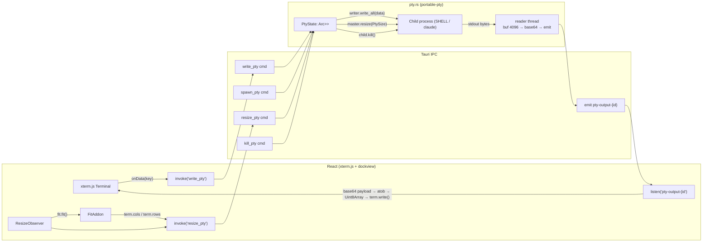

# Workspace

The Workspace is Ant Farm’s interactive, always-live terminal environment. It provides a tabbed, tiled arrangement of panes — each pane is a full PTY terminal rendered by xterm.js — docked and resized freely via the [dockview](https://dockview.dev) library. Layouts are persisted per workspace so the arrangement survives restarts. This is the “v2 workspace” referenced in the README roadmap; it is now fully shipped.

**Parent topic:** [Features](../features.md)

**Prerequisites:** Familiarity with [Frontend architecture](../architecture/frontend.md) (React/Tauri IPC) and [Backend architecture](../architecture/backend.md) (Tauri commands).

---

## Data-path overview



---

## Why `element={null}` in App.tsx

Every other page in Ant Farm is rendered by React Router’s `<Outlet>` inside `Layout`. Workspace is different: open terminals must not unmount when the user navigates to another page (the PTY child process would be killed). The solution is to hoist `WorkspacePage` **above** the `<Outlet>` and keep it permanently mounted in `Layout.tsx`:

```tsx
// src/components/Layout.tsx
export function Layout() {
  const { pathname } = useLocation();
  const isWorkspace = pathname === "/workspace";

  return (
    <div className="flex h-full overflow-hidden">
      <Sidebar />
      {/* Always mounted; CSS-toggled visible/hidden */}
      <div
        className="flex-1 overflow-hidden"
        style={{ display: isWorkspace ? "flex" : "none", flexDirection: "column" }}
      >
        <WorkspacePage />
      </div>
      {/* All other routes — hidden, not unmounted, on /workspace */}
      <main
        className="flex-1 overflow-y-auto bg-surface-0"
        style={{ display: isWorkspace ? "none" : undefined }}
      >
        <Outlet />
      </main>
    </div>
  );
}
```

The route in `App.tsx` is declared as `<Route path="workspace" element={null} />` solely to register the path so that the sidebar link resolves correctly. The real render happens in `Layout`, outside the outlet. When the user switches away from `/workspace` and back, `display:none → display:flex` triggers every `ResizeObserver` inside `TerminalPane`, which calls `fit.fit()` and then `resize_pty`, keeping the terminal columns/rows in sync with the current pane dimensions.

---

## `withGlobalTauri`

`src-tauri/tauri.conf.json` sets `"withGlobalTauri": true`. This makes the Tauri core APIs (`window.__TAURI__`) available globally in the WebView without requiring a bundle import, which is needed for the xterm.js `onData` handler and event listeners to call `invoke` and `listen` at setup time inside `useEffect`.

---

## WorkspaceEntry type

Both sides of the IPC share a single entry shape.

**TypeScript** (`src/types.ts`):

```ts
export interface WorkspaceEntry {
  id: string;               // UUID generated on creation
  name: string;             // user-visible tab label
  project_slug: string | null;  // which project's repos to cwd into
  layout_json: string | null;   // serialized dockview layout (JSON string)
}
```

**Rust** (`src-tauri/src/main.rs`):

```rust
struct WorkspaceEntry {
    id: String,
    name: String,
    project_slug: Option<String>,
    layout_json: Option<String>,
}
```

---

## Persistence: `load_workspaces` / `save_workspaces`

Workspace state is stored in a JSON file at:

```
~/Library/Application Support/com.connordore.antfarm/workspaces.json
```

`load_workspaces` reads and deserializes the file on startup; `save_workspaces` serializes and writes it. Both are `#[tauri::command]` functions in `src-tauri/src/main.rs`:

```rust
#[tauri::command]
fn load_workspaces() -> Vec<WorkspaceEntry> {
    match fs::read_to_string(workspaces_path()) {
        Ok(c) => serde_json::from_str(&c).unwrap_or_default(),
        Err(_) => vec![],
    }
}

#[tauri::command]
fn save_workspaces(workspaces: Vec<WorkspaceEntry>) -> Result<(), String> {
    let dir = app_data_dir();
    fs::create_dir_all(&dir).map_err(|e| e.to_string())?;
    let json = serde_json::to_string_pretty(&workspaces).map_err(|e| e.to_string())?;
    fs::write(workspaces_path(), json).map_err(|e| e.to_string())
}
```

On the React side, `WorkspacePage` calls `load_workspaces` once on mount and calls `save_workspaces` in three situations:

1.  When a workspace is created, renamed, or closed.
2.  When `handleLayoutChange` fires (debounced 500 ms) from dockview’s `onDidLayoutChange` event.
3.  Directly on workspace creation to persist the initial empty-layout entry.

The `layout_json` field holds the result of `api.toJSON()` — dockview’s serialized panel tree — which is passed back to `api.fromJSON()` on the next load.

---

## Dockview layout

### DockArea component

`DockArea` (a `forwardRef` component in `Workspace.tsx`) wraps `DockviewReact` and owns the `DockviewApi` ref. On `onReady`:

1.  If `workspace.layout_json` is non-null it calls `api.fromJSON(parsed)` to restore the saved layout.
2.  It registers `api.onDidLayoutChange(() => scheduleSave())` — the debounced callback that serializes the current layout and propagates it up via `onLayoutChange`.
3.  Any panels queued before `onReady` fired (from `useImperativeHandle`) are flushed immediately.

```tsx
function handleReady(event: DockviewReadyEvent) {
  apiRef.current = event.api;
  if (workspace.layout_json) {
    try {
      event.api.fromJSON(JSON.parse(workspace.layout_json));
    } catch {
      // corrupt layout — start fresh
    }
  }
  event.api.onDidLayoutChange(() => scheduleSave());
  const pending = pendingPanesRef.current.splice(0);
  for (const p of pending) {
    try { doAddPanel(event.api, p.type, p.slug); } catch { /* skip */ }
  }
}
```

The `DockviewReact` element uses the `dockview-theme-abyss` CSS class so it inherits Ant Farm’s dark palette.

### Panel constraints

Every terminal panel has minimum size constraints to prevent panes from collapsing below a usable size:

```ts
const TERM_CONSTRAINTS = { minimumWidth: 320, minimumHeight: 160 } as const;
```

These are applied via `panel.api.setConstraints(TERM_CONSTRAINTS)` immediately after `api.addPanel(...)`.

### Grid presets

The toolbar’s **Grid** menu offers one-click layout presets via `buildGridLayout`:

| Preset | Panels |
| --- | --- |
| `2across` | 2 shell panes side by side |
| `3across` | 3 shell panes side by side |
| `2x2` | 4 shell panes in a 2×2 grid |
| `conductor` | Orchestrator (50% width) + 2 Executor panes |

After building a grid the user can invoke **Even out** to redistribute pane sizes equally via the `evenOutPanes` helper, which walks the dockview gridview tree and calls `branchNode.resizeChild()` top-down.

### PTY persistence limitation

Dockview serializes panel IDs and parameters but the xterm.js terminal and the underlying PTY process are ephemeral. Restoring a layout from JSON re-creates the UI panels with their saved `project_slug` and `role` params, which triggers a new `spawn_pty` call per pane. Shell history and running processes do not survive a restart.

---

## PTY layer ([pty.rs](http://pty.rs))

The PTY implementation lives entirely in `src-tauri/src/pty.rs` and depends on the `portable-pty` crate (`NativePtySystem` on macOS) with base64 I/O bridged over Tauri events.

### PtyState

```rust
pub(crate) struct PtyEntry {
    writer: Box<dyn Write + Send>,
    master: Box<dyn portable_pty::MasterPty + Send>,
    child: Box<dyn portable_pty::Child + Send>,
}

pub struct PtyState(pub Arc<Mutex<HashMap<String, PtyEntry>>>);
```

`PtyState` is registered as Tauri managed state at startup and is shared across all four PTY commands. `PtyEntry` holds the master PTY handle (for resize), its writer (for stdin), and the child process handle (for kill).

### spawn\_pty

```rust
#[tauri::command]
pub fn spawn_pty(
    pane_id: String,
    cwd: String,
    cols: u16,
    rows: u16,
    kind: Option<String>,
    app: tauri::AppHandle,
    state: tauri::State<'_, PtyState>,
) -> Result<(), String>
```

Execution order:

1.  **Kill any existing PTY** for `pane_id` (handles hot-reload cases).
2.  **Open a PTY pair** via `NativePtySystem::openpty(PtySize { rows, cols, … })`.
3.  **Resolve CWD** — if `cwd` is empty or does not exist on disk, fall back to `$HOME`.
4.  **Build the command** from `$SHELL` (default `/bin/zsh`) with `TERM=xterm-256color`, `COLORTERM=truecolor`, and `LANG=en_US.UTF-8`.
5.  **Apply role** based on `kind`:
    -   `"orchestrator"` — launches `claude --add-dir <brain_dir> --model claude-opus-4-8` via `shell -lc exec …`, giving the orchestrator PTY access to the cross-project brain at `~/Desktop/CD_claude`.
    -   `"executor"` — launches `claude --model claude-sonnet-4-6` via `shell -lc exec …`.
    -   `"shell"` or `None` — plain interactive login shell, no extra arguments.
6.  **Spawn the child** on the slave side; drop `pair.slave` in the parent.
7.  **Store** `PtyEntry { writer, master, child }` in `PtyState`.
8.  **Spawn a reader thread** that loops over a 4096-byte buffer, base64-encodes each chunk, and emits it as a Tauri event named `pty-output-{pane_id}`.

### write\_pty

```rust
#[tauri::command]
pub fn write_pty(
    pane_id: String,
    data: String,
    state: tauri::State<'_, PtyState>,
) -> Result<(), String>
```

Locks the map, finds the entry, writes `data.as_bytes()` to the master writer, and flushes. Called on every keystroke from the xterm.js `onData` callback.

### resize\_pty

```rust
#[tauri::command]
pub fn resize_pty(
    pane_id: String,
    cols: u16,
    rows: u16,
    state: tauri::State<'_, PtyState>,
) -> Result<(), String>
```

Calls `master.resize(PtySize { rows, cols, … })`. Triggered by the `ResizeObserver` inside `TerminalPane` whenever the pane’s DOM dimensions change (e.g., on window resize or panel drag).

### kill\_pty

```rust
#[tauri::command]
pub fn kill_pty(
    pane_id: String,
    state: tauri::State<'_, PtyState>,
) -> Result<(), String>
```

Removes the `PtyEntry` from the map and calls `child.kill()`. Called from the `TerminalPane` cleanup function when the React component unmounts (e.g., the user closes the dockview panel). `kill_all` is called on window close to prevent zombie shell processes.

### brain\_dir

```rust
fn brain_dir() -> String {
    let home = std::env::var("HOME").unwrap_or_else(|_| "/tmp".into());
    format!("{}/Desktop/CD_claude", home)
}
```

The orchestrator PTY is started with `--add-dir <brain_dir>`, giving it read access to `~/Desktop/CD_claude`. This is the same brain directory used by the rest of Ant Farm, so the orchestrator carries cross-project memory for planning. See [Data Sources](../architecture/data-sources.md) for details on the brain layout.

---

## TerminalPane (React side)

`TerminalPane` is a `dockview` panel component (`IDockviewPanelProps<TerminalParams>`). Its `useEffect` initializes the full xterm.js stack and owns the PTY lifecycle.

### Initialization sequence

```ts
const term = new Terminal({
  fontFamily: '"Cascadia Code", "JetBrains Mono", "Fira Code", Menlo, monospace',
  fontSize: 13,
  lineHeight: 1.2,
  theme: XTERM_THEME,
  cursorBlink: true,
  scrollback: 5000,
  allowTransparency: false,
});
const fit = new FitAddon();
term.loadAddon(fit);
term.open(containerRef.current);
```

### Keystroke to PTY stdin

```ts
term.onData(data => {
  invoke("write_pty", { paneId, data }).catch(() => {});
});
```

`term.onData` fires for every character, escape sequence, or paste event. The string is passed directly to the `write_pty` Tauri command, which writes bytes to the PTY master writer in Rust.

### PTY stdout to xterm

```ts
listen<string>(`pty-output-${paneId}`, event => {
  const b64 = event.payload;
  const binary = atob(b64);
  const bytes = new Uint8Array(binary.length);
  for (let i = 0; i < binary.length; i++) bytes[i] = binary.charCodeAt(i);
  term.write(bytes);
});
```

The Rust reader thread base64-encodes raw PTY output bytes before emitting them. The listener decodes the base64 string back to a `Uint8Array` and hands it to `term.write()`, which handles ANSI escape sequences, color codes, and cursor movements natively.

### Resize

```ts
const ro = new ResizeObserver(() => {
  fit.fit();
  invoke("resize_pty", {
    paneId,
    cols: Math.max(1, term.cols),
    rows: Math.max(1, term.rows),
  }).catch(() => {});
});
ro.observe(containerRef.current);
```

`FitAddon.fit()` recalculates `term.cols` and `term.rows` from the container dimensions, then `resize_pty` propagates the new size to the kernel PTY via `master.resize(PtySize { … })`. This keeps the running program’s `COLUMNS` and `LINES` environment accurate.

### Spawn

`startPty()` is called after the xterm.js setup is complete. It first resolves the CWD by calling `get_project_paths` for the workspace’s `project_slug`, then calls `spawn_pty` with the resolved path, terminal dimensions, and the pane’s `role` (`"shell"`, `"orchestrator"`, or `"executor"`). If the project path lookup fails, `spawn_pty` falls back to `$HOME` in Rust.

### Cleanup

The `useEffect` cleanup function:

1.  Sets `mounted = false` to prevent async callbacks from firing after unmount.
2.  Disconnects the `ResizeObserver`.
3.  Calls `unlisten?.()` to unsubscribe the Tauri event listener.
4.  Calls `invoke("kill_pty", { paneId })` to terminate the child process.
5.  Calls `term.dispose()` to release xterm.js DOM resources.

---

## Pane roles and visual identity

Each terminal pane carries a `role` that determines both its behavior and its visual chrome:

| Role | Label | Accent color | Process launched |
| --- | --- | --- | --- |
| `shell` | Terminal | `#3f3f46` (zinc) | `$SHELL` (interactive) |
| `orchestrator` | Orchestrator | `#6366f1` (indigo) | `claude --add-dir <brain> --model claude-opus-4-8` |
| `executor` | Executor | `#10b981` (emerald) | `claude --model claude-sonnet-4-6` |

Orchestrator and Executor panes display a colored status bar beneath the dockview tab with a role label and a dot indicator. Orchestrator panes also show the annotation “plans and reviews, has brain memory”.

---

## Pane types

The dockview component registry (`DOCK_COMPONENTS`) maps three component IDs:

| Component ID | React component | Description |
| --- | --- | --- |
| `terminal` | `TerminalPane` | Full PTY terminal |
| `web` | `WebPane` | URL viewer / YouTube embed |
| `project_info` | `ProjectInfoPane` | Renders project brief from brain |

`WebPane` accepts a URL, converts YouTube watch URLs to embed URLs, and renders them in an `<iframe>`. Full non-embed browsing is blocked by sites’ `X-Frame-Options` headers; a native WebView pane is planned for a future iteration. `ProjectInfoPane` calls `get_project_detail` and renders the project markdown via `MarkdownView`.

---

## Slash commands / SkillsMenu

Orchestrator panes surface a **SkillsMenu** button in their status bar. Clicking it fetches the available slash commands via `invoke("list_slash_commands")` and renders a filterable popover. Selecting a command calls:

```ts
invoke("write_pty", { paneId, data: `/${name} ` }).catch(() => {});
```

This writes the slash command with a trailing space directly into the PTY stdin, so the user can append arguments before pressing Enter. See [Dispatch](../features/dispatch.md) for how slash commands relate to headless agent runs.

---

## Mode toggle

`WorkspacePage` has a top-level mode toggle that switches between three views without unmounting anything below the tab bar:

| Mode | View |
| --- | --- |
| `live` | Dockview workspace with PTY panes |
| `agents` | `AgentsView` — overnight harness run list |
| `chat` | `ChatView` — planning chat thread |

Mode selection is persisted to `localStorage` under the key `antfarm-workspace-mode`.

---

## Adding a new pane type

1.  Define a params interface and a React component that accepts `IDockviewPanelProps<YourParams>`.
2.  Add the component to `DOCK_COMPONENTS` under a new string key.
3.  Add the key to the `PaneType` union.
4.  Handle the new type in `doAddPanel` and, if applicable, in `buildGridLayout` grid presets.
5.  Add an entry to the `AddPaneMenu` in `WorkspacePage`.

No Rust changes are needed unless the new pane requires a new Tauri command.

---

## Related topics

-   [Frontend Architecture](../architecture/frontend.md) — React routing, component structure, and the Tauri IPC call pattern used throughout.
-   [Backend Architecture](../architecture/backend.md) — How `#[tauri::command]` functions are registered in `invoke_handler` and how managed state works.
-   [Dispatch](../features/dispatch.md) — The headless `claude -p` run mechanism that complements interactive workspace sessions.
-   [Overview](../overview.md) — The v2 roadmap context and the observe-first, zero-API principles this feature was built around.
