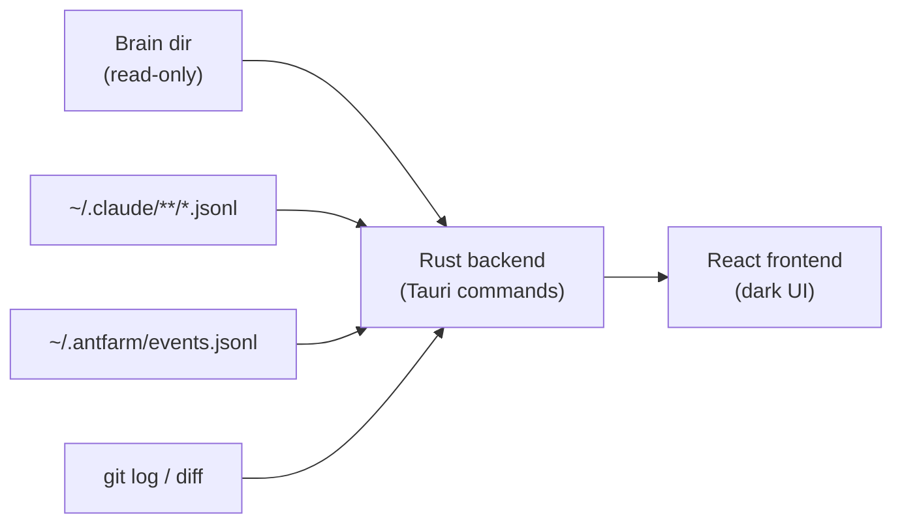

# Ant Farm — Overview

Ant Farm is a local-first desktop application that acts as a project operating system for a Claude Code and Cowork-heavy workflow. It reads a local project “brain” directory read-only, then overlays live agent sessions, token cost, git metrics, and one-click headless agent dispatch — all sourced from the local filesystem and process table, with zero API calls and zero tokens consumed by the observer itself.

The project started as “watch your agents work through glass” and is growing into “dispatch work and get tapped on the shoulder when it needs you.” It is a **personal, pre-release tool** — not packaged or signed for distribution.

## Design Principles

Ant Farm enforces four invariants across every subsystem:

### Observe-first

The project brain (`~/Desktop/CD_claude/tools-built/<slug>/`) is strictly read-only. Ant Farm never writes to it. The brain remains human-edited; the app only renders what is already there. This means any information surfaced by Ant Farm can be trusted to reflect the developer’s own notes and decisions, not the tool’s interpretation.

### Zero API, zero tokens

Every number the app displays — token counts, costs, git stats, session status — comes from local files and the process table (`ps`). Nothing phones home. The session transcripts (`.jsonl` files under `~/.claude/projects/`) contain `message.usage` fields; git stats come from `git log` and `git diff`; session liveness is determined by a running `claude` process combined with a recent transcript mtime. No Anthropic API key is required or used at runtime.

### Tolerant parsers

Claude Code and Cowork session/transcript formats are undocumented and change between releases. Every parser in the Rust backend is written to degrade gracefully: a malformed line becomes “details unavailable” and the rest of the list still loads. A bad file never crashes a rollup or a list view. This is enforced as a coding convention in `src-tauri/src/main.rs` and its sibling modules.

### Writes stay sandboxed

The app’s write surface is limited to two locations: `~/.antfarm/` (events log, dispatch run records, the mobile token) and the Tauri app-data directory. It never modifies the brain, the registry, the Claude Code settings, or any project repository outside an explicitly created git worktree.

## Data-Flow Model

## Feature Tour

Each section below is a one-paragraph summary. Follow the link for the full subsystem reference, including the relevant frontend pages, Tauri commands, and local files.

### [Projects](features/projects.md)

The Projects page scans the brain directory to produce a grid of every known project. Each card shows the project name, a one-line brief, and a session-active indicator. Clicking through to the detail view renders the project’s `README`, `decisions.md`, `ideas.md`, and `notes/` content with syntax-highlighted Markdown, plus git summary and uncommitted-file counts sourced from the backend. The mapping from brain slug to local repository path is resolved through the registry file (`~/Desktop/CD_claude/ant-farm-registry.json`).

### [Sessions and Push Status](features/sessions.md)

The Sessions page lists all active and recent Claude Code and Cowork sessions, grouped by project. Status transitions — Running, Idle, Needs permission, Done — are driven by Claude Code lifecycle hooks that append events to `~/.antfarm/events.jsonl`. The backend tails that file with `notify` and emits Tauri events to the frontend, so status updates are push-based rather than polled. Installing the hook script once in `~/.antfarm/hooks/` and merging four entries into `~/.claude/settings.json` is sufficient.

### [Usage, Cost, and Wrapped](features/usage.md)

The Usage page rolls up token counts and estimated dollar cost per project, per day, and per week. Cost is computed per-message using the `model` field from the transcript to look up the correct input, output, cache-read, and cache-write price. Both Claude Code and Cowork transcripts are included. A self-set weekly budget cap provides a progress bar. The Wrapped view is a yearly recap — total tokens, top projects, model breakdown, and a timeline — built from the same local data.

### [Git Metrics and Working Tree](features/git-metrics.md)

Per-repository git metrics (commit count, lines added, lines removed, files changed, and last-commit summary) are computed by spawning `git log` and `git diff` from the Rust backend and parsing the output. The working-tree view lists uncommitted files across all tracked repos, sorted oldest-first, so stale in-progress work surfaces before fresh changes. No `libgit2` dependency — plain subprocess calls keep the implementation small and auditable.

### [Dispatch](features/dispatch.md)

The Dispatch panel fires a headless `claude -p` run at a selected project. The prompt and options (worktree isolation, permission mode — `acceptEdits` or `dontAsk`) are configured in the UI; the backend in `src-tauri/src/dispatch.rs` spawns the subprocess, streams stdout to a live log panel, and persists the run record to `~/.antfarm/runs/`. When a run stalls waiting for human input, a “Take over” button opens a real terminal (PTY) connected to the same session. Completed runs can be reviewed inline.

### [Overnight Harness](features/overnight-harness.md)

The overnight harness (`src-tauri/src/harness.rs`) orchestrates multi-step plans that run unattended. It enforces a token budget gate before each step, isolates each task in a git worktree, reconciles orphaned runs from previous sessions, and produces a diff for review when a step completes. The morning review UI exposes accept, reject, and take-over actions per step, letting the developer confirm or undo each unit of automated work before it is merged.

### [Workspace](features/workspace.md)

The Workspace page (`src/pages/Workspace.tsx`) provides named, project-scoped tabbed workspaces with tiled terminal panes. Terminals are backed by `portable-pty` on the Rust side and rendered with `xterm.js` (`@xterm/xterm`) on the frontend. Pane layout — which terminals are open, their sizes, and their arrangement — is managed by `dockview` and persisted per workspace. A workspace can host a shell pane, a Claude Code pane, and a reviewer pane side by side.

### [Morning and Planning](features/morning-and-planning.md)

The Morning page (`src/pages/Morning.tsx`) surfaces a daily briefing: WHOOP health data, a chief-of-staff agent summary, and project insights pulled by `src-tauri/src/morning.rs`. The Tonight / planning flow (`src/pages/Tonight.tsx`, `src-tauri/src/planning.rs`) locks tomorrow’s work plan using a chat interface backed by `src-tauri/src/chat.rs`. Both flows write only to `~/.antfarm/` — never to the brain.

### [Voice and Mobile](features/voice-and-mobile.md)

Voice mode (`src/pages/VoiceMode.tsx`, `src/lib/useVoice.ts`) connects to a realtime speech session: speech-to-text transcribes the developer’s voice, the assistant responds, and text-to-speech reads the reply aloud. The mobile bridge (`src-tauri/src/mobile.rs`) runs a `tiny_http` server bound to a local port, gated by a one-time token stored in `~/.antfarm/`, so a phone on the same network can reach the app without exposing it to the internet. Outbound HTTP for the voice session uses `reqwest`.

## Technology Stack

| Layer | Technologies |
| --- | --- |
| Desktop shell | Tauri 2 |
| Backend | Rust 2021 edition; `serde`/`serde_json`, `chrono`, `notify`, `portable-pty`, `tiny_http`, `reqwest` |
| Frontend | Vite 6, React 18, TypeScript 5, Tailwind CSS 3 (dark theme) |
| Terminal | `@xterm/xterm` 6, `@xterm/addon-fit`, `portable-pty` 0.9 |
| Layout | `dockview` 6 |
| Charts | `recharts` 3 |
| Markdown | `react-markdown` 10 |
| Routing | `react-router-dom` 7 |
| Icons | `lucide-react` |

The app is built with `npm run build` (runs `tsc --noEmit && vite build`) and `cargo check` before every push. It is **not** packaged or signed; development and usage are entirely from `npm run tauri dev`. There are no feature branches or pull requests — changes push straight to `main`.

## Current Status

Ant Farm is a personal tool at version `0.1.0`, pre-release. It is not distributed or signed. The v1 feature set (projects, sessions, usage, git metrics, dispatch) is complete. The v2 workspace (tabbed PTY workspaces with dockview tiling) is shipped. Morning/planning, overnight harness, and voice/mobile are active development tracks.

## Next Steps

-   [Getting Started](getting-started.md) — prerequisites, `npm install`, `npm run tauri dev`, hook setup, and the required build gate.
-   [Architecture](architecture.md) — the Tauri model, the frontend/backend split, the IPC command surface, and the observe-first data flow.
-   [Features](features.md) — the full subsystem index with deep-dive links.
